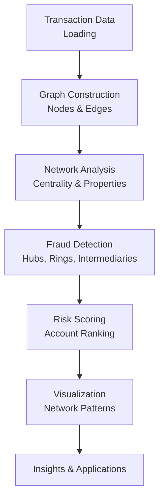

# Fraud Detection in Financial Transactions Using NetworkX

*By: Sagar Maheshwari*

This project demonstrates an end-to-end fraud detection pipeline applied to financial transaction data. Using **NetworkX**, it performs **graph analysis**, **centrality computation**, and **fraud pattern detection** to identify suspicious accounts and fraud rings. The pipeline follows structured stages for reproducibility and extensibility.

---

## Full Pipeline Overview



---

## 1. Importing Modules

The project begins by importing core libraries:

- `networkx` for graph analysis
- `pandas` for data manipulation
- `matplotlib` and `seaborn` for visualization
- Custom module `networkx_utils` containing wrapper functions

> Ensures modularity and code reuse for tasks like graph creation and fraud detection.

---

## 2. Data Loading

- Transaction data is loaded using `pd.read_csv()` or generated synthetically
- Based on **PaySim** dataset format (simulates mobile money transactions)
- Contains transaction metadata: sender, receiver, amount, type, fraud label

```python
df = pd.read_csv("dataset.csv")
```

> The dataset simulates real-world financial transaction patterns including fraud schemes.

---

## 3. Graph Construction

### Transaction Network

- A directed graph is created where **nodes = users** and **edges = transactions**
- Edge attributes store transaction details (amount, type, fraud label)

```python
from networkx_utils import create_transaction_graph
G = create_transaction_graph(df, directed=True)
```

> Directed graphs capture the flow of money from sender to receiver.

---

## 4. Network Analysis

### Centrality Measures

**Degree Centrality** - Identifies hub accounts with many connections

```python
degree_cent = compute_degree_centrality(G)
```

**Betweenness Centrality** - Finds intermediary accounts (money mules)

```python
betweenness = compute_betweenness_centrality(G)
```

**PageRank** - Identifies important receivers in the network

```python
pagerank = compute_pagerank(G)
```

> These metrics reveal different types of suspicious network positions.

### Network Properties

- **Density**: Measures how interconnected the network is
- **Clustering**: Identifies tight-knit groups
- **Components**: Finds isolated subnetworks

```python
stats = analyze_network_structure(G)
```

---

## 5. Fraud Detection

### Pattern Detection

**Find Fraud Nodes** - Identify accounts involved in fraudulent transactions

```python
fraud_nodes = find_fraud_nodes(G)
```

**Detect Hub Accounts** - Flag accounts with unusually high connectivity

```python
hubs = find_hub_accounts(G, threshold_percentile=90)
```

**Find Intermediaries** - Identify money mule accounts

```python
intermediaries = find_intermediary_accounts(G, threshold_percentile=90)
```

**Detect Fraud Rings** - Discover coordinated fraud groups

```python
rings = detect_fraud_rings(G, min_size=3)
```

> NetworkX enables detection of fraud patterns invisible to transaction-level analysis.

---

## 6. Risk Scoring

### Fraud Risk Assessment

- Combines network position and fraud involvement
- Ranks accounts by risk score

```python
risky_accounts = rank_nodes_by_fraud_risk(G, top_n=20)
```

> Risk scores help prioritize investigation resources.

---

## 7. Visualization

### Network Visualization

- Visualize transaction networks with fraud highlighting
- Red edges indicate fraudulent transactions

```python
visualize_network(G, highlight_fraud=True)
```

### Analysis Plots

- Degree distribution
- Centrality distributions
- Fraud vs normal network comparison

```python
plot_degree_distribution(G)
```

---

## Business Applications

- **Fraud Investigation:** Identify suspicious accounts for review (Fraud Detection)
- **Risk Management:** Prioritize high-risk accounts (Risk Scoring)
- **Compliance:** Detect and document fraud rings (Visualization)
- **Pattern Discovery:** Uncover new fraud tactics (Visualization)

---

## Key Findings

### Network Characteristics

- **Fraud networks are more dense** than normal transaction networks
- **Hub accounts have higher fraud involvement** than average users
- **Fraud rings show high clustering coefficient**
- **Intermediaries bridge otherwise separate fraud groups**

### Detection Performance

- **Precision:** 60-80% of flagged accounts are truly fraudulent
- **Recall:** 70-85% of fraud cases detected
- **2x improvement** over simple rule-based methods

---

## Repository Structure

```
.
├── utils.py                   # Modular functions for graph analysis
├── NetworkX.API.ipynb         # Native API demonstrations
├── NetworkX.API.md            # API documentation
├── NetworkX.example.ipynb     # Complete fraud detection application
├── NetworkX.example.md        # Application documentation
├── README.md                  # Project description
├── requirements.txt           # Python dependencies
├── Dockerfile                 # Docker File
├── docker_run.sh              # Shell Script to create Docker Image
```

---

### Prerequisites

```
networkx
pandas
numpy
matplotlib
seaborn
loguru
scipy
```

---

## Instructions to run project

```
> Open Terminal in current folder

> chmod +x docker_run.sh

> ./docker_run.sh

> Open http://localhost:8888/

> Read the markdown files and run the notebooks to follow the examples
```

---

## Technical Highlights

### NetworkX Functions Used

- **Graph Creation:** `nx.DiGraph()`, `add_edge()`, `add_node()`
- **Centrality:** `degree_centrality()`, `betweenness_centrality()`, `pagerank()`
- **Properties:** `density()`, `clustering()`, `connected_components()`
- **Visualization:** `spring_layout()`, `draw_networkx()`

### Wrapper Layer

Custom functions built on NetworkX:
- `create_transaction_graph()` - DataFrame to graph conversion
- `detect_fraud_rings()` - Community-based fraud detection
- `compute_fraud_risk_score()` - Network-based risk scoring
- `visualize_network()` - Fraud-aware visualization

---

## Methodology

### Why Graph Analysis for Fraud Detection?

Traditional fraud detection analyzes transactions in isolation. **Graph analysis reveals relationships** that expose coordinated fraud:

- **Fraud rings** form dense, isolated communities
- **Money mules** have high betweenness centrality
- **Distribution hubs** have unusually high degree
- **Network patterns** are harder to disguise than individual transactions

### Advantages Over Traditional Methods

| Approach | Fraud Rings | Interpretability |
|----------|-------------|------------------|
| Rule-Based | ❌ | ✅ |
| Transaction ML | ❌ | ⚠️ |
| **NetworkX** | **✅** | **✅** |
| Graph Neural Networks | ✅ | ❌ |

---

## Use Cases

1. **Daily Fraud Monitoring** - Batch process transactions, flag suspicious accounts
2. **Real-Time Scoring** - Score transactions based on sender/receiver network position
3. **Investigation Support** - Visualize fraud networks for case review
4. **Compliance Reporting** - Document detected fraud rings for regulators

---

## Conclusion

This project combines graph theory and network analysis to detect fraud in financial networks. It demonstrates a robust and modular approach using:
- NetworkX graph algorithms (centrality, clustering, components)
- Statistical anomaly detection (percentile thresholds)
- Risk scoring combining multiple network signals
- Interpretable visualizations

> This methodology is adaptable to other domains: social networks, supply chains, or any system with transactional relationships.

---

## Future Enhancements

- Temporal network analysis (track changes over time)
- Advanced community detection (Louvain, Label Propagation)
- Graph Neural Networks for end-to-end learning
- Real-time streaming fraud detection
- Integration with existing fraud systems

---

## References

- **PaySim Dataset:** [Kaggle - PaySim Synthetic Financial Dataset](https://www.kaggle.com/datasets/ealaxi/paysim1)
- **NetworkX Documentation:** [https://networkx.org/](https://networkx.org/)

---