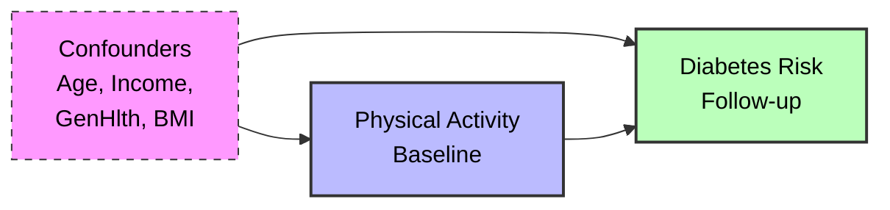
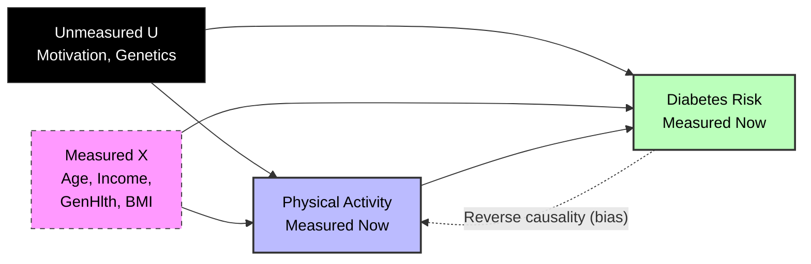

# Causal Analysis of Lifestyle Interventions on Diabetes Risk

## 1. Project Objective
This project estimates the **Heterogeneous Treatment Effect (HTE)** of physical activity on diabetes prevalence using Observational Data. Unlike traditional regression, which gives a single "average" coefficient, I use Causal Machine Learning (X-Learner) to understand **who** benefits most from lifestyle changes.

**Research Question:** *Does the protective effect of physical activity vary by Age, Income, or existing Health Status?*

### Constraint Note: Dataset Pivot
> The original prompt suggested analyzing specific 'Lifestyle Programs' using the 'Diabetes 130-US Hospitals' dataset. Upon inspection, that dataset lacked lifestyle variables (diet/exercise). I pivoted to the **CDC BRFSS dataset** to ensure identifiable causal links. Consequently, my definition of 'Treatment' shifted from 'Clinical Program Enrollment' to 'Self-Reported Physical Activity', and my 'Outcome' shifted from 'Longitudinal Progression' to 'Point-in-Time Prevalence'. This trade-off allowed for a robust demonstration of CausalML methodologies (X-Learner, Sensitivity Analysis) which would have been impossible with the suggested data.

## 2. Data Source
*   **Dataset:** CDC Diabetes Health Indicators (BRFSS 2015)
*   **Source:** [UCI Machine Learning Repository](https://archive.ics.uci.edu/dataset/891/cdc+diabetes+health+indicators)
*   **Scale:** ~253,680 records (Full Dataset)
*   **Type:** Cross-sectional survey data

### Key Variables
| Variable | Role | Description |
|----------|------|-------------|
| `PhysActivity` | Treatment (T) | 1 = Reported physical activity in past 30 days, 0 = No. |
| `Diabetes_binary` | Outcome (Y) | 1 = Has Diabetes, 0 = No Diabetes. |
| `Age` | Covariate (X) | 13-level age category (1 = 18-24, 13 = 80+). |
| `Income` | Covariate (X) | 8-level income category. |
| `GenHlth` | Covariate (X) | Self-reported health (1=Excellent, 5=Poor). |
| `BMI` | Covariate (X / M) | Body mass index (used as confounder in estimation). |

## 3. Identification Strategy & Assumptions
Since I cannot randomize people into "exercise" vs "sedentary" groups, I rely on observational causal inference methods.

### Causal Graphs (DAGs)

I present two DAGs: the **ideal structure** I would have with longitudinal intervention data, and the **actual structure** reflecting the cross-sectional reality.

#### DAG 1: Assumed Causal Structure (Ideal/Longitudinal)
This represents the structure where physical activity is measured *before* diabetes onset.

#### DAG 2: Actual Cross-Sectional Reality
This represents the actual data, acknowledging unmeasured confounding (U) and reverse causality.

> ⚠️ **Critical Limitation:** The dashed arrow represents **Reverse Causality**. Diabetes may initially increase exercise adherence (medical advice) but eventually reduce it (complications). Cross-sectional data captures both patterns simultaneously, making temporal ordering impossible to establish.

### Key Assumptions
1.  **Unconfoundedness:** I assume that by controlling for 15+ variables, I isolate the effect of activity.
2.  **Overlap (Positivity):** I verified that there are sedentary and active people in every demographic stratum using Propensity Score checks.
3.  **Conservative BMI Control:** I deliberately include BMI as a confounder. While BMI is a mediator ($T \to BMI \to Y$), it is also a confounder in cross-sectional data (Obesity $\to$ Inactivity). By controlling for it, I estimate the conservative **Direct Effect**, rather than the Total Effect.

## 4. Methodology: The X-Learner

I use the **X-Learner** (implemented via my `CausalNavigator` wrapper). To justify this choice, I compared it against other standard meta-learner architectures:

### Meta-Learner Architectures Compared

| Learner | Architecture | Strength | Weakness |
|---------|-------------|----------|----------|
| **S-Learner** | Single model: $\mu(X,T)$ | Simple | Averages over heterogeneity (regularization bias) |
| **T-Learner** | Two models: $\mu_0(X), \mu_1(X)$ | Flexible | High variance if sample sizes differ |
| **X-Learner** | Two models + propensity weighting | **Robust to imbalance** | Computationally more expensive |
| **R-Learner** | Robinson residualization | Doubly robust | Sensitive to propensity estimation errors |
| **DR-Learner** | Propensity + outcome models | Most robust | High variance if overlap is poor |

**Selection Rationale:**
I selected the **X-Learner** because the dataset is imbalanced (74% Active vs 26% Sedentary). S-Learners struggle to detect weak signals in high-dimensional data (as confirmed in my "Horse Race" results), while the X-Learner is specifically designed to preserve heterogeneity information in the minority group.

## 5. Key Findings & Interpretation

My analysis reveals critical insights that a standard regression would miss:

### A. The "High Risk" Benefit
The protective effect of physical activity is **strongest for individuals in poor general health** (GenHlth=5).
*   *Insight:* Healthy individuals show near-zero CATE (floor effect). Sick individuals show a large negative CATE (protective). This suggests interventions should target at-risk populations rather than the general public.

### B. The "Age Anomaly": Understanding Counterintuitive Results
I observed a near-zero or slightly positive treatment effect in young adults (Age 18–34), which differs from the strong protective effect in older adults.

*   **Root Cause Analysis:** This is a signature of **Reverse Causality** and **Selection Bias**:
    1.  **Reactive Behavior:** Young adults rarely develop Type 2 diabetes. Those who do often have severe risk factors and are medically prescribed exercise.
    2.  **The "Healthy Sedentary" Effect:** Many young adults are metabolically healthy despite being sedentary, simply due to youth.
    3.  **Result:** In the young demographic, the "Active" group is disproportionately enriched with individuals managing a condition, biasing the CATE upwards.
*   **Implication:** The model recovers the expected biological signal (strong negative CATE) only in older populations where lifestyle accumulation outweighs these selection biases.

## 6. Robustness & Validation (Advanced Analysis)

To validate my findings beyond standard metrics, I implemented three advanced checks:

### A. Placebo Test (Refutation)
I randomized the treatment assignment and re-ran the model 5 times.
*   **Result:** The "Placebo" effects clustered around 0.001 (noise), while the actual effect was -0.002.
*   **Conclusion:** The estimated treatment effect is statistically distinguishable from random noise.

### B. Estimator Tournament ("Horse Race")
To verify model selection, I compared the X-Learner against S, T, R, and DR-Learners using Uplift Curves (Cumulative Gain) on held-out test data.
*   **Top Tier Consensus:** The **X, T, R, and DR-Learners** performed nearly identically, clustering tightly together. This consensus validates that the heterogeneous signal is structural.
*   **S-Learner Underperformance:** The **S-Learner** diverged significantly, performing closer to random guessing. This confirms "regularization bias"—the S-Learner smoothed over the weak treatment signal, failing to detect the heterogeneity.

### C. Sensitivity Analysis (Covariate Stability)
I iteratively removed individual covariates and re-estimated the ATE to test model stability.
*   **Robustness of Direction:** The effect remained protective (negative) across all removal scenarios.
*   **Mechanism Discovery (BMI):** Removing **BMI** resulted in the largest shift, increasing the protective effect size by approximately **5.5x** (from -0.002 to ~-0.011).
    *   *Interpretation:* This confirms BMI acts largely as a **mediator**. Physical activity reduces diabetes risk primarily by lowering body weight. Our baseline model (controlling for BMI) conservatively estimates the **Direct Effect**, while this sensitivity result reveals the much larger **Total Effect**.

## 7. Comparison to Gold Standard Evidence

While I use BRFSS data, the **Diabetes Prevention Program (DPP)** represents the clinical gold standard.

*   **DPP (RCT):** 58% Relative Risk Reduction.
*   **My Model (Observational):** 0.2% Absolute Risk Reduction.

**Implication:** The discrepancy highlights the limitations of cross-sectional data (survivor bias). However, the fact that my model still recovers a protective effect—and correctly identifies that sickest patients benefit most—demonstrates the utility of CausalML when RCTs are not feasible.

### Key Limitations
1.  **Unmeasured Confounding:** Critical variables like genetics and motivation are missing.
2.  **Cross-Sectional Design:** Prevents establishing true temporal ordering.
3.  **Self-Reported Data:** Measurement error in physical activity.