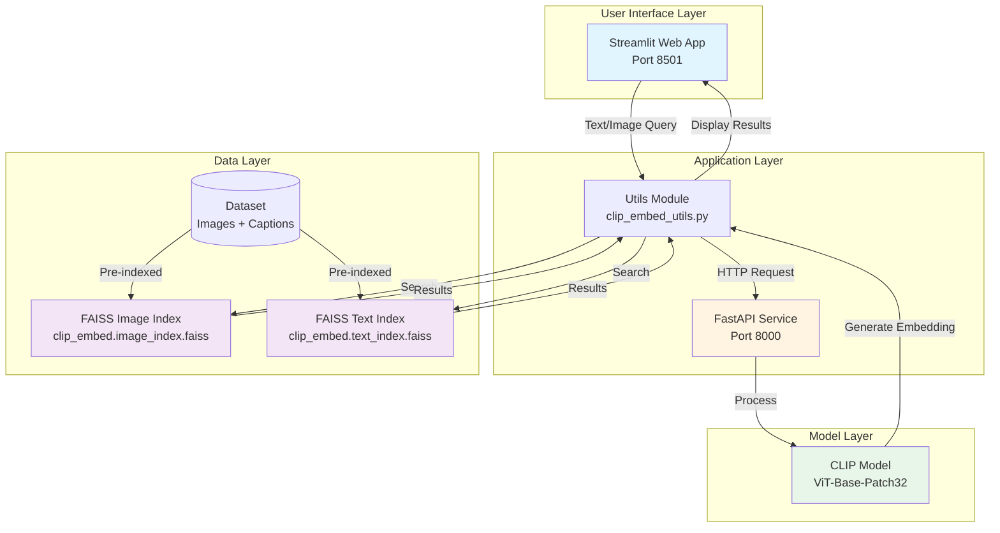

# CLIP Embeddings Search App - MSML610 Fall25#37

A powerful multimodal search engine that leverages OpenAI's CLIP (Contrastive Language–Image Pretraining) model to enable semantic search across images and text. This project demonstrates how to build and query text and image embeddings using CLIP and FAISS, all packaged with Docker and a Streamlit interface.

## Features

The application provides several key capabilities:

- **Text-to-Image Search**: Input natural language queries and retrieve the most relevant images from a dataset
- **Image-to-Text Search**: Upload an image to find semantically similar captions or text descriptions
- **Fast Similarity Search**: Powered by FAISS (Facebook AI Similarity Search) for efficient vector similarity operations
- **RESTful API**: FastAPI-based service for generating embeddings from images and text
- **Interactive Web Interface**: User-friendly Streamlit app for multimodal querying
- **Dockerized Environment**: Complete containerized setup for easy deployment and reproducibility

## Architecture

The system consists of three main components working together:



### Architecture Components

1. **Streamlit Web Interface** (`clip_embed.streamlit.py`)
   - Provides three tabs: About & Analysis, Text Search, and Image Search
   - Handles user input (text queries or image uploads)
   - Displays search results with similarity scores

2. **FastAPI Service** (`clip_embed_API.py`)
   - `/embed/image`: Generates CLIP embeddings for uploaded images
   - `/embed/text`: Generates CLIP embeddings for text queries
   - Uses OpenAI's CLIP ViT-Base-Patch32 model
   - Automatically uses GPU if available, falls back to CPU

3. **Utils Module** (`clip_embed_utils.py`)
   - Interfaces with the FastAPI service to get embeddings
   - Performs FAISS similarity search on pre-built indexes
   - Normalizes embeddings for optimal search performance

4. **FAISS Indexes**
   - Pre-computed vector indexes for fast similarity search
   - Separate indexes for images and text embeddings
   - Enables efficient k-nearest neighbor search

## Project Structure

```
.
├── clip_embed_API.py              # FastAPI service for embedding generation
├── clip_embed_utils.py            # Utility functions for API calls and FAISS search
├── clip_embed.streamlit.py        # Streamlit web application
├── clip_embed.example.ipynb        # Example notebook demonstrating embedding generation
├── clip_embed.API.ipynb           # API usage examples notebook
├── clip_embed.dataset/            # Dataset directory
│   ├── captions.txt               # Text captions for image-text pairs
│   └── images/                    # Folder containing sample images (8000+ images)
├── clip_embed.image_index.faiss   # FAISS index for image embeddings
├── clip_embed.text_index.faiss    # FAISS index for text embeddings
├── ClipArchitecture.png           # Architecture diagram image
├── Dockerfile                     # Docker container configuration
├── requirements.txt               # Python dependencies
└── README.md                      # Project documentation
```

## Docker Setup & Run Instructions

### Step 1: Build the Docker Image

Navigate to the project directory and build the Docker image:

```bash
cd TutorTask37_Fall2025_CLIP_ViT_Large_Patch14_Generative_Art_from_Text_Prompts
docker build -t clip-embedding-app .
```

This process creates a Python 3.11 environment, installs all dependencies from `requirements.txt`, installs JupyterLab for notebook access, and copies all project files into the container.

### Step 2: Run the Docker Container

Run the container with port mappings for all services:

```bash
docker run -d \
  --name clip-app \
  -p 8000:8000 \
  -p 8501:8501 \
  -p 8502:8502 \
  clip-embedding-app
```

The following ports are mapped:
- Port `8000`: FastAPI service for embedding generation
- Port `8501`: Streamlit web interface
- Port `8502`: JupyterLab for notebook access

### Step 3: Access the Services

Once the container is running, you can access the services:

- Streamlit Web App: Navigate to `http://localhost:8501` in your browser
- FastAPI Documentation: Visit `http://localhost:8000/docs` for interactive API documentation
- JupyterLab: Access at `http://localhost:8502` (no token required)

### Step 4: Verify the Setup

Check if the container is running:

```bash
docker ps
```

View container logs:

```bash
docker logs clip-app
```

## Usage Guide

### Using the Streamlit Interface

**Text-to-Image Search:**
Navigate to the "Text Search" tab, select the number of results (k) you want to retrieve (1-5), type your query in the chat input (e.g., "a child playing in a park"), and view the top-k most similar images with their similarity scores.

**Image-to-Text Search:**
Navigate to the "Image Search" tab, upload an image file (JPG, JPEG, or PNG), select the number of results (k) you want to retrieve, and view the top-k most similar captions with their similarity scores.

### Using the API Directly

#### Generate Image Embedding

```bash
curl -X POST "http://localhost:8000/embed/image" \
  -H "accept: application/json" \
  -H "Content-Type: multipart/form-data" \
  -F "image=@path/to/your/image.jpg"
```

#### Generate Text Embedding

```bash
curl -X POST "http://localhost:8000/embed/text" \
  -H "accept: application/json" \
  -H "Content-Type: application/x-www-form-urlencoded" \
  -d "text=a beautiful sunset over the ocean"
```

#### Check API Status

```bash
curl http://localhost:8000/
```

## API Documentation

### Endpoints

**GET /**
Root endpoint to check API status. Returns `{"message": "CLIP embedding API is running!"}`.

**POST /embed/image**
Generates CLIP embedding for an uploaded image. Accepts an image file as a parameter and returns a JSON response containing the image filename and embedding vector:

```json
{
  "image_filename": "example.jpg",
  "embedding": [0.123, -0.456, ...]
}
```

**POST /embed/text**
Generates CLIP embedding for input text. Accepts text as form data and returns a JSON response containing the text and embedding vector:

```json
{
  "text": "your query text",
  "embedding": [0.789, -0.321, ...]
}
```

Interactive API documentation is available at `http://localhost:8000/docs` when the container is running.

## Technical Details

- **CLIP Model**: OpenAI CLIP ViT-Base-Patch32
- **Embedding Dimension**: 512 (for ViT-Base-Patch32)
- **Similarity Metric**: Cosine similarity (via normalized embeddings)
- **Index Type**: FAISS IndexFlatL2 (L2 distance with normalization)

## Notes

The model has been successfully executed and tested. FAISS indexes are pre-built and included in the repository. The system automatically detects and uses GPU if available. For production use, consider using `faiss-gpu` instead of `faiss-cpu` for better performance.
