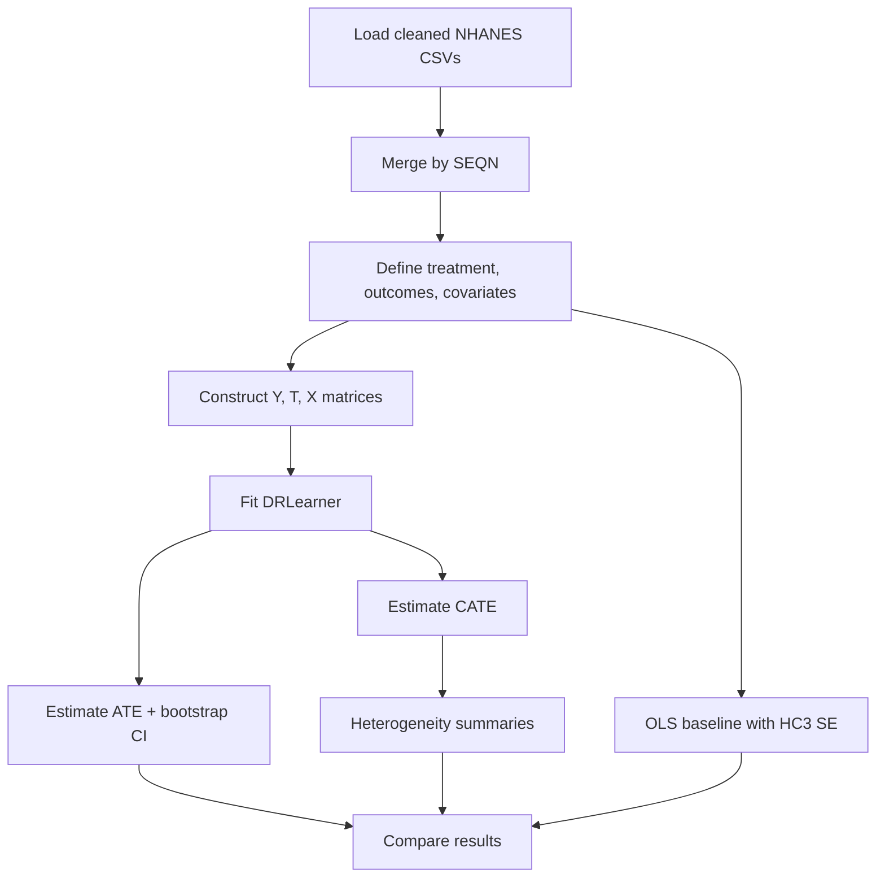

# Evaluating the Impact of Dietary Supplement Use on Health Outcomes with EconML (NHANES 2021–2023)

**Course**: MSML610 — Fall 2025
**Project**: TutorTask82_Fall2025_EconML_Evaluating_the_Impact_of_Health_Interventions_on_Patient_Outcomes
**Author(s)**: Karthik Vakada, Sri Akash Kadali
**Last Updated**: 2025-12-14

---

## Table of Contents

* [Project Overview and Goals](#project-overview-and-goals)
* [Causal Question and Scope](#causal-question-and-scope)
* [Methodological Framing](#methodological-framing)
* [Project Structure](#project-structure)
* [Data Sources and Feature Construction](#data-sources-and-feature-construction)
* [End-to-End Pipeline](#end-to-end-pipeline)
* [Getting Started](#getting-started)
* [Usage](#usage)
* [Results Summary](#results-summary)
* [Heterogeneity Analysis](#heterogeneity-analysis)
* [Baseline Comparison (OLS vs EconML)](#baseline-comparison-ols-vs-econml)
* [API vs Example Layers](#api-vs-example-layers)
* [Reproducibility and Assumptions](#reproducibility-and-assumptions)
* [Limitations](#limitations)
* [TA-Facing Design Summary](#ta-facing-design-summary)
* [Troubleshooting](#troubleshooting)
* [References](#references)

---

## Project Overview and Goals

This project is a **causal inference study**, not a predictive modeling task.

We estimate the **causal effect of dietary supplement use** on selected health outcomes using **observational data** from the **National Health and Nutrition Examination Survey (NHANES) 2021–2023**, applying **double-robust machine learning methods** implemented via **EconML**.

The primary objective is to demonstrate **correct causal reasoning under confounding**, including:

* Explicit treatment definition
* Separation of nuisance models and causal estimands
* Estimation of treatment effect heterogeneity
* Transparent comparison against classical statistical baselines

---

## Causal Question and Scope

### Main causal question

> What is the causal effect of **dietary supplement use** on selected cardiometabolic health outcomes, after adjusting for observed confounders?

### Treatment definition

* **Treatment (`T`)**: Binary indicator of **any dietary supplement use**
* Derived from NHANES dietary supplement questionnaire data (`DSQTOT_*`)
* This project intentionally treats supplement use as a **coarse intervention**, reflecting real-world observational ambiguity

### Outcomes analyzed

* **Mean systolic blood pressure** (`sbp_mean`)
* **Fasting plasma glucose** (`fasting_glucose_mg_dl`)

---

## Methodological Framing

This project follows a **potential outcomes framework**:

* Target estimands:

  * **ATE**: Average Treatment Effect
  * **CATE**: Conditional Average Treatment Effect
* Identification strategy:

  * Conditional unconfoundedness given observed covariates
  * Overlap assumed and empirically checked
* Estimator:

  * **DRLearner (Double Robust Learner)** from EconML

Double robustness ensures consistent estimation if **either**:

* the outcome model **or**
* the treatment (propensity) model
  is correctly specified.

---

## Project Structure

```text
TutorTask82_Fall2025_EconML_Evaluating_the_Impact_of_Health_Interventions_on_Patient_Outcomes/
├── README.md
├── how_to_run.md
├── changelog.txt
├── __init__.py
│
├── Data_Preparation_Sri.ipynb
├── MSML610_DataPrepaparation_Karthik.ipynb
│
├── econml_utils.py
├── econml.API.py
├── econml.example.py
├── econml.API.ipynb
├── econml.example.ipynb
├── econml.API.md
├── econml.example.md
│
├── data/
│   └── cleaned and labeled NHANES CSV files
│
├── requirements.txt
├── Dockerfile
│
├── docker_build.sh
├── docker_jupyter.sh
├── docker_bash.sh
├── docker_name.sh
├── run_jupyter.sh
│
├── install_common_packages.sh
├── install_jupyter_extensions.sh
├── bashrc
├── etc_sudoers
├── version.sh
└── .gitignore
```

---

## Data Sources and Feature Construction

All NHANES components are merged using the respondent identifier `SEQN`.

### NHANES components used

* `DEMO_*` — age, sex, race/ethnicity, income
* `BMX_*` — BMI and body measures
* `BPXO_*` — blood pressure readings
* `GLU_*` — fasting plasma glucose
* `TCHOL_*`, `HDL_*`, `TRIGLY_*` — lipid profile
* `HSCRP_*` — inflammation marker
* `DSQTOT_*` — dietary supplement use

### Feature handling

* Outcomes computed **before** causal modeling
* Covariates selected to avoid post-treatment leakage
* All feature construction centralized in `econml_utils.py`

---

## End-to-End Pipeline



---

## Getting Started

### Prerequisites

* Docker Desktop (WSL2 backend on Windows)
* 1–2 GB free disk space

---

### Docker Setup (Recommended and Graded Path)

```bash
cd TutorTask82_Fall2025_EconML_Evaluating_the_Impact_of_Health_Interventions_on_Patient_Outcomes
chmod +x docker_*.sh run_jupyter.sh install_*.sh version.sh
./docker_build.sh
./docker_jupyter.sh
```

Open: `http://localhost:8888`

---

## Usage

### Primary analysis

* Open **`econml.example.ipynb`**
* Restart kernel
* Run all cells top to bottom

### Minimal API demo

* `econml.API.ipynb`

### Script-based execution

```bash
./docker_bash.sh
python econml.example.py
```

---

## Results Summary

The project reports:

* **ATE estimates** with bootstrap confidence intervals
* Directional consistency across outcomes
* Differences between causal and naive regression estimates

Exact numeric values depend on NHANES sampling weights and preprocessing decisions and are reproducible using Docker.

---

## Heterogeneity Analysis

Treatment effect heterogeneity is examined via:

* Individual-level CATE estimates
* Subgroup summaries by:

  * Age group
  * Sex
  * Baseline health status

This analysis highlights that **average effects mask meaningful variation**, reinforcing the importance of causal ML methods over single-point estimates.

---

## Baseline Comparison (OLS vs EconML)

A classical OLS regression with **HC3 robust standard errors** is used as a baseline.

Observed differences arise because:

* OLS conflates treatment assignment with confounding
* DRLearner orthogonalizes nuisance estimation from causal estimation

This comparison is included to **demonstrate why causal ML is necessary**, not to dismiss traditional methods.

---

## API vs Example Layers

### Stable API layer

* `econml_utils.py`
* `econml.API.py`

Reusable, deterministic, side-effect-free functions.

### Example / teaching layer

* `econml.example.ipynb`
* `econml.example.py`
* `econml.API.ipynb`

---

## Reproducibility and Assumptions

* Docker ensures environment reproducibility
* Random seeds fixed where applicable
* Bootstrap used for uncertainty estimation

### Key assumptions

* Conditional unconfoundedness given observed covariates
* Sufficient overlap between treated and untreated groups
* No interference between units (SUTVA)

---

## Limitations

* Observational data cannot eliminate unmeasured confounding
* Supplement use is coarsely defined
* Results are not clinical recommendations
* NHANES sampling weights are not fully exploited

These limitations are acknowledged explicitly.

---

## TA-Facing Design Summary

This project prioritizes:

* Correct causal framing
* Transparent baselines
* Reproducibility
* Separation of concerns (data, estimation, interpretation)

Design choices align directly with **MSML610 learning objectives**.

---

## Troubleshooting

### Windows line ending issue

```bash
sed -i 's/\r$//' run_jupyter.sh
```

### Apple Silicon

```bash
export DOCKER_DEFAULT_PLATFORM=linux/amd64
./docker_build.sh
```

---

## References

* EconML: [https://econml.azurewebsites.net/](https://econml.azurewebsites.net/)
* NHANES 2021–2023: [https://wwwn.cdc.gov/nchs/nhanes/continuousnhanes/default.aspx?Cycle=2021-2023](https://wwwn.cdc.gov/nchs/nhanes/continuousnhanes/default.aspx?Cycle=2021-2023)
* scikit-learn: [https://scikit-learn.org/](https://scikit-learn.org/)
* statsmodels: [https://www.statsmodels.org/](https://www.statsmodels.org/)
