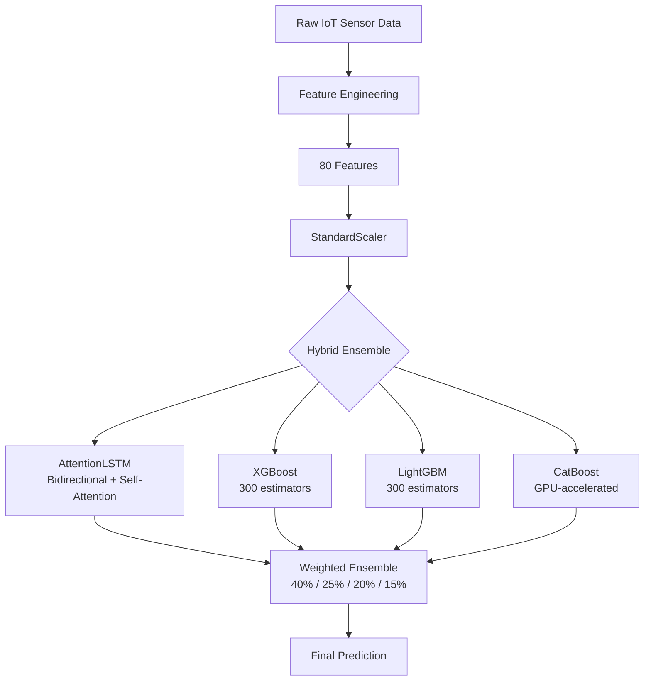

# IoT Anomaly Detection - API Documentation

This document describes the programming interface (API) for the IoT Anomaly Detection system using a **hybrid LSTM-XGBoost-LightGBM-CatBoost ensemble**.

## Table of Contents

- [Overview](#overview)
- [Architecture](#architecture)
- [Core Components](#core-components)
- [API Reference](#api-reference)
- [Usage Examples](#usage-examples)
- [Model Performance](#model-performance)

## Overview

The IoT Anomaly Detection API is designed to be:
- **Simple**: Minimal code to get started
- **Production-ready**: Includes model persistence and error handling
- **GPU-accelerated**: Supports CUDA for deep learning components
- **Honest**: Reports realistic performance metrics with known limitations

### Key Features

- **Hybrid Ensemble**: LSTM (40%) + XGBoost (25%) + LightGBM (20%) + CatBoost (15%)
- **80 Engineered Features** from 5 raw sensors
- **5-Fold Stratified Cross-Validation** for robust evaluation
- **Class Balancing** for imbalanced datasets

## Architecture



## Core Components

### 1. IoTAnomalyDetector Class

The main interface for the anomaly detection pipeline.

**Location**: `iot_anomaly_utils.py`

### 2. Feature Engineering Module

**Location**: `scripts/feature_engineering.py`

**Features Generated (80 total)**:
| Category | Count | Description |
|----------|-------|-------------|
| Basic Transformations | 15 | squared, sqrt, log1p |
| Per-machine Z-scores | 5 | Standardized by machine |
| Row Statistics | 5 | mean, std, min, max, range |
| Interaction Terms | 6 | sensor products/ratios |
| Temporal Encodings | 8 | hour, day, cyclic sin/cos |
| Rolling Features | 20 | mean, std (window 5, 10) |
| Deviation Features | 6 | distance from machine mean |
| Lag Features | 10 | lag_1, lag_3 per sensor |

### 3. Production Models

**Location**: `models/`

| File | Description |
|------|-------------|
| `anomaly_xgb.pkl` | XGBoost classifier |
| `anomaly_catboost.cbm` | CatBoost classifier |
| `anomaly_lstm.pth` | LSTM neural network weights |
| `anomaly_scaler.pkl` | StandardScaler for features |

### 4. LSTM Training Notebook

**Location**: `lstm.ipynb`

Run on Google Colab Pro (Tesla T4 GPU) for training the full hybrid ensemble.

## API Reference

### Class: IoTAnomalyDetector

#### Constructor

```python
detector = IoTAnomalyDetector()
```

#### Methods

##### load_data

```python
detector.load_data(filepath: str, sample_size: Optional[int] = None) -> pd.DataFrame
```

Load raw IoT sensor data from CSV.

**Parameters**:
- `filepath`: Path to CSV file
- `sample_size`: Optional number of rows to sample

**Returns**: pandas DataFrame

---

##### prepare_features

```python
detector.prepare_features(target_col: str = "anomaly_flag") -> pd.DataFrame
```

Compute 80 engineered features from raw sensor data.

**Parameters**:
- `target_col`: Target column name

**Returns**: DataFrame with features

---

##### prepare_train_test_split

```python
detector.prepare_train_test_split(
    target_col: str = "anomaly_flag",
    test_size: float = 0.2,
    scale: bool = True,
    stratify: bool = True
) -> Tuple[np.ndarray, np.ndarray, np.ndarray, np.ndarray]
```

Split data into train/test sets with optional scaling.

**Returns**: (X_train, X_test, y_train, y_test)

---

##### load_model / save_model

```python
detector.load_model(model_path: str)
detector.save_model(model_path: str)
```

Load or save scikit-learn compatible models (.pkl files).

---

##### predict

```python
detector.predict(X: np.ndarray) -> np.ndarray
```

Make predictions using loaded model.

---

##### evaluate_classification

```python
detector.evaluate_classification(y_true, y_pred) -> Dict[str, float]
```

**Returns**: Dictionary with `accuracy`, `precision`, `recall`, `f1`

---

##### evaluate_regression

```python
detector.evaluate_regression(y_true, y_pred) -> Dict[str, float]
```

**Returns**: Dictionary with `mae`, `rmse`, `r2`

---

##### plot_confusion_matrix

```python
detector.plot_confusion_matrix(y_true, y_pred, labels=None) -> plt.Figure
```

---

##### plot_feature_importance

```python
detector.plot_feature_importance(top_n: int = 20) -> plt.Figure
```

## Usage Examples

### Example 1: Using Pre-trained XGBoost Model

```python
from iot_anomaly_utils import IoTAnomalyDetector
import joblib

# Initialize
detector = IoTAnomalyDetector()
detector.load_data("data/smart_manufacturing_data.csv", sample_size=1000)
detector.prepare_features("anomaly_flag")
X_train, X_test, y_train, y_test = detector.prepare_train_test_split()

# Load production model
scaler = joblib.load("models/anomaly_scaler.pkl")
model = joblib.load("models/anomaly_xgb.pkl")

# Predict
X_test_scaled = scaler.transform(X_test)
predictions = model.predict(X_test_scaled)

# Evaluate
metrics = detector.evaluate_classification(y_test, predictions)
print(f"F1 Score: {metrics['f1']:.4f}")
```

### Example 2: Full Hybrid Ensemble (requires PyTorch)

See `lstm.ipynb` for the complete implementation including:
- AttentionLSTM model
- XGBoost + LightGBM + CatBoost
- Weighted ensemble combination
- 5-fold cross-validation

## Model Performance

### Results from 5-Fold Cross-Validation on 100K samples

| Task | F1 Score | Precision | Recall | Notes |
|------|----------|-----------|--------|-------|
| **Anomaly Detection** | 99.30% | 99.22% | 99.38% | Excellent |
| **Downtime Risk** | 99.33% | 99.27% | 99.39% | Correlated with anomaly |
| **Maintenance** | 61.65% | 97.10% | 45.17% | High precision, low recall |
| **Failure Type** | 19.16% | - | - | 92% class imbalance |
| **RUL (R²)** | 17.81% | MAE=113.6 | - | Limited signal |

### Known Limitations

1. **Correlated Targets**: `anomaly_flag` and `downtime_risk` are nearly identical
2. **Class Imbalance**: Failure type has 92% "Normal" class
3. **Maintenance Trade-off**: Model optimizes precision over recall
4. **RUL**: Sensor features have limited predictive power for remaining life

### Recommended Use Cases

| Task | Recommendation |
|------|----------------|
| Anomaly Detection | Production ready |
| Downtime Risk | Redundant with anomaly |
| Maintenance | Use with threshold tuning |
| Failure Type | Needs rebalancing |
| RUL | Insufficient signal |

## Data Format

### Input Requirements

| Column | Type | Description |
|--------|------|-------------|
| timestamp | datetime | Reading timestamp |
| machine_id | int | Machine identifier |
| temperature | float | Temperature (°C) |
| vibration | float | Vibration (Hz) |
| humidity | float | Humidity (%) |
| pressure | float | Pressure (bar) |
| energy_consumption | float | Energy (kWh) |
| anomaly_flag | int | 0=normal, 1=anomaly |
| maintenance_required | int | 0=no, 1=yes |
| downtime_risk | float | 0.0 to 1.0 |
| failure_type | str | Normal, Overheating, etc. |
| predicted_remaining_life | float | Hours |

## Best Practices

1. **Always scale features** before prediction
2. **Use the provided scaler** (`models/anomaly_scaler.pkl`)
3. **For maintenance**: Consider lowering threshold from 0.5 to ~0.3 for better recall
4. **For failure type**: Filter to anomalous samples only
5. **Monitor** for data drift in production

## Next Steps

- See [iot_anomaly.example.md](iot_anomaly.example.md) for complete examples
- Review [lstm.ipynb](lstm.ipynb) for training the hybrid ensemble
- Check [README.md](README.md) for project overview
