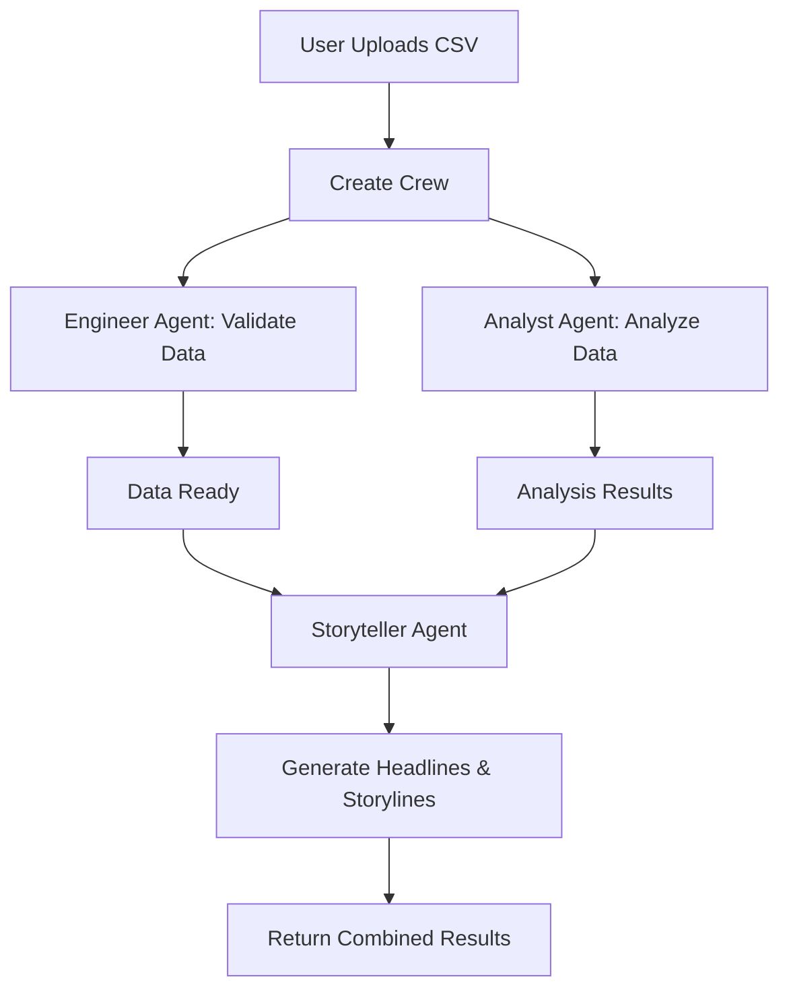

# CrewAI Example: NBA Data Analysis

This example demonstrates a complete NBA data analysis application using CrewAI's multi-agent framework. The application uses three specialized agents working together to analyze NBA statistics and generate engaging narratives.

## Overview

The NBA Analysis application showcases how to:
- Create specialized AI agents for different roles (Engineer, Analyst, Storyteller)
- Use tools to interact with data (CSV files, vector databases)
- Orchestrate parallel and sequential task execution
- Generate insights and narratives from data

## Architecture

The application uses a three-agent system:

1. **Data Engineer Agent**: Validates and prepares the dataset
2. **Data Analyst Agent**: Performs statistical analysis and extracts insights
3. **Storyteller Agent**: Creates engaging headlines and narratives from analysis results

### Execution Flow



## Key Components

### Utils Module (`crewai_utils.py`)

The utils module contains all reusable functions:
- **Configuration**: LLM setup, data paths
- **Vector Database**: Semantic search functionality
- **Tools**: Data access tools for agents
- **Agents**: Agent creation functions
- **Tasks**: Task creation functions
- **Crews**: Crew orchestration functions
- **App Functions**: Gradio interface functions

### Tools Available to Agents

1. **read_nba_data**: Read sample rows from CSV
2. **search_nba_data**: Filter and search CSV data
3. **get_nba_data_summary**: Get comprehensive dataset overview
4. **semantic_search_nba_data**: Natural language semantic search using vector embeddings
5. **analyze_nba_data**: Execute pandas operations for advanced analysis

## Usage Example

### Basic Analysis

```python
from crewai_utils import create_crew

# Create and run crew
crew = create_crew()
result = crew.kickoff()

# Access results
print(result.tasks_output[0])  # Engineer output
print(result.tasks_output[1])  # Analyst output
```

### Custom Query Analysis

```python
from crewai_utils import create_flow_crew, NBA_DATA_PATH

# Ask a specific question
query = "Who are the top 5 three-point shooters?"

# Create crew with custom query
crew = create_flow_crew(query, NBA_DATA_PATH)
result = crew.kickoff()

# Results include Engineer, Analyst, and Storyteller outputs
```

### Quick Questions (Analyst Only)

```python
from crewai_utils import create_analyst_only_crew, NBA_DATA_PATH

# Quick question - only Analyst agent
query = "What team has the best win rate?"
crew = create_analyst_only_crew(query, NBA_DATA_PATH)
result = crew.kickoff()
```

## Implementation Details

### Task Dependencies

The application uses task dependencies to control execution flow:

- **Engineering Task**: Independent (runs first)
- **Analysis Task**: Can run in parallel with Engineering Task (no dependency)
- **Storytelling Task**: Depends on Analysis Task (waits for analysis results)

This allows for efficient parallel execution while ensuring data flows correctly.

### Vector Database

The application uses ChromaDB with sentence-transformers for semantic search:
- First run: Indexes the CSV file into vector embeddings
- Subsequent runs: Uses cached embeddings for fast semantic search
- Enables natural language queries like "high scoring games with many three pointers"

### LLM Configuration

The application uses OpenAI's API (configurable via environment variables):
- Default model: `gpt-4o`
- Can be configured via `OPENAI_API_KEY` and `OPENAI_MODEL` environment variables
- All agents share the same LLM instance for consistency

## Example Queries

The application can handle various types of queries:

- **Top N queries**: "Who are the top 5 three-point shooters?"
- **Statistical analysis**: "What team has the highest average points per game?"
- **Pattern detection**: "Find players with the best field goal percentage"
- **Semantic search**: "Show me high scoring games with many assists"
- **Comprehensive analysis**: Leave query blank for full dataset analysis

## Output Format

The application returns structured results:

1. **Engineer Output**: Dataset validation and structure confirmation
2. **Analyst Output**: Statistical analysis, insights, and findings
3. **Storyteller Output**: Engaging headlines and narratives (if storyteller agent is used)

## Best Practices Demonstrated

1. **Modular Design**: All functions in `crewai_utils.py`, notebooks call functions
2. **Tool Documentation**: All tools have clear docstrings for agents
3. **Error Handling**: Graceful error handling in app functions
4. **Shared LLM**: Single LLM instance shared across agents
5. **Task Dependencies**: Clear dependency management for sequential execution
6. **Parallel Execution**: Independent tasks run in parallel for efficiency

## Running the Example

See `crewai.example.ipynb` for a complete runnable example that demonstrates:
- Setting up the environment
- Running basic analysis
- Custom query analysis
- Using individual components
- Direct tool usage
- Vector database operations
- Multiple queries in sequence

## Requirements

- Python 3.11 or 3.12
- OpenAI API key
- Required packages: `crewai`, `pandas`, `chromadb`, `sentence-transformers`, `gradio`

## Next Steps

1. Explore the API: See `crewai.API.ipynb` for native CrewAI API usage
2. Run the example: Execute `crewai.example.ipynb` to see the full workflow
3. Customize: Modify agents, tasks, or tools in `crewai_utils.py`
4. Extend: Add new tools or agents for your specific use case
