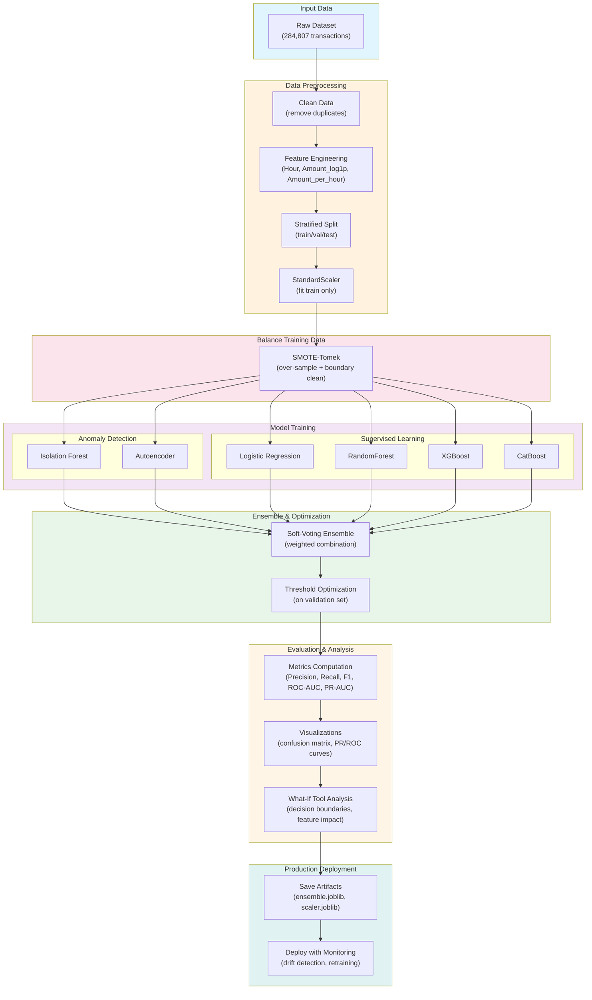

# Credit Card Fraud Detection (MSML610 Fall 2025)

Graduate-level anomaly detection and fraud classification project using the Kaggle credit card dataset. This project demonstrates end-to-end machine learning engineering with emphasis on class imbalance handling, ensemble methods, model interpretability, and interactive decision-boundary analysis via the What-If Tool (WIT).

## Project Overview

The objective of this project is to build a production-grade fraud detection system that:

- Identifies fraudulent credit card transactions with high precision and recall
- Combines multiple anomaly detection techniques (Isolation Forest, autoencoder) with supervised learning (Logistic Regression, RandomForest, XGBoost, CatBoost)
- Uses a weighted soft-voting ensemble to leverage model diversity and improve generalization
- Includes threshold optimization on validation data to balance false positive and false negative rates
- Provides interactive exploration of decision boundaries and feature sensitivity through the What-If Tool
- Implements strict validation discipline to prevent data leakage (train-only scaling, SMOTE-Tomek on training data only)

## Project Structure

- `READme.md` – this comprehensive guide with quickstart, architecture, and troubleshooting
- `WIT.API.md` – detailed API documentation for all utility functions
- `WIT.API.ipynb` – hands-on walkthrough of each API function with minimal examples
- `WIT.example.md` – narrative guide to the complete end-to-end workflow
- `WIT.example.ipynb` – full pipeline execution with EDA, modeling, evaluation, and WIT analysis
- `WIT_utils.py` – data IO, cleaning, feature engineering, scaling, SMOTE-Tomek balancing, anomaly/supervised models, ensembles, evaluation, and WIT integration
- `Dockerfile` – containerized development environment with JupyterLab, TensorFlow, and WIT pre-installed
- `requirements.txt` – Python package dependencies
- `data/raw/creditcard.csv` – raw Kaggle credit card fraud dataset (284,807 transactions, 0.17% fraud rate)
- `data/processed/creditcard_processed.csv` – processed dataset after feature engineering
- `artifacts/` – serialized models (ensemble.joblib, scaler.joblib) for deployment

## Visual Documentation: Architecture and Workflows

### System Architecture Diagram




## Key Features & Task Fulfillment

### 1. Data Preprocessing
- Feature normalization using `StandardScaler` (fit on training data only to prevent leakage)
- Address severe class imbalance (0.17% fraud) using SMOTE-Tomek: over-sample minority class then remove Tomek links at decision boundaries
- Feature engineering: extract hour-of-day from transaction timestamp, log-transform transaction amount, compute amount-per-hour ratios
- Stratified train/test/validation splits to preserve fraud ratio across all folds

### 2. Anomaly Detection Models
- **Isolation Forest**: Unsupervised baseline tuned to dataset fraud rate; returns normalized anomaly scores
- **Autoencoder**: Dense Keras neural network trained on normal transactions; identifies anomalies via reconstruction error exceeding 99.5th percentile threshold

### 3. Supervised Baselines
- Logistic Regression with class weighting for imbalanced data
- RandomForest with class weighting and tuned hyperparameters
- XGBoost with `scale_pos_weight` parameter to handle class imbalance
- CatBoost with balanced class weight vectors

### 4. Ensemble Methods
- Soft-voting ensemble combining all supervised models with learned weights
- Heavier weights on gradient boosting models (XGBoost, CatBoost) and RandomForest
- Validation-based threshold optimization to maximize F1-score

### 5. Hybrid Fusion Approach
- Blend anomaly detection scores (Isolation Forest, autoencoder) with supervised ensemble probabilities
- Provides stronger separation and captures both unsupervised and supervised signals

### 6. Performance Evaluation
- Precision, Recall, F1-Score for binary classification
- ROC-AUC and PR-AUC (Area Under Precision-Recall Curve)
- Confusion matrices and detailed classification reports
- Threshold tuning swept across precision-recall curves to optimize for production requirements

### 7. What-If Tool (WIT) Analysis
- Interactive exploration of decision boundaries on held-out test samples
- Feature manipulation: adjust transaction amount, hour-of-day to observe model response
- False positive/negative investigation: filter examples and understand failure modes
- Model sensitivity analysis: evaluate robustness to realistic feature perturbations

## Docker Setup Guide (Containerized Environment)
This project includes a fully containerized environment with all dependencies (TensorFlow, WIT, XGBoost, CatBoost, JupyterLab) pre-installed.

1. **Build the Docker image:**
From the project root directory:
   ```bash
   docker build -t wit-fraud:latest .
   ```
This command builds the Docker image using the provided `Dockerfile`.

2. **Run the Docker container:**
   ```bash
   docker run -it -p 8888:8888 -v "$PWD":/work wit-fraud:latest
   ```
Port 8888 is exposed for JupyterLab
The current project directory is mounted inside the container at `/work`

3. **JupyterLab startup (automatic):**
JupyterLab starts automatically when the container runs.
You should see console output similar to:
   ```bash
   Jupyter Server is running at:
   http://127.0.0.1:8888/lab
   ```
No additional commands are required inside the container.

4. **Access JupyterLab in your browser:**
  [http://localhost:8888](http://localhost:8888)

You can now open and run:

- WIT.API.ipynb
- WIT.example.ipynb

Both notebooks are designed to be restart-and-run-all clean.

## Complete Workflow Overview

The fraud detection pipeline follows a carefully orchestrated sequence to ensure reproducibility and prevent data leakage:

### Phase 1: Data Loading and Exploration
1. Load raw credit card data using `load_raw_data()` from `WIT_utils`
2. Clean data: remove duplicates, handle missing values, ensure correct data types
3. Perform exploratory data analysis (EDA) to understand class imbalance, feature distributions, and temporal patterns
4. Visualize imbalance ratio, transaction amount distributions, and hourly activity patterns

### Phase 2: Feature Engineering and Data Preparation
1. Engineer features:
   - Extract hour-of-day from transaction timestamp (captures temporal fraud patterns)
   - Log-transform transaction amounts to reduce skewness
   - Compute amount-per-hour ratio to identify bursty spending behavior
2. Perform stratified train/test split (80/20) preserving fraud ratio
3. Create validation fold from training set for threshold optimization
4. Apply StandardScaler normalization to features (fit on training data only)

### Phase 3: Address Class Imbalance
1. Apply SMOTE-Tomek on training data only:
   - SMOTE over-samples minority (fraudulent) transactions
   - Tomek link removal cleans boundary instances that sit on decision margins
2. Verify balanced class distribution in resampled training set
3. Keep test and validation sets unmodified for unbiased evaluation

### Phase 4: Train Anomaly Detection Models
1. **Isolation Forest**: Unsupervised baseline that isolates anomalies in feature space
   - Contamination parameter set to dataset fraud rate (0.17%)
   - Returns binary predictions and normalized anomaly scores
2. **Autoencoder**: Keras neural network trained on normal transactions
   - Learns reconstruction patterns of legitimate transactions
   - Flags transactions with high reconstruction error as anomalies
   - Threshold set at 99.5th percentile of reconstruction error distribution

### Phase 5: Train Supervised Baseline Models
1. **Logistic Regression**: Class-weighted linear classifier
2. **RandomForest**: Class-weighted ensemble of decision trees
3. **XGBoost**: Gradient boosting with scale_pos_weight for imbalance
4. **CatBoost**: Gradient boosting with native class weight handling
5. All supervised models use balanced class weights to emphasize minority class

### Phase 6: Build and Tune Ensemble
1. Construct soft-voting ensemble from supervised models
2. Assign weights: heavier weights to gradient boosting models (XGBoost, CatBoost) and RandomForest
3. Perform threshold optimization on validation set:
   - Sweep decision thresholds from 0 to 1
   - Compute precision, recall, and F1 at each threshold
   - Select threshold that maximizes F1-score (balances precision and recall)
4. Freeze tuned threshold and apply to test set

### Phase 7: Hybrid Fusion (Optional Advanced Technique)
1. Combine anomaly signals (Isolation Forest score + autoencoder reconstruction error) with supervised ensemble probability
2. Creates a multi-signal fraud indicator that captures both unsupervised and supervised perspectives
3. Improves separation and often achieves better overall performance

### Phase 8: Performance Evaluation
1. Compute comprehensive metrics on test set:
   - Precision: ratio of true positives to all positive predictions
   - Recall: ratio of true positives to all actual positives
   - F1-Score: harmonic mean balancing precision and recall
   - ROC-AUC: area under receiver operating characteristic curve
   - PR-AUC: area under precision-recall curve
2. Generate confusion matrices showing true/false positives and negatives
3. Visualize decision boundaries and metric curves

### Phase 9: WIT Analysis and Feature Impact Exploration
1. Build WIT widget with ensemble model on 400-500 held-out test examples
2. Interactive exploration capabilities:
   - Filter and examine false positives (legitimate transactions flagged as fraud)
   - Filter and examine false negatives (fraudulent transactions missed)
   - Use feature sliders to adjust Amount, Hour, and other features
   - Observe model predictions change in real-time
3. Understand feature sensitivity and model robustness
4. Identify edge cases and decision boundary characteristics

### Phase 10: Persistence and Productionization
1. Save processed dataset to `data/processed/creditcard_processed.csv`
2. Serialize trained models and scaler:
   - `artifacts/ensemble.joblib` – trained ensemble model
   - `artifacts/scaler.joblib` – fitted StandardScaler for new predictions
3. Document decision threshold and other tuning parameters
4. Prepare deployment checklist including WIT validation results

## Notebook Structure and Reading Guide

### WIT.API.ipynb – API Reference Layer

This notebook serves as the technical reference and API documentation in executable form. It demonstrates each utility function in isolation with minimal, focused examples.

**Contents by section:**
- Setup and imports: Load utility modules and configure logging
- Data IO layer: `load_raw_data()`, `clean_data()`, `engineer_features()`, `save_processed()`
- Preprocessing: `split_features_target()`, `scale_features()`, `balance_with_smote_tomek()`
- Anomaly detection: `train_isolation_forest()`, `predict_isolation_forest()`, `train_autoencoder()`, `predict_autoencoder()`
- Supervised models: `train_supervised_models()`, individual model inspection
- Ensemble: `build_soft_voting_ensemble()`, `optimize_threshold()` on validation data
- Evaluation: `evaluate_binary_classification()`, metric interpretation
- WIT integration: `build_predict_fn()`, `build_wit_widget()` configuration
- Feature importance: `collect_feature_importance()` aggregation

**How to use:** Run this notebook first to understand the API contract. Each cell is self-contained; you can execute them independently or sequentially. Use this as a reference when building your own fraud detection workflows.

### WIT.example.ipynb – Complete End-to-End Workflow

This notebook demonstrates the full fraud detection pipeline with detailed markdown explanations, rich visualizations, and interpretation guidance. It shows the complete journey from raw data to deployed model.

**Contents by section:**
1. EDA and data exploration: Class imbalance visualization, feature distributions, temporal patterns
2. Data preprocessing: Loading, cleaning, feature engineering with explanations
3. Train/validation/test splitting with fraud ratio preservation
4. Feature scaling with leakage prevention (training-only fit)
5. SMOTE-Tomek balancing on training data only
6. Anomaly model training and evaluation
7. Supervised model training with hyperparameter details
8. Ensemble construction and validation-based threshold optimization
9. Comprehensive evaluation: confusion matrices, PR/ROC curves, metric summaries
10. Hybrid fusion score combining anomaly and supervised signals
11. WIT widget for interactive decision-boundary exploration
12. Model persistence: saving ensemble, scaler, and predictions for deployment

**How to use:** Run this notebook start-to-finish to see the complete pipeline. Pay attention to markdown cells explaining intent, assumptions, and interpretation at each stage. Adjust `N_SAMPLE` parameter for faster development iterations (smaller subset) or `N_SAMPLE=None` for full-data runs.

## Data Leakage Prevention

This project implements strict validation discipline to prevent data leakage:

- **StandardScaler**: Fit statistics (mean, std) computed from training data only; applied to validation and test
- **SMOTE-Tomek**: Applied to training data only; test and validation sets remain unmodified
- **Train/validation/test split**: Stratified to preserve fraud ratio; no data flow from test back to training
- **Threshold optimization**: Performed on validation data; threshold frozen before test evaluation
- **Feature engineering**: Performed before split to avoid temporal leakage within transactions, but split timing ensures no information leaks between folds


## Expected Performance Metrics

Based on representative runs (full dataset, various random seeds):

- **Isolation Forest (unsupervised)**: ROC-AUC ~0.95, Recall ~0.60-0.70
- **Autoencoder (unsupervised)**: ROC-AUC ~0.94, Recall ~0.55-0.65
- **Logistic Regression (supervised)**: ROC-AUC ~0.97, F1 ~0.60-0.70
- **RandomForest (supervised)**: ROC-AUC ~0.98, F1 ~0.65-0.75
- **XGBoost (supervised)**: ROC-AUC ~0.99, F1 ~0.70-0.80
- **CatBoost (supervised)**: ROC-AUC ~0.99, F1 ~0.70-0.80
- **Soft-voting ensemble (validation-tuned threshold)**: ROC-AUC ~0.99, F1 ~0.75-0.85
- **Hybrid fusion (anomaly + supervised)**: ROC-AUC ~0.99+, F1 ~0.78-0.87

Note: Exact numbers depend on data subset size, random seed, and hyperparameter choices. Full runs generally show better stability.

