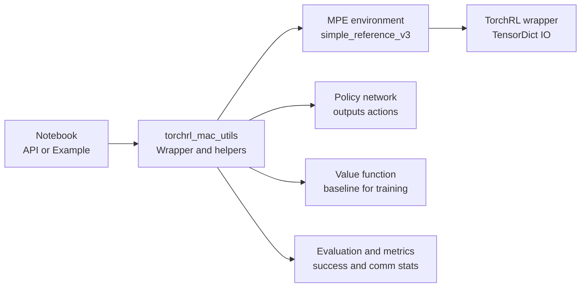

# TorchRL + PettingZoo MPE API Layer (Multi-Agent Communication)

## Goal of this tutorial

This API tutorial introduces a lightweight wrapper layer for **training and evaluating cooperative multi-agent RL policies with communication** on PettingZoo's MPE tasks using TorchRL-friendly primitives.

The focus is on:

- configuring the training run using a single config object,
- running training end-to-end through one clean entrypoint,
- producing standardized plots and evaluation metrics,
- validating communication behavior with measurable signals.

This file explains the interface and design decisions. The corresponding notebook (`TorchRL_MAC.API.ipynb`) demonstrates minimal usage.

---

## Project structure

- `TorchRL_MAC_utils.py`: reusable logic (config, env setup, model construction, training wrapper, evaluation helpers)
- `TorchRL_MAC.API.ipynb`: minimal usage demo of this API
- `TorchRL_MAC.example.*`: end-to-end project narrative + full workflow demo

---

## High-level API: one config + one entrypoint

The API notebook uses **two public functions**:

- `default_cfg()`  
  Returns a configuration object with sane defaults.

- `train_wrapper(cfg)`  
  Runs the full training loop and produces:
  - training curves (loss, return, entropy),
  - checkpointing (saved automatically after training).

### Minimal usage pattern

```python
from TorchRL_MAC_utils import train_wrapper, default_cfg

cfg = default_cfg()
# optionally override cfg fields
train_wrapper(cfg)
```

### High-level architecture (API layer)



## Key design decision: stable agent ordering

Multi-agent training is sensitive to consistent agent ordering. The API enforces a fixed ordering of agents so that:

- per-agent policies always receive the correct agent's observation slot
- communication metrics computed from actions and observations remain comparable across steps/episodes

## Configuration object (what you control)

The API notebook demonstrates editing these fields for stability and reproducibility:

### Data per update (critical for stability)

- `cfg.rollout_len`: number of steps collected per environment per update
- `cfg.num_envs`: number of parallel environments

In the notebook we explicitly set:

```python
rollout_len = 128
num_envs = 4
```

This yields 128 * 4 = 512 samples per update, which is typically much more stable than very small on-policy batches.

### PPO-style optimization knobs (as used in the notebook)

- `cfg.ppo_epochs`: number of optimization epochs per collected batch
- `cfg.clip_param`: PPO clipping parameter for stable policy updates
- `cfg.entropy_coef`: exploration regularization

### Training runtime knobs

- `cfg.num_iters`: total training iterations
- `cfg.lr`: learning rate
- `cfg.hidden_dim`: network width
- `cfg.log_interval`: print/log frequency

### Evaluation knobs

- `cfg.eval_episodes`: number of eval episodes per evaluation phase (used when calling `evaluate()` separately)
- `cfg.eval_interval`: evaluation interval (currently set in notebook but evaluation is done separately after training)

## What train_wrapper(cfg) does (conceptual contract)

At a high level, `train_wrapper(cfg)` performs:

1. Initialize env(s) + policy/value networks from config
2. For each training iteration:
   - Collect rollouts across `num_envs * rollout_len` steps
   - Update policy/value using PPO-style minibatch optimization for `ppo_epochs`
   - Log training metrics (loss, return, entropy) at `log_interval`
3. Generate and display training curves (loss, return, entropy plots)
4. Save checkpoint with trained models

> **Note:** Evaluation (success metrics, communication statistics) is performed separately using the `evaluate()` function after training completes. See `TorchRL_MAC.example.ipynb` for examples of post-training evaluation.
