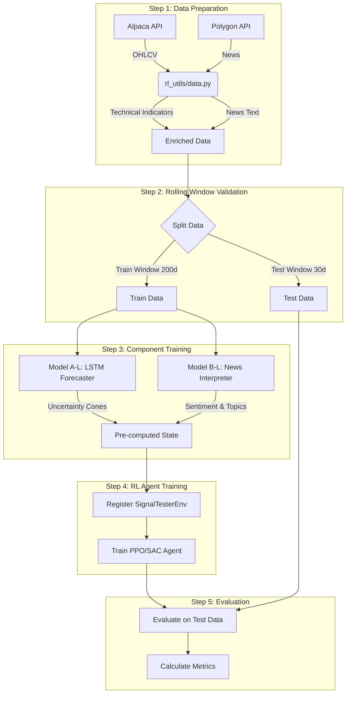

# CleanRL for Stock Trading Signal Generation

## Building an Ensemble RL Strategy

After extensive research into applying reinforcement learning to financial markets, I discovered that single RL agents (PPO, SAC) are not enough on their own. Through experimentation and failed attempts, I learned several critical lessons that shaped this pipeline.

## Why I Built This Architecture

### The Problem with Pure RL Approaches

When I first started this project, I tried the straightforward approach: feed OHLCV data and news directly into an RL agent and let it learn trading signals. This failed spectacularly for several reasons:

1. **RL agents are decision makers, not forecasters**: I realized that PPO and SAC are powerful at learning optimal policies given good state representations, but they're fundamentally not designed to forecast asset movements or detect market regimes from raw price data. They need features that already encode meaningful patterns.

2. **Raw TF-IDF vectors don't work**: My initial attempt involved dumping TF-IDF news vectors directly into the RL agent's observation space. The performance remained completely unchanged—the agent couldn't extract anything meaningful from the high-dimensional sparse text features. It was like giving someone a dictionary and expecting them to understand the story.

3. **Uncertainty matters in finance**: Markets are inherently uncertain, and point forecasts are insufficient. I needed a way to quantify uncertainty and give the RL agent confidence intervals rather than single predictions.

### The Solution: An Ensemble Pipeline

After reviewing recent research on hybrid approaches in algorithmic trading, I designed a three-model ensemble:

**Model A-L (LSTM Forecaster with MC Dropout)**

- Purpose: Forecasts uncertainty cones for price and volatility
- Why: LSTMs can capture temporal dependencies in price movements, and Monte Carlo Dropout provides uncertainty quantification
- Output: 10th, 50th, 90th percentiles for both price and volatility (6 paths × 20 days = 120 features)

**Model B-L (News Interpreter with LM Dictionary + LDA)**

- Purpose: Extracts structured context from news text
- Why: Instead of raw TF-IDF, I use LM (Loughran-McDonald) financial sentiment dictionary combined with LDA topic modeling to create interpretable features
- Output: 3 sentiment scores (positive/negative/uncertainty) + 15 topic probabilities = 18 features

**Model C (RL Agent - PPO/SAC)**

- Purpose: Synthesizes the enriched state into optimal trading signals
- Why: Now that the state encodes meaningful patterns (uncertainty + context), the RL agent can focus on decision-making
- Output: Trading signal vector [directional_bias, volatility_bias, duration]

This decomposition works because each model does what it's good at: the LSTM forecasts, the NLP model interprets, and the RL agent decides.

## Why Monte Carlo Dropout and Uncertainty Forecasting?

I chose Monte Carlo Dropout for uncertainty quantification for several quantitative reasons:

1. **Bayesian approximation at low cost**: MC Dropout provides an approximate Bayesian posterior without the computational overhead of full Bayesian inference. Each forward pass with dropout enabled samples from an implicit distribution over predictions.

2. **Epistemic uncertainty**: In financial forecasting, we care about model uncertainty (epistemic) not just data noise (aleatoric). MC Dropout captures epistemic uncertainty by showing us how confident the model is in its predictions.

3. **Practical benefits for RL**:

   - **Risk management**: Wide uncertainty cones → agent learns to reduce position size or duration
   - **Regime detection**: Uncertainty patterns change across market regimes (bull/bear/sideways)
   - **Calibration**: Percentile forecasts provide natural confidence intervals that the RL agent can condition on

The key insight: by giving the RL agent a distribution of possible futures rather than a single prediction, it learns more robust policies that account for uncertainty.

## The Full Pipeline: From Data to Signals

The following diagram illustrates the complete end-to-end workflow, from raw data ingestion to signal generation and evaluation.



Let me walk through each step and where the code lives:

### Step 1: Data Preparation (`rl_utils/data.py`)

**What happens:**

- Fetch historical OHLCV data for the target asset
- Fetch corresponding news articles from Polygon API
- Calculate technical indicators (moving averages, volatility, momentum, etc.)
- Create rolling news windows (e.g., past 30 days of news for each trading day)

**Code location:** `rl_utils/data.py::prepare_data_features()`
**Note** all code within `rl_utils` folder is prebuilt and imported from my personal quantitative strategy project.

**Key design choice:** I use caching aggressively because API calls are slow and expensive. Each data/news fetch is cached locally with a hash-based key.

### Step 2: Model Training (`rl_env.py`)

**Model A-L (LSTM Forecaster):**

```python
# Location: rl_env.py::train_uncertainty_forecaster()
# Trains on: 60-day lookback windows → 20-day forward predictions
# Output: Saves trained model, used for inference in next step
```

The LSTM is trained to predict two targets:

- Log returns: `log(price_t+1 / price_t)`
- Realized volatility: Rolling 5-day standard deviation of returns

Why these targets? Log returns are more stationary than raw prices, and realized volatility is what we actually care about for risk management.

**Model B-L (News Interpreter):**

```python
# Location: rl_env.py::NewsInterpreter.fit()
# Fits on: Entire corpus of news documents
# Output: Fitted TF-IDF vectorizer + LDA model
```

The interpreter is fitted once on all available news and then used for fast inference. I use:

- TF-IDF with financial stop words removed
- LDA with 15 topics (emperically, more topics led to noise)
- LM Dictionary for sentiment (pre-defined lists of positive/negative/uncertain financial words)

### Step 3: Feature Pre-computation (`generate_env_inputs()`)

**Critical optimization:** Instead of computing forecasts on-the-fly during RL training (which would be impossibly slow), I pre-compute everything once using `generate_env_inputs()`:

```python
# Pre-compute inputs for the entire window
uncertainty_forecasts, news_contexts = generate_env_inputs(
    data_slice, full_data, start_idx,
    forecaster, interpreter, ...
)
```

This takes time upfront (a few minutes for 200 days) but makes training instant. The RL agent just loads precomputed features from memory.

### Step 4: Dynamic Environment Registration

To make the custom environment compatible with CleanRL's `gym.make()` interface while passing in our complex pre-computed data, I register a unique environment ID for each rolling window:

```python
# Register a specific environment for this window (e.g., "SignalTester-w0-v0")
register(
    id=env_id,
    entry_point="rl_env:SignalTesterEnv",
    kwargs={
        "data": train_data,
        "uncertainty_forecasts": train_forecasts, # Pass pre-computed forecasts
        "news_contexts": news_contexts,           # Pass pre-computed news
        "episode_length": 252,
    }
)
```

Now `gym.make(env_id)` creates an environment that already has all the heavy lifting done, allowing the RL agent to step through it extremely fast.

### Step 5: RL Training

I use the `CleanRL_API` modules to train the agent. The training loop is adaptive:

1.  **Algorithm Selection**: I can switch between **SAC** (Soft Actor-Critic) and **PPO** (Proximal Policy Optimization) by setting the `ALGO` flag.
    - **SAC**: Sample-efficient, good for continuous control.
    - **PPO**: Stable, robust, standard baseline.
2.  **Hyperparameters**:
    - `total_timesteps`: 5000 (short training per window)
    - `hidden_size`: 256 (deeper network for 138-dim state)
    - `learning_starts`: 1000 (for SAC)
3.  **Execution**: The agent interacts with the `SignalTesterEnv` using the pre-computed features, making training extremely fast (seconds per window).

## Strategy Validation and Performance

To ensure the strategy isn't just memorizing the past, I use a **Adaptive Rolling Window** approach.

### How I Test Signals

The pipeline iterates through the data in chunks:

- **Train Window**: 200 days. The Forecaster, Interpreter, and RL Agent are trained on this data.
- **Test Window**: 30 days. The trained agent is evaluated on unseen data immediately following the training window.
- **Slide**: The window moves forward by 30 days, and the process repeats.

**Validation approach:**

1.  **Out-of-sample testing**: Performance is only measured on the Test Window.
2.  **Walk-forward validation**: Simulates how the strategy would perform in real-time as models are retrained.
3.  **Signal quality metrics**: I track not just returns, but risk-adjusted metrics.

**Code location:** `CleanRL.example.ipynb` (Main Loop) and `rl_env.py` (Reward Calculation).

The environment calculates realized metrics during testing:

```python
# Reward Function in rl_env.py
# Reward = Directional_Bias * Actual_Sharpe * (1 + Volatility_Bias * Vol_Change)
```

### Performance Metrics I Track

For each window and the aggregated run, I calculate:

- **Cumulative Return**: Total profit/loss.
- **Benchmark Return**: Buy-and-hold return of the underlying asset (e.g., AAPL).
- **Win Rate**: Percentage of days with positive PnL.
- **Sharpe Ratio**: Risk-adjusted return ($Mean(R) / Std(R) * \sqrt{252}$).
- **Sortino Ratio**: Similar to Sharpe but only penalizes downside volatility.
- **Jensen's Alpha**: Excess return over the benchmark adjusted for beta.
- **Plot return vs Bench**: 2 graphs show strategy's return vs the benchmark buy and hold asset return along with a drawdown graph

### Computational Cost

**Training time:**

- **Data Prep**: ~2-3 minutes (fetching 1.5 years of data).
- **Forecaster/Interpreter**: ~1 minute per window.
- **RL Training**: ~1-5 min per window (thanks to pre-computation).
- **Total**: A full backtest over 1.5 years takes about 10-15 minutes due to dockerized jupyter notebook environment.
  Note: the above values show much can done to speedup training using parallelization, gpu acceleration etc.

## Conclusion

This project demonstrates a **Ensemble RL** approach to algorithmic trading. By decomposing the problem into **Forecasting** (LSTM), **Interpretation** (NLP), and **Decision Making** (RL), we create a system that is more robust and interpretable than a "black box" end-to-end RL agent. The use of **CleanRL** ensures the RL component is using transparent, verified implementations, while the custom `SignalTesterEnv` bridges the gap between financial data and reinforcement learning.

Though the results might seem, not up to standard of a production ready strategy, further optimizations can be made in hyperparameter tuning, changing from a adaptive rolling window to a online learning approach i.e the model is never re-trained rather learns on the go "online", another straight forward update would be to feed in the previous actions the model took on test data into the next run or learning period to promote robustness.

A single RL agent that follows the Markov Decision Process will be contrained by its own fundamentals i.e we're trying to use more data to train and optimize a singular policy function. the underlying nature of ohlcv data is a brownian motion with the market having many layers like regimes, macro economics, seasonality etc. feeding more data to a singular model will not yeild a optimal approach but cutting edge research shows Hierarchical RL frameworks which consist of multiple RL "meta" agents, with each agent specialized, are far more robust than a single ensemble RL agent.
