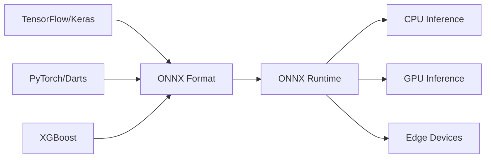

# ONNX API

## Introduction

ONNX (Open Neural Network Exchange) is an open format for representing machine learning models that enables interoperability between different frameworks. In the context of time series forecasting for financial data, ONNX provides essential infrastructure for bridging the gap between model development and production deployment.

### What is ONNX?

At its core, ONNX addresses several critical challenges in machine learning deployment:

- **Framework Independence**: Train models in TensorFlow, PyTorch, or scikit-learn, then deploy anywhere
- **Performance Optimization**: Execute models with 2-5x faster inference through optimized runtime engines
- **Hardware Acceleration**: Support for CPU, CUDA GPU, TensorRT, and specialized accelerators
- **Cross-Platform Deployment**: Deploy on cloud, edge devices, mobile, and browsers with consistent behavior
- **Model Versioning**: Standardized format for tracking and deploying model versions across environments

### Why ONNX for Stock Price Forecasting?

Traditional approaches to deploying time series models often lock teams into a specific framework ecosystem. A model trained in TensorFlow requires TensorFlow for inference, creating dependencies and limiting deployment options. ONNX provides a structured, flexible framework that addresses these challenges:

- **Production Deployment**: Optimized inference engines reduce latency for real-time trading systems
- **Model Portability**: Train with the best framework for development, deploy with the best runtime for production
- **Hardware Flexibility**: Seamlessly switch between CPU and GPU execution without model changes
- **Integration Simplicity**: Standard format simplifies integration with existing trading infrastructure

## Native ONNX API Overview

The native ONNX ecosystem consists of two primary components that work together to enable framework-independent machine learning.

### ONNX Model Format

The ONNX model format provides a standardized representation of computational graphs. A model consists of nodes representing operations and edges representing data flow between operations. Each node has specific operator types, attributes, and input/output specifications.

The format captures the complete computational graph including weights, biases, and layer configurations. This allows any ONNX-compatible runtime to load and execute the model without requiring the original training framework.

**Model Structure Components:**
- **Graph**: The computational structure with nodes and edges
- **Nodes**: Individual operations like matrix multiplication, convolution, or activation functions
- **Initializers**: Model parameters like weights and biases
- **Metadata**: Version information, producer details, and model documentation

### ONNX Runtime Inference Engine

ONNX Runtime is a high-performance inference engine that executes ONNX models across different hardware platforms. It implements graph-level optimizations and operator-level optimizations to maximize throughput and minimize latency.

**Execution Providers:**

ONNX Runtime uses execution providers as pluggable backends for different hardware:
- **CPU Execution Provider**: Optimized CPU inference using vectorization and multi-threading
- **CUDA Execution Provider**: NVIDIA GPU acceleration with kernel fusion
- **TensorRT Execution Provider**: NVIDIA TensorRT integration for maximum GPU performance
- **DirectML Execution Provider**: Windows GPU acceleration via DirectML
- **OpenVINO Execution Provider**: Intel hardware optimization

The runtime automatically selects the best execution provider based on availability and falls back gracefully if preferred providers are unavailable.

**Graph Optimization Levels:**

ONNX Runtime performs optimizations at different levels:
- **Basic**: Constant folding, redundant node elimination, simple algebraic simplifications
- **Extended**: Layout optimizations, kernel fusion, memory planning
- **All**: Aggressive optimizations including layout transformations and operator replacements

These optimizations happen transparently during session initialization, requiring no code changes.

### Model Conversion APIs

Different frameworks provide conversion paths to ONNX format, each with framework-specific considerations.

**TensorFlow/Keras to ONNX:**

Keras 3 provides native ONNX export through the model export API. The conversion process translates Keras layers into equivalent ONNX operators. However, certain optimizations like CuDNN-accelerated LSTM layers are not directly compatible with ONNX and require special handling.

The conversion challenge with LSTM models stems from CuDNN's fused implementation, which combines multiple operations into a single optimized kernel. ONNX requires standard LSTM operations without CuDNN fusion. The solution involves recreating the model architecture with CuDNN disabled before conversion.

**PyTorch to ONNX:**

PyTorch provides ONNX export through tracing or scripting. The export process captures the computational graph by running a forward pass with example inputs. For time series models like TCN (Temporal Convolutional Networks), the export must handle dynamic batch sizes and sequence lengths.

**XGBoost to ONNX:**

Tree-based models like XGBoost convert to ONNX through sklearn-onnx converters. The conversion translates decision tree ensembles into ONNX graph structures. When combined with preprocessing pipelines, the entire prediction workflow (scaling, feature transformation, and model inference) can be converted to a single ONNX graph.

### Model Verification

ONNX provides validation tools to ensure converted models conform to the specification. Verification checks include:
- Graph connectivity ensuring all nodes have valid inputs
- Type consistency across connections
- Operator compatibility with specified opset versions
- Shape inference correctness
- Attribute validity for each operator type

Verification catches conversion issues before deployment, preventing runtime failures in production systems.

## Wrapper Utilities Layer

The wrapper utilities provide a simplified Python interface on top of the native ONNX API, abstracting common patterns and handling framework-specific edge cases.

### Design Philosophy

The wrapper layer follows these principles:
- **Simplicity**: Single-function interfaces for common operations
- **Robustness**: Automatic handling of framework-specific issues
- **Consistency**: Uniform API across different model types
- **Transparency**: Clear error messages and validation feedback

### Model Conversion Wrapper

The conversion wrapper unifies the conversion process across different frameworks while handling common pitfalls automatically.

**Automatic CuDNN Handling:**

The wrapper detects Keras models with CuDNN LSTM layers and automatically recreates the model architecture with standard LSTM operations. This process:
1. Loads the original model and extracts its configuration
2. Modifies LSTM layer configurations to disable CuDNN
3. Recreates the model from the modified configuration
4. Transfers weights from the original model
5. Exports to ONNX format

This automatic handling eliminates a major source of conversion failures.

**Multi-Framework Support:**

The wrapper provides specialized converters for:
- **LSTM models**: Keras LSTM with automatic CuDNN handling
- **TCN models**: Darts TCN (PyTorch-based) with proper input/output formatting
- **XGBoost models**: Pipeline conversion including preprocessing steps

Each converter handles framework-specific requirements while presenting a consistent interface.

### Verification Wrapper

The verification wrapper extends ONNX's validation with structured output suitable for automated testing and logging.

**Structured Results:**

Instead of raising exceptions on validation failure, the wrapper returns a dictionary containing:
- Validation success/failure status
- Detailed error messages if validation fails
- Model metadata (opset version, node count)
- Additional diagnostic information

This structured approach enables programmatic handling of validation results.

### Inference Session Wrapper

The inference session wrapper simplifies ONNX Runtime usage by eliminating boilerplate and providing convenience methods.

**Automatic Configuration:**

The wrapper handles:
- Input/output name management (no need to track tensor names)
- Automatic dtype conversion (ensures float32 for model compatibility)
- Shape validation and error reporting
- Provider selection with graceful fallbacks

**Convenience Methods:**

The wrapper provides methods to query model metadata:
- Expected input shape for validation
- Output shape for downstream processing
- Active execution provider for performance monitoring

### Framework Comparison Utility

The comparison utility benchmarks inference performance between the original framework and ONNX Runtime, validating both speed and accuracy.

**Performance Metrics:**

The utility measures:
- Inference time for both frameworks on identical inputs
- Speedup factor (framework time / ONNX time)
- Maximum absolute difference between predictions
- Mean absolute difference for statistical validation
- Numerical equivalence within floating-point tolerance

**Validation Approach:**

The comparison runs both models on the same test data and validates:
1. Numerical correctness (predictions within tolerance)
2. Performance improvement (speedup measurement)
3. Consistency across different batch sizes

This dual validation ensures the ONNX model is both correct and performant.

## Production Deployment Considerations

Deploying ONNX models in production requires attention to several operational aspects.

### Performance Optimization

**Execution Provider Selection:**

Choose execution providers based on deployment environment:
- Cloud deployment: CUDA or TensorRT for GPU instances, optimized CPU for CPU instances
- Edge devices: CPU provider with appropriate thread configuration
- Mobile: Platform-specific providers (CoreML, NNAPI)

**Session Configuration:**

Optimize session settings for workload:
- Thread count: Match available CPU cores for throughput
- Graph optimization level: Balance initialization time vs inference speed
- Memory management: Configure arena allocators for memory efficiency

### Model Versioning and Deployment

**Version Management:**

ONNX models should be versioned alongside:
- Training data version
- Feature engineering code version
- Scaler parameters for denormalization
- Performance metrics on validation data

This comprehensive versioning enables reproducing predictions and rolling back if needed.

**Deployment Pipeline:**

A typical deployment pipeline includes:
1. Model training and validation
2. ONNX conversion and verification
3. Performance benchmarking
4. Integration testing with production data formats
5. Gradual rollout with monitoring

### Monitoring and Observability

**Inference Monitoring:**

Production systems should monitor:
- Inference latency (p50, p95, p99 percentiles)
- Throughput (requests per second)
- Error rates (validation failures, runtime errors)
- Prediction distributions (detect data drift)

**Model Performance Tracking:**

Track model accuracy over time:
- Compare predictions against actual outcomes
- Calculate rolling accuracy metrics
- Alert on performance degradation
- Trigger retraining when accuracy drops

---

For a complete implementation example demonstrating this architecture, see `onnx_forecasting.API.md`.
