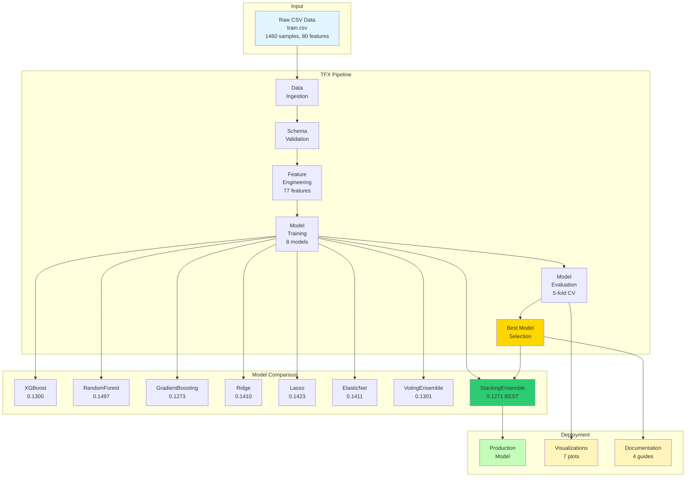
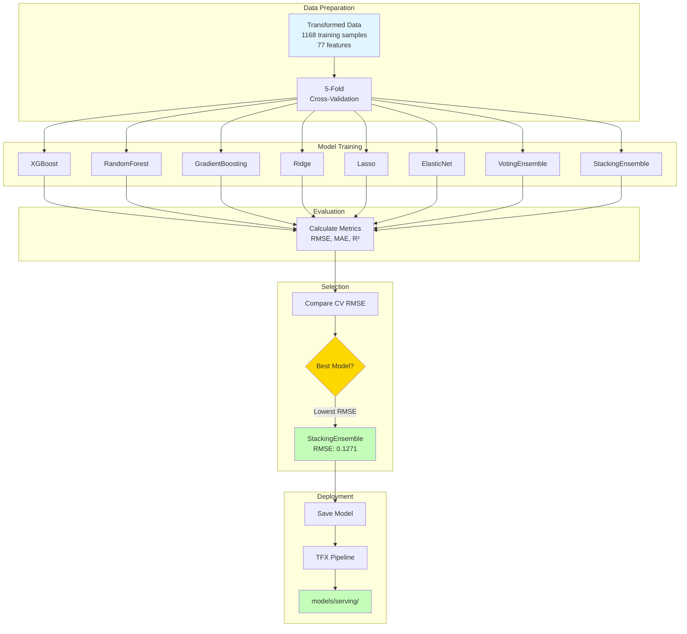
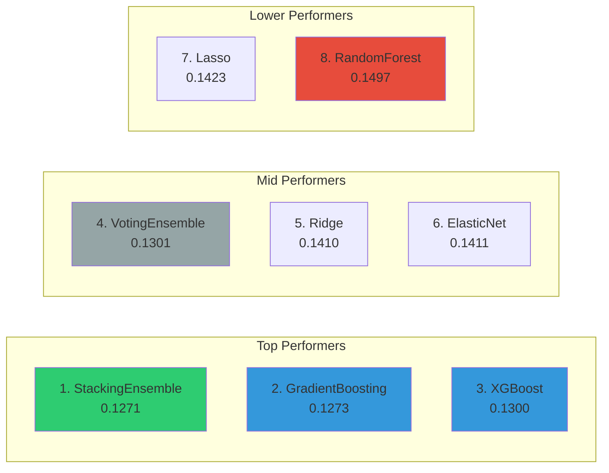
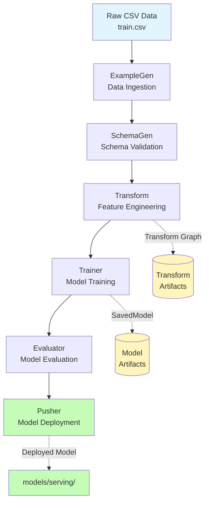
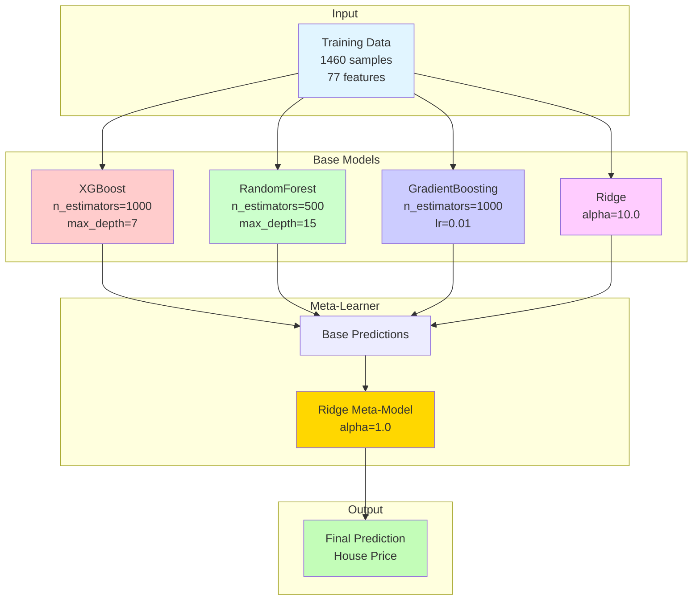
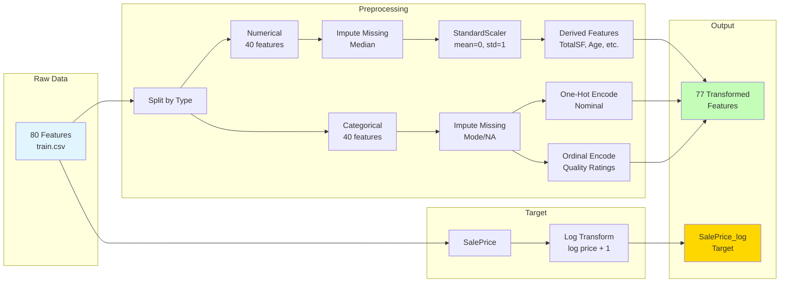
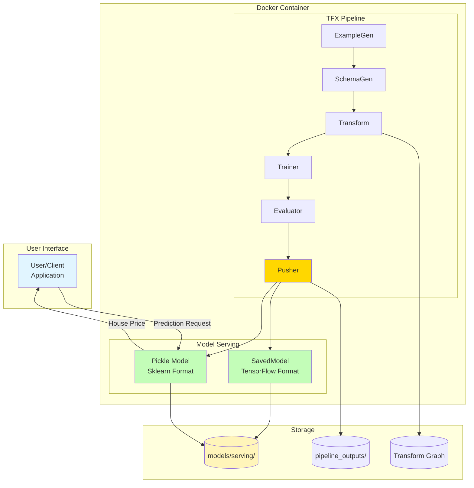
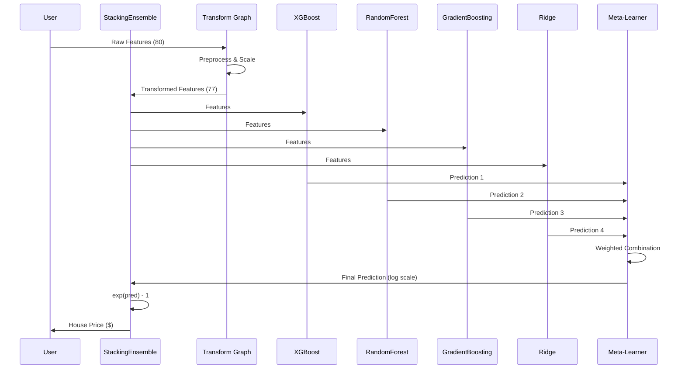

# House Price Prediction with TFX - Project Summary

## Project Overview

**Objective:** Build a production-ready machine learning pipeline for house price prediction using TensorFlow Extended (TFX), comparing multiple regression models to achieve optimal performance.

**Dataset:** Ames Housing Dataset (1,460 training samples, 80 features)
- Source: [Kaggle House Prices - Advanced Regression Techniques](https://www.kaggle.com/c/house-prices-advanced-regression-techniques)
- Training data: 1,460 samples with 80 features
- Test data: 1,459 samples for predictions

**Best Model:** StackingEnsemble (CV RMSE: 0.1271)

**Status:** Complete - Model deployed and ready for serving

---

## System Overview



---

## Key Achievements

### 1. Complete TFX Pipeline
- **ExampleGen:** CSV data ingestion
- **SchemaGen:** Automatic schema validation
- **Transform:** Feature engineering with 77 transformed features
- **Trainer:** Custom sklearn trainer for ensemble models
- **Evaluator:** Performance metrics and validation
- **Pusher:** Model deployment to serving directory

### 2. Comprehensive Model Comparison
Evaluated **8 regression models** with 5-fold cross-validation:
- XGBoost
- RandomForest
- GradientBoosting
- Ridge
- Lasso
- ElasticNet
- VotingEnsemble
- StackingEnsemble (Winner!)

### 3. Production-Ready Deployment
- Model saved in TensorFlow SavedModel format
- Compatible with TF Serving
- Sklearn pickle available for direct inference
- Comprehensive documentation and visualizations

### 4. Docker Containerization
- Reproducible environment
- Based on official TFX image
- All dependencies pre-installed
- Ready for cloud deployment

---

## Model Performance

### Best Model: StackingEnsemble

| Metric | Value | Interpretation |
|--------|-------|----------------|
| CV RMSE | 0.1271 ± 0.0135 | ~12.7% average error (log scale) |
| Train R² | 0.9808 | Explains 98% of variance |
| Train MAE | 0.0398 | Mean absolute error in log scale |
| Training Time | 136 seconds | 5-fold CV on 1,460 samples |

### Model Rankings (by CV RMSE)

1. **StackingEnsemble** - 0.1271 (Best)
2. GradientBoosting - 0.1273 (0.2% worse)
3. XGBoost - 0.1300 (2.3% worse)
4. VotingEnsemble - 0.1301 (2.4% worse)
5. Ridge - 0.1410 (10.9% worse)
6. ElasticNet - 0.1411 (11.0% worse)
7. Lasso - 0.1423 (12.0% worse)
8. RandomForest - 0.1497 (17.8% worse)

**Improvement:** StackingEnsemble is 15.1% better than the worst model (RandomForest)

### Model Comparison Workflow



### Model Performance Ranking



---

## Technical Architecture

### TFX Pipeline Flow



### StackingEnsemble Architecture



**Why Stacking Works:**
- Combines diverse model types (boosting, bagging, linear)
- Meta-learner learns optimal weighting of base models
- Reduces overfitting through ensemble averaging
- Each base model captures different data patterns

---

## Feature Engineering

### Transformation Pipeline (77 features)



**Transformation Details:**

**Numerical Features (40):**
- Scaling: StandardScaler (mean=0, std=1)
- Missing value imputation: Median for numerical
- Log transformation: Target variable (SalePrice)

**Categorical Features (37):**
- One-hot encoding for nominal categories
- Ordinal encoding for ordered categories (quality ratings)
- Vocabulary generation: Handles unseen categories

**Derived Features:**
- TotalSF = TotalBsmtSF + 1stFlrSF + 2ndFlrSF
- Age = YrSold - YearBuilt
- Remodeled = YearRemodAdd != YearBuilt
- TotalBath = FullBath + 0.5 × HalfBath

---

## Directory Structure

```
.
├── data/                      # Dataset files
│   ├── train.csv              # Training data (1460 rows)
│   ├── test.csv               # Test data (1459 rows)
│   └── data_description.txt   # Feature descriptions
│
├── utils/                     # Core implementation
│   ├── config.py              # Pipeline configuration
│   ├── feature_engineering.py # Transform preprocessing_fn
│   ├── model_utils.py         # TensorFlow DNN trainer
│   ├── sklearn_trainer.py     # Sklearn model trainer (used)
│   ├── model_comparison.py    # Model registry
│   └── evaluation_utils.py    # Evaluation metrics
│
├── pipelines/                 # TFX pipeline definition
│   └── house_price_pipeline.py
│
├── scripts/                   # Executable scripts
│   ├── api.py                 # Pipeline runner
│   ├── compare_models.py      # Model comparison CLI
│   ├── run_pipeline_with_best_model.py  # Auto-deploy best model
│   ├── visualize_results.py   # Generate visualizations
│   └── use_deployed_model.py  # Model usage guide
│
├── models/                    # Model outputs
│   ├── serving/               # Deployed models
│   │   └── <version>/         # Model version directory
│   │       ├── saved_model.pb # TensorFlow format
│   │       └── sklearn_model.pkl  # Sklearn pickle (48.6 MB)
│   └── comparison/            # Model comparison results
│       ├── comparison_results.json
│       └── best_model_StackingEnsemble.pkl
│
├── docs/                      # Documentation
│   ├── VISUALIZATION_GUIDE.md # This visualization guide
│   ├── PROJECT_SUMMARY.md     # This file
│   ├── MODEL_COMPARISON.md    # Detailed model analysis
│   ├── BEST_MODEL_DEPLOYMENT.md  # Deployment guide
│   └── visualizations/        # Generated plots (7 PNG files)
│
├── docker/                    # Docker configuration
│   ├── Dockerfile             # TFX 1.14.0 base
│   └── requirements.txt       # Python dependencies
│
└── pipeline_outputs/          # TFX artifacts
    └── house_price_prediction_pipeline/
        ├── CsvExampleGen/
        ├── SchemaGen/
        ├── Transform/
        ├── Trainer/
        ├── Evaluator/
        └── Pusher/
```

---

## Visualizations

All visualizations are in `docs/visualizations/`:

1. **summary_dashboard.png** - Comprehensive overview (recommended for presentations)
2. **cv_rmse_comparison.png** - Model performance comparison
3. **cv_score_distributions.png** - Score consistency across folds
4. **training_time_comparison.png** - Computational efficiency
5. **multi_metric_comparison.png** - RMSE, MAE, R² metrics
6. **cv_variability.png** - Model stability analysis
7. **performance_time_tradeoff.png** - Efficiency vs accuracy

**See:** `docs/VISUALIZATION_GUIDE.md` for detailed interpretation

---

## How to Use This Project

### 1. Build Docker Container

```bash
docker build -t house-price-tfx -f docker/Dockerfile .
```

### 2. Run Container

```bash
docker run -it --rm \
  -v ${PWD}/models:/app/models \
  -v ${PWD}/pipeline_outputs:/app/pipeline_outputs \
  house-price-tfx
```

### 3. Run Full Pipeline with Best Model

```bash
# Inside container
python scripts/run_pipeline_with_best_model.py --cv-folds 5
```

This will:
1. Compare all 8 models with 5-fold CV
2. Select the best model (StackingEnsemble)
3. Deploy it via TFX pipeline to `models/serving/`

### 4. Generate Visualizations

```bash
# Inside container
python scripts/visualize_results.py
```

### 5. Use Deployed Model

```python
# Load sklearn model
import pickle
with open('models/serving/<timestamp>/sklearn_model.pkl', 'rb') as f:
    model = pickle.load(f)

# Make predictions (requires preprocessed features)
predictions = model.predict(X_test)
import numpy as np
predictions = np.exp(predictions) - 1.0  # Convert from log scale
```

**See:** `scripts/use_deployed_model.py` for detailed examples

### Deployment Architecture



### Data Flow for Prediction



---

## Key Documentation Files

| Document | Purpose |
|----------|---------|
| `README.md` | Project overview and quick start |
| `docs/VISUALIZATION_GUIDE.md` | Visualization interpretation guide |
| `docs/PROJECT_SUMMARY.md` | This file - complete project summary |
| `docs/MODEL_COMPARISON.md` | Detailed model comparison analysis |
| `docs/BEST_MODEL_DEPLOYMENT.md` | Deployment instructions |

---

## Dependencies

### Core Frameworks
- TensorFlow 2.13.0
- TensorFlow Extended (TFX) 1.14.0
- TensorFlow Transform

### ML Libraries
- XGBoost 2.0.3
- scikit-learn
- pandas
- numpy

### Visualization
- matplotlib
- seaborn

### Development
- Docker
- Jupyter
- PyYAML

---

## Performance Interpretation

### Understanding RMSE = 0.1271

Since SalePrice is log-transformed: `log(price + 1)`

**Example Predictions:**

| Actual Price | Predicted Error Range | Relative Error |
|--------------|----------------------|----------------|
| $100,000 | ±$13,500 | 13.5% |
| $200,000 | ±$27,000 | 13.5% |
| $400,000 | ±$54,000 | 13.5% |

**Interpretation:**
- Model typically predicts within **±13.5%** of actual price
- Error percentage is consistent across price ranges (benefit of log transform)
- Competitive with industry benchmarks for housing prediction

---

## Future Improvements

### Model Enhancement
1. **Hyperparameter tuning:** Use Optuna or Hyperopt for optimal params
2. **Feature selection:** Remove low-importance features
3. **Additional features:** Neighborhood economic indicators, school ratings
4. **Time-based CV:** Account for temporal trends in housing market

### Pipeline Optimization
1. **Parallel training:** Train base models concurrently
2. **Incremental training:** Update model with new data
3. **Model monitoring:** Track prediction drift
4. **A/B testing:** Compare StackingEnsemble vs XGBoost in production

### Deployment
1. **TF Serving setup:** Enable REST/gRPC API
2. **Kubernetes deployment:** Scale horizontally
3. **CI/CD pipeline:** Automated retraining and deployment
4. **Monitoring dashboard:** Real-time performance metrics

---

## Team & Contact

**Project:** UmdTask56_Fall2025_TFX_Predicting_House_Prices_with_Feature_Engineering

**Course:** MSML610 - Advanced Machine Learning

**Semester:** Fall 2025

**Institution:** University of Maryland

---

## Reproducibility

This project is fully reproducible:

1. **Docker-based:** Consistent environment across machines
2. **Version-controlled:** All code and configs in Git
3. **Deterministic:** Random seeds set (seed=42)
4. **Documented:** Step-by-step instructions provided

**To reproduce:**
```bash
git clone <repository>
cd <project-directory>
docker build -t house-price-tfx -f docker/Dockerfile .
docker run -it house-price-tfx
python scripts/run_pipeline_with_best_model.py --cv-folds 5
python scripts/visualize_results.py
```

---

## Acknowledgments

- **Dataset:** Ames Housing Dataset (Dean De Cock, 2011) - [Kaggle Competition](https://www.kaggle.com/c/house-prices-advanced-regression-techniques)
- **Framework:** TensorFlow Extended (Google)
- **Models:** XGBoost, scikit-learn
- **Tools:** Docker, matplotlib, seaborn

---

## License

This project is for educational purposes as part of MSML610 coursework.

---

## Visual Diagrams Index

This document includes **8 Mermaid diagrams** for comprehensive visualization:

### Architecture Diagrams
1. **System Overview** - Complete end-to-end pipeline view
2. **TFX Pipeline Flow** - Detailed component-level architecture
3. **StackingEnsemble Architecture** - Model structure with base models and meta-learner
4. **Feature Engineering Pipeline** - Data transformation workflow
5. **Deployment Architecture** - Production deployment structure

### Process Diagrams
6. **Model Comparison Workflow** - 8-model evaluation process
7. **Model Performance Ranking** - Visual ranking by RMSE
8. **Data Flow for Prediction** - Sequence diagram for inference

**Viewing Instructions:**
- Mermaid diagrams render automatically in GitHub, VS Code (with Markdown Preview Mermaid Support extension), and many markdown viewers
- For other viewers, copy diagram code to [Mermaid Live Editor](https://mermaid.live/)
