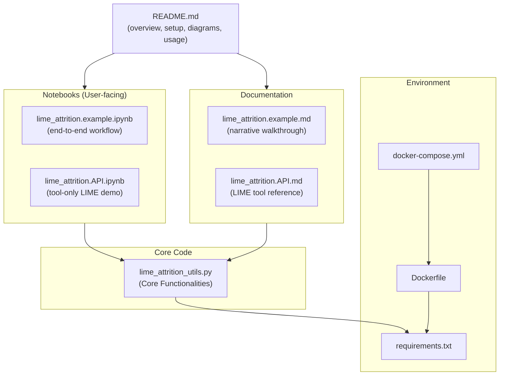
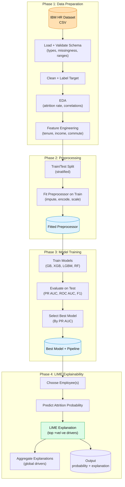
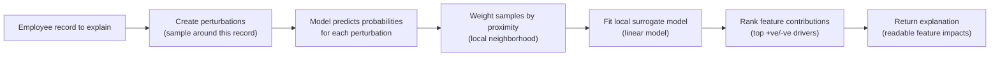

# UmdTask62 – Employee Attrition Prediction with LIME

**Author Name: Dhanush Garikapati**  
**UID: 121324924**

This project implements a complete, explainable machine learning pipeline for **employee attrition prediction** using **LIME (Local Interpretable Model-agnostic Explanations)**. The system:

- Loads and cleans the IBM HR Employee Attrition dataset.
- Engineers additional features related to compensation, tenure, and commute.
- Trains several gradient-boosting–based models (GradientBoosting, XGBoost, LightGBM, RandomForest).
- Selects a best-performing model using metrics suited to imbalanced classification (especially PR AUC).
- Uses LIME to explain individual predictions and to derive **global drivers** of attrition.
- Includes a **bonus feature-subset experiment** that studies how explanations change when restricting to different feature groups.

The project is organized to emphasize a clean internal API (`lime_attrition_utils.py`) and a thin wrapper layer in example notebooks, consistent with the MSML610 LIME project requirements.

You can run the project either:

- In a **local Python virtual environment (venv)**, or  
- Using the provided **Dockerfile + docker-compose.yml** to start a Jupyter environment in a container.

---

## 1. Overview

This repository demonstrates how to combine:

- **Modern tree-based models** (e.g., XGBoost, LightGBM, GradientBoosting) for tabular HR data.
- **A reusable API layer** encapsulating all data, preprocessing, model, and LIME logic.
- **LIME** for local, model-agnostic explanations.
- **Feature subset experiments** for assessing the stability of explanations.

From a user’s perspective, there are two main entry points:

1. `lime_attrition.example.ipynb` – the **main end-to-end notebook**, showing the full workflow.
2. `lime_attrition.API.ipynb` + `lime_attrition.API.md` – **tool-focused LIME artifacts**, explaining and demonstrating the native LIME tabular API (on a synthetic dataset) plus a small, generic helper layer for common usage patterns.

Everything is designed to be run either in a standard Python environment (venv) or inside Docker.

### 1.1 Dataset

This project uses the **IBM HR Employee Attrition** dataset (commonly distributed as `WA_Fn-UseC_-HR-Employee-Attrition.csv`) and expects it under `data/` by default.

**Primary target**
- `Attrition` *(categorical: Yes/No)* is converted into a binary label `AttritionTarget ∈ {0,1}` for modelling.

**Feature columns (original schema)**
- **Identifiers / quasi-identifiers**
  - `EmployeeNumber` *(int)*: unique employee identifier. This is useful for indexing, but typically not predictive can be excluded from modelling.
- **Likely constant / low-variance columns**
  - `EmployeeCount` *(int)*, `StandardHours` *(int)*, `Over18` *(categorical)*: These are constant in this dataset and removed to avoid zero-variance features.
- **Categorical (one-hot encoded)**
  - `BusinessTravel`, `Department`, `EducationField`, `Gender`, `JobRole`, `MaritalStatus`, `OverTime` are *categorical strings*.
- **Numeric (scaled)**
  - `Age`, `DailyRate`, `DistanceFromHome`, `HourlyRate`, `MonthlyIncome`, `MonthlyRate`,
    `NumCompaniesWorked`, `PercentSalaryHike`, `TotalWorkingYears`, `TrainingTimesLastYear`,
    `YearsAtCompany`, `YearsInCurrentRole`, `YearsSinceLastPromotion`, `YearsWithCurrManager` are *mostly ints*.
- **Ordinal / rating-style (treated as numeric in this project)**
  - `Education`, `EnvironmentSatisfaction`, `JobInvolvement`, `JobLevel`, `JobSatisfaction`,
    `PerformanceRating`, `RelationshipSatisfaction`, `StockOptionLevel`, `WorkLifeBalance` are *ints with small discrete ranges*.

**How the dataset is used**
- The raw dataset is loaded, validated, and split into features `X` and target `y` with a stratified train/test split.
- A scikit-learn preprocessing pipeline standardizes numeric features and one-hot encodes categorical features.
- Additional engineered features are created (e.g., `IncomePerYearAtCompany`, `TenureRatio`, `LongCommute`, `EarlyCareer`) and are included alongside the original predictors.

**Note on JSON input**
- Training is performed from the canonical CSV file, but the inference/explanation pipeline can accept **JSON** (single record or list-of-records) as long as the JSON fields match the expected feature schema.

---

## 2. Project Layout

All files live under something like:

```text
class_project/MSML610/Fall2025/Projects/UmdTask62_Fall2025_LIME_Employee_Attrition_Prediction/
```

Key files and directories:

- `lime_attrition_utils.py`  
  Core utilities and API layer:
  - Data loading, cleaning, and splitting:
    - Load raw IBM HR CSV.
    - Convert `Attrition` to a binary target.
    - Split into `X` (features) and `y` (target).
    - Train/test split with stratification.
  - Configuration objects:
    - `AttritionDataConfig`
    - `ModelConfig`
    - `LimeConfig`
  - Preprocessing:
    - Build a `ColumnTransformer` with numeric scaling and categorical one-hot encoding.
  - Model training:
    - Train pipelines combining the preprocessor with:
      - `GradientBoostingClassifier`
      - `XGBClassifier`
      - `LGBMClassifier` 
      - `RandomForestClassifier`
  - Evaluation:
    - Compute classification metrics (accuracy, precision, recall, F1, ROC AUC, PR AUC).
    - Return metrics in a convenient dictionary / DataFrame-friendly structure.
  - LIME utilities:
    - Build a LIME explainer from a **fitted** preprocessor and training data.
    - Explain individual employees.
    - Batch explanations and long-format tables.
    - Aggregate and plot global feature importance using mean absolute LIME weights.
  - Bonus helpers:
    - Utilities for feature-subset experiments and consistent feature-name handling.

- `lime_attrition.API.md`  
  Tool-only documentation describing:
  - What LIME is (local, model-agnostic explanations) and when it is appropriate to use.
  - The **native LIME tabular API**:
    - `lime.lime_tabular.LimeTabularExplainer`
    - `explainer.explain_instance(...)`
    - `lime.explanation.Explanation` outputs (`as_list`, `as_pyplot_figure`, `save_to_file`)
  - Key implementation considerations (feature-space alignment, `predict_fn` probability shape, stability knobs like `num_samples` and discretization).
  - A short Mermaid flowchart showing the LIME explanation pipeline.
  - A lightweight, **generic helper layer** (thin wrappers) that standardizes common patterns while preserving LIME semantics.

- `lime_attrition.API.ipynb`  
  Tool-only API demonstration notebook:
  - Uses a **synthetic tabular dataset** not the Employee Attrition dataset.
  - Trains a simple probabilistic classifier and demonstrates end-to-end LIME usage:
    - build an explainer, explain a single instance, and render outputs (table/plot/HTML).
  -  uses the generic helper utilities to keep cells minimal and readable.


- `lime_attrition.example.ipynb`  
  Main end-to-end example notebook:
  - Uses the API layer (plus light visualization code) to:
    - Load and clean data.
    - Perform EDA and correlation analysis.
    - Engineer features.
    - Train and evaluate multiple models.
    - Plot ROC and PR curves.
    - Perform error analysis (confusion matrix, FP/FN inspection, and threshold trade-offs).
    - Generate individual, comparative, and aggregate LIME explanations.
    - Perform the feature subset bonus experiment and analyze Jaccard similarity of top LIME features.
  - This is the notebook that tells the full “story” of the project in code.

- `lime_attrition.example.md`  
  Narrative explanation of the example pipeline:
  - Mirrors the structure of `lime_attrition.example.ipynb`.
  - Provides detailed descriptions of each step, design decisions, and results interpretation.
  - Intended for readers who prefer a prose description over code.

- `requirements.txt`  
  Python dependencies for the project. Key packages include:
  - `pandas`
  - `numpy`
  - `scikit-learn`
  - `xgboost`
  - `lightgbm`
  - `lime`
  - `matplotlib`
  - `seaborn`

- `Dockerfile`  
  Container definition for running the project in a reproducible environment:
  - Uses `python:3.10-slim` as the base image.
  - Installs system dependencies (e.g., `build-essential`, `libgomp1`).
  - Sets `/workspace` as the working directory.
  - Installs `requirements.txt`.
  - Copies the project into `/workspace`.
  - Exposes port `8888`.
  - Starts a **Jupyter Notebook** server bound to `0.0.0.0:8888` with no token.

- `docker-compose.yml`  
  Compose file for running the container:
  - Defines an `app` service.
  - Builds from the local `Dockerfile`.
  - Exposes container port `8888` as host port `8888`.
  - Sets environment variables:
    - `TOKENIZERS_PARALLELISM=false`
    - `HF_HUB_DISABLE_TELEMETRY=1`
  - Mounts the current project directory to `/workspace` inside the container.

- `.gitignore`  
  Standard ignore rules (e.g., `__pycache__`, `.venv`, `.ipynb_checkpoints`, etc.).

- `data/`  
  Directory expected to hold the dataset:
  - `WA_Fn-UseC_-HR-Employee-Attrition.csv` (IBM HR dataset).

- `README.md`  
  This file. High-level entry point for anyone viewing the repository.

### 2.1 Project Structure: How files connect



---

## 3. Workflow Overview

The project follows a clear pipeline from raw HR data to LIME-based insights:

### 3.1 Workflow diagram



1. **Data Loading & Cleaning**
   - Load the IBM HR Employee Attrition CSV.
   - Clean columns, standardize types, and create a binary target `AttritionTarget`.

2. **Exploratory Data Analysis (EDA)**
   - Compute overall attrition rate.
   - Explore attrition by key categorical features (`OverTime`, `JobRole`, `Department`, `BusinessTravel`, etc.).
   - Explore numeric distributions by attrition status.
   - Compute numeric correlations with the attrition target and plot a **correlation heatmap**.

3. **Feature Engineering**
   - Create engineered features that capture richer signals, for example:
     - `IncomePerYearAtCompany`
     - `TenureRatio`
     - `LongCommute` (binary)
     - `EarlyCareer` (binary)

4. **Preprocessing & Model Training**
   - Use a scikit-learn `ColumnTransformer` to:
     - Scale numeric features.
     - One-hot encode categorical features.
   - Train multiple models (GradientBoosting, XGBoost, LightGBM, RandomForest) using a consistent preprocessing pipeline.

5. **Model Evaluation & Selection**
   - Evaluate models on:
     - Accuracy, precision, recall, F1
     - ROC AUC
     - Precision–Recall AUC (PR AUC)
   - **Select the best model by PR AUC**, due to class imbalance.
   - Plot ROC and Precision–Recall curves for the chosen model.

6. **LIME Explanations**
   - Build a LIME explainer on top of the **fitted** preprocessing pipeline and training data.
   - Explain:
     - The highest-risk employee.
     - A comparison pair (one predicted to leave vs one predicted to stay).
   - Generate batch explanations for multiple high-risk employees.
   - Aggregate feature importances across employees to identify global drivers.

7. **Bonus: Feature Subset Experiments**
   - Define conceptual feature groups:
     - All features + engineered features (reference).
     - Demographics-only.
     - Workload & work-life.
     - Compensation & tenure.
   - Train a model per subset and generate LIME explanations for the same employee.
   - Compute **Jaccard similarity** between top-k LIME features of each subset model and the full model.
   - Analyze both performance and explanation stability across subsets.
     
8. **What Jaccard similarity means:**
     We treat the “top-k LIME features” from each model as a set of feature names and measure how much the sets overlap.
     A score near **1.0** means the subset-model and full-model explanations highlight **nearly the same features** meaning stable explanation story,
     while a score near **0.0** means they highlight **different features** so the explanation story changes significantly when the feature set changes.


For a narrative, human-readable explanation of this workflow, see `lime_attrition.example.md`.

---

## 4. Dependencies and Environments

You can run this project in **two main ways**:

1. **Local Python + virtual environment (venv)**  
2. **Docker + docker-compose** (recommended if you want a reproducible environment without managing local installs)

### 4.1 Python Dependencies

`requirements.txt` contains:

```text
pandas
numpy
scikit-learn
xgboost
lightgbm
lime
matplotlib
seaborn
```

These cover:

- Data handling (`pandas`, `numpy`)
- Modelling (`scikit-learn`, `xgboost`, `lightgbm`)
- Explainability (`lime`)
- Visualization (`matplotlib`, `seaborn`)

---

## 5. Running with a Local Virtual Environment (venv)

### 5.1 Create and Activate a Virtual Environment

From the project root:

```bash
python -m venv .venv
source .venv/bin/activate      # Linux/macOS
# .venv\Scripts\activate     # Windows PowerShell / cmd
```

### 5.2 Install Dependencies

```bash
pip install --upgrade pip
pip install -r requirements.txt
```

### 5.3 Prepare the Dataset

1. Ensure the IBM HR Employee Attrition dataset (commonly distributed as  
   `WA_Fn-UseC_-HR-Employee-Attrition.csv`) is downloaded.
2. Place the CSV file under:

   ```text
   data/WA_Fn-UseC_-HR-Employee-Attrition.csv
   ```

3. If you use a different filename or path, update the data-loading section of the notebooks accordingly.

### 5.4 Launch Jupyter and Run the Notebooks

```bash
jupyter notebook
# or
jupyter lab
```

Then in your browser:

1. Open `lime_attrition.example.ipynb`.
2. Run all cells from top to bottom.

Expected behavior:

- Data is loaded and cleaned; you see a summary of columns and attrition rate.
- EDA cells produce descriptive tables and plots, including a **numeric correlation heatmap**.
- Models are trained; a metrics table is displayed with accuracy/F1/ROC AUC/PR AUC per model.
- A best model is chosen (typically one of the boosting models, often XGBoost or LightGBM).
- ROC and precision–recall curves are plotted for the best model.
- Error analysis is shown (confusion matrix, FP/FN examples, and an illustrative threshold adjustment).
- LIME explanations are generated for:
  - The highest-risk employee.
  - A comparison between “leave” vs “stay” examples.
- Batch LIME explanations and aggregated driver plots are shown, summarizing global drivers.
- The feature subset bonus experiment runs, producing a table and/or plot of Jaccard similarity vs subset along with associated performance metrics.

You can also open `lime_attrition.API.ipynb` to see smaller, focused **tool-only** LIME usage examples (on a synthetic dataset).

To deactivate the virtual environment:

```bash
deactivate
```

---

## 6. Running with Docker and docker-compose

If you prefer **not** to install Python and libraries directly on your host machine, you can use Docker.

### 6.1 Prerequisites

- Docker installed (Engine + CLI)
- docker-compose (or `docker compose` integrated into Docker)

### 6.2 Build and Start the Container

From the project root:

```bash
docker compose up --build
```

This will:

- Build an image based on the provided `Dockerfile`.
- Install all dependencies from `requirements.txt`.
- Start a container running a Jupyter Notebook server listening on port `8888`.
- Mount your project directory to `/workspace` in the container.

You should see logs indicating that Jupyter is running on `0.0.0.0:8888` with no token.

### 6.3 Connect to Jupyter

In your browser, go to:

- `http://localhost:8888`

You should see the Jupyter file browser for the `/workspace` directory. From there:

- Open `lime_attrition.example.ipynb` and run all cells as described above.
- Open `lime_attrition.API.ipynb` for **tool-only** LIME API examples (synthetic dataset).

Because the project directory is mounted as a volume:

- Any notebook changes you save are written back to your host filesystem.
- Generated figures or intermediate artifacts in the repo directory will persist after you stop the container.

### 6.4 Stopping the Container

In the terminal where `docker compose up --build` is running, press:

```text
Ctrl + C
```

To clean up any stopped containers, you can run:

```bash
docker compose down
```

---

## 7. Documentation

This project includes multiple layers of documentation:

- **`README.md`** (this file) – High-level overview, environment setup, and how to run everything.
- **`lime_attrition.API.md`** – Tool-only LIME reference:
  - Explains what LIME does for tabular classification and the core assumptions behind local surrogate explanations.
  - Documents the native LIME programming interface (`LimeTabularExplainer`, `explain_instance`, and `Explanation` outputs).
  - Summarizes a small, generic helper layer that standardizes common LIME usage patterns.

- **`lime_attrition.API.ipynb`** – Tool-only executable demonstration of:
  - Building a tabular LIME explainer and explaining individual predictions on a **synthetic dataset**.
  - Rendering explanations as a list, plot.
- **`lime_attrition.example.ipynb`** – Main narrative notebook:
  - End-to-end pipeline with EDA, feature engineering, model training, LIME, and bonus analysis.
- **`lime_attrition.example.md`** – Description of:
  - The entire pipeline and design.
  - Model and LIME interpretation.
  - Feature subset experiment and results.

**For new users/learners**, a recommended order is:

1. Read `README.md` to understand the big picture and setup.
2. Run `lime_attrition.example.ipynb` (via venv or Docker) to see the full workflow end-to-end.
3. Refer to `lime_attrition.API.md` and `lime_attrition.API.ipynb` for tool-only LIME concepts, native API usage, and generic usage patterns.
4. Read `lime_attrition.example.md` for a narrative explanation to accompany the notebook.

---

## 8. Key Technical Details

### 8.1 Modelling Pipeline

- Uses a **scikit-learn pipeline**:
  - `("preprocess", ColumnTransformer(...))`
  - `("model", GradientBoostingClassifier / XGBClassifier / LGBMClassifier / RandomForestClassifier)`
- Preprocessing:
  - Numeric: `StandardScaler`
  - Categorical: `OneHotEncoder` (with safe handling of unknown categories)
- Hyperparameters:
  - Chosen to balance performance and training time; customizable via `ModelConfig`.
- Metrics:
  - Accuracy, precision, recall, F1
  - ROC AUC
  - PR AUC (primary for model selection due to class imbalance)

### 8.2 LIME Integration

- Adopts the **Tabular LIME** paradigm:
  - Uses the **fitted preprocessing step** extracted from the pipeline, ensuring LIME sees the same transformed features as the model.
  - Uses the training data (after preprocessing) as the background distribution for perturbations.
- Explanations are:
  - Local (per employee).
  - Model-agnostic (work with any fitted pipeline).
  - Expressed in terms of human-readable feature names (including engineered features and one-hot encoded categories).

#### LIME Internal Pipeline: How explanation is produced



### 8.3 Feature Subset Experiments

- Each subset experiment:
  - Restricts `X_train` / `X_test` to a subset of columns.
  - Trains a new model with its own preprocessor.
  - Builds a LIME explainer for that subset model.
- For a **fixed employee**, the notebook compares:
  - The top-k LIME features under the full model vs subset model.
  - Similarity of explanations using **Jaccard similarity** of feature sets.
- This highlights which feature groups are essential for stable and meaningful explanations.

---

## 9. Results

Exact metrics may vary by random seed and environment, but in a representative run:

- Gradient-boosted models achieve:
  - Accuracy around **0.84–0.86** on the test set.
  - ROC AUC around **0.79–0.81**.
  - PR AUC in the **0.47–0.52** range, depending on model.

- XGBoost or LightGBM often emerge as the best models by **PR AUC** and are used for LIME explanations.

LIME results typically highlight features such as:

- `OverTime` (Yes/No)
- `JobRole`
- `MonthlyIncome`
- `YearsAtCompany` and related tenure features
- `DistanceFromHome`
- Satisfaction scores (`JobSatisfaction`, `EnvironmentSatisfaction`, etc.)
- Engineered features like `LongCommute` and `TenureRatio`

These align well with intuitive HR hypotheses about attrition drivers.

---

## 10. Limitations and Future Work

**Current limitations:**

- Single dataset (IBM HR) – may not generalize directly to another organization.
- Cross-sectional (no temporal dimension).
- Explanations are **correlational**, not causal.
- Feature subsets for the bonus experiment are manually defined.

**Future improvements could include:**

- Fairness and bias audits across demographic groups.
- Causal modelling or uplift analysis for HR interventions.
- Richer dashboard-style front-ends for consuming explanations.

---

## 11. Getting Started Checklist

If you are **new to this repository** and want to confirm that everything is self-contained and executable:

1. Check that the following files exist at the project root:
   - `lime_attrition_utils.py`
   - `lime_attrition.API.ipynb`
   - `lime_attrition.API.md`
   - `lime_attrition.example.ipynb`
   - `lime_attrition.example.md`
   - `requirements.txt`
   - `Dockerfile`
   - `docker-compose.yml`
2. Ensure the IBM HR CSV is present at:
   - `data/WA_Fn-UseC_-HR-Employee-Attrition.csv`
3. Choose **either**:
   - Local venv route (Section 5), **or**
   - Docker route (Section 6).
4. Run `lime_attrition.example.ipynb` from top to bottom.
5. Run `lime_attrition.API.ipynb` for API-level examples.

These steps complete without errors, so:

- The project is **self-contained**.
- All required deliverables (`*_API.md`, `*_API.ipynb`, `*_example.md`, `*_example.ipynb`, `*_utils.py`) are present and connected.
- The analysis and explanations are reproducible on any machine with Docker or a compatible Python environment.

## References

- Ribeiro, M. T., Singh, S., & Guestrin, C. (2016). *"Why Should I Trust You?": Explaining the Predictions of Any Classifier.* (LIME)
- scikit-learn documentation: Pipelines, ColumnTransformer, GradientBoostingClassifier
- IBM HR Attrition dataset (commonly hosted on Kaggle as "Employee Attrition and Performance")
