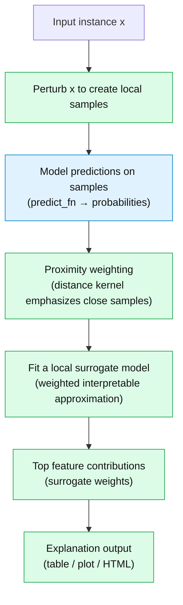

# lime_attrition.API.md (LIME Tool-Focused)

This document describes the **native programming interface** (API) of **LIME** for **tabular classification** and a **lightweight, generic helper layer** that standardizes common usage patterns.

> Scope: This API documentation is **tool-only**. It does not describe the Employee Attrition project pipeline that content belongs in `lime_attrition.example.*`.

---

## 1) What is LIME?

**LIME (Local Interpretable Model-agnostic Explanations)** explains a model’s prediction for **one specific input** by:
1. Generating many **perturbed samples** near the input instance,
2. Querying the black-box model to get predictions on those samples,
3. Fitting a simple **interpretable surrogate model** (typically sparse linear) *locally*,
4. Returning the most influential features for that *single* prediction.

### LIME workflow



Key properties:
- **Local**: explanations are instance-specific not global feature importance.
- **Model-agnostic**: LIME only needs a prediction function that returns probabilities.

---

## 2) Native LIME tabular API (primary objects)

### 2.1 `lime.lime_tabular.LimeTabularExplainer`

**Purpose:** constructs an explainer for tabular data.

Typical usage:

```python
from lime.lime_tabular import LimeTabularExplainer

explainer = LimeTabularExplainer(
    training_data,                 # numpy array in the same feature space as predict_fn expects
    feature_names=[...],           # list[str]
    class_names=["Class0","Class1"],
    mode="classification",
    discretize_continuous=True,    # optional, bins continuous features for readability
    random_state=42,               # optional, reproducibility
)
```

Important requirements:
- `training_data` must be in the **same feature space** that your `predict_fn` expects.
- For classification, `predict_fn(X)` must return probabilities shaped `(n_samples, n_classes)`.

### 2.2 `explainer.explain_instance(...)`

**Purpose:** explain one prediction for one input row.

```python
exp = explainer.explain_instance(
    data_row,            # 1D numpy array (one instance)
    predict_fn,          # callable returning class probabilities
    num_features=10,     # number of features to display
    num_samples=5000,    # number of perturbed samples
    top_labels=1,        # optional: explain top predicted class
)
```

Common knobs:
- Increase `num_samples` for more stable estimates (trade off: slower).
- Increase `num_features` to show longer explanations.

### 2.3 `lime.explanation.Explanation`

**Purpose:** stores the explanation and supports multiple renderings.

Common methods:
- `exp.as_list()` → list of `(feature_string, weight)`
- `exp.as_pyplot_figure()` → matplotlib figure
- `exp.save_to_file("explanation.html")` → HTML report

---

## 3) Generic helper layer (wrapper functions)

To keep notebooks clean, a small set of helper utilities can wrap common patterns without changing LIME’s semantics.

### 3.1 `lime_predict_proba_fn(model)`

**Purpose:** create a LIME-compatible prediction function from any classifier exposing `predict_proba`.

```python
predict_fn = lime_predict_proba_fn(model)  # predict_fn(X) -> probabilities
```

### 3.2 `lime_build_tabular_explainer(...)`

**Purpose:** thin wrapper around the native `LimeTabularExplainer(...)` constructor.

```python
explainer = lime_build_tabular_explainer(
    training_data=X_train,
    feature_names=feature_names,
    class_names=["Class0","Class1"],
    discretize_continuous=True,
    mode="classification",
    random_state=42,
)
```

### 3.3 `lime_explain_instance(...)`

**Purpose:** wrapper around `explainer.explain_instance(...)` that standardizes inputs and returns the native `Explanation`.

```python
exp = lime_explain_instance(
    explainer=explainer,
    data_row=X_test[0],
    predict_fn=predict_fn,
    num_features=10,
    num_samples=5000,
)
```

### 3.4 `lime_explanation_to_df(exp, top_k=None)`

**Purpose:** convert a LIME explanation into a compact table for inspection or reporting.

Returns a DataFrame with columns:
- `feature`
- `weight`
- `abs_weight`

### 3.5 `LimeTabularWrapper`

**Purpose:** a minimal wrapper that returns a DataFrame directly.

```python
wrapper = LimeTabularWrapper(explainer=explainer, predict_fn=predict_fn, class_names=class_names)
df = wrapper.explain(X_test[1], top_k=8, num_samples=5000)
```

---

## 4) Where to find tool usage demos

- `lime_attrition.API.ipynb` demonstrates the native LIME API and the helper layer on a **synthetic tabular dataset**.
- `lime_attrition.example.ipynb` contains the **project-specific** end-to-end implementation and applies LIME to the Employee Attrition model.
