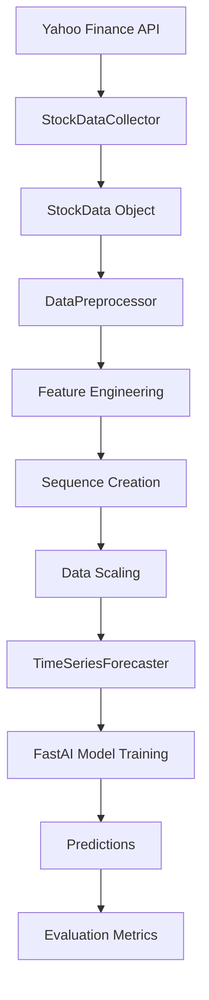

# Time Series Forecasting API Documentation

## Overview

This API provides a clean, structured interface for time series forecasting of stock prices using FastAI. The API abstracts away the complexity of data collection, preprocessing, model training, and prediction, providing a simple interface for stock price forecasting.

## Architecture

The API follows a modular design with clear separation of concerns:

```
StockDataCollector → DataPreprocessor → TimeSeriesForecaster → Predictions
```

### Core Components

#### 1. Data Structures

**StockData**: Container for stock information
```python
@dataclass
class StockData:
    symbol: str        # Stock ticker symbol
    data: pd.DataFrame # Historical price data
    start_date: str    # Data collection start date
    end_date: str      # Data collection end date
```

**ModelConfig**: Configuration for model training and prediction
```python
@dataclass
class ModelConfig:
    sequence_length: int = 60    # Number of time steps for input sequences
    prediction_horizon: int = 1  # Steps ahead to predict
    train_split: float = 0.8     # Training data proportion
    batch_size: int = 32         # Training batch size
    epochs: int = 50            # Number of training epochs
    learning_rate: float = 1e-3 # Learning rate for optimization
```

#### 2. Data Collection Layer

**StockDataCollector**: Handles data acquisition from Yahoo Finance
- `fetch_stock_data(symbol, start_date, end_date)`: Retrieves historical data
- Automatic error handling and validation
- Returns structured StockData object

#### 3. Data Preprocessing Layer

**DataPreprocessor**: Transforms raw data into model-ready format
- `create_features(data)`: Engineers technical indicators (MA, RSI, Volatility)
- `create_sequences(data)`: Creates input sequences for time series modeling
- `preprocess_data(stock_data)`: Complete preprocessing pipeline

#### 4. Model Training Layer

**TimeSeriesForecaster**: Core forecasting engine using FastAI
- `prepare_data(X, y)`: Creates FastAI DataLoaders
- `train_model(X, y)`: Trains neural network forecasting model
- `predict(X, scaler)`: Generates predictions on new data
- `evaluate_model(X_test, y_test, scaler)`: Calculates performance metrics

#### 5. Utility Functions

**plot_predictions(actual, predicted, title)**: Visualization helper
**create_pipeline(symbol, start_date, end_date, config)**: End-to-end pipeline

## API Interface

### Core Classes

#### StockDataCollector
```python
class StockDataCollector:
    @staticmethod
    def fetch_stock_data(symbol: str, start_date: str, end_date: str) -> StockData
```

#### DataPreprocessor
```python
class DataPreprocessor:
    def __init__(self, config: ModelConfig)
    def create_features(self, data: pd.DataFrame) -> pd.DataFrame
    def create_sequences(self, data: np.ndarray) -> Tuple[np.ndarray, np.ndarray]
    def preprocess_data(self, stock_data: StockData) -> Tuple[np.ndarray, np.ndarray, MinMaxScaler]
```

#### TimeSeriesForecaster
```python
class TimeSeriesForecaster:
    def __init__(self, config: ModelConfig)
    def prepare_data(self, X: np.ndarray, y: np.ndarray) -> DataLoaders
    def train_model(self, X: np.ndarray, y: np.ndarray) -> None
    def predict(self, X: np.ndarray, scaler: MinMaxScaler) -> np.ndarray
    def evaluate_model(self, X_test: np.ndarray, y_test: np.ndarray, scaler: MinMaxScaler) -> Dict[str, float]
```

### Configuration Options

The ModelConfig class allows customization of:

- **Sequence Length**: Number of historical time steps used for prediction (default: 60)
- **Prediction Horizon**: Number of future steps to predict (default: 1)
- **Train Split**: Proportion of data used for training (default: 0.8)
- **Batch Size**: Training batch size (default: 32)
- **Epochs**: Maximum training epochs (default: 50)
- **Learning Rate**: Optimization learning rate (default: 1e-3)

### Feature Engineering

The preprocessing pipeline automatically creates:

1. **Technical Indicators**:
   - Moving Averages (5-day, 20-day)
   - Relative Strength Index (RSI)
   - Volatility (rolling standard deviation)

2. **Lagged Variables**:
   - Price lags (1, 2, 3, 5 days)
   - Price changes

3. **Base Features**:
   - Close price
   - Volume
   - Open, High, Low prices (available in raw data)

### Model Architecture

The forecasting model uses a feedforward neural network with:
- Input layer: Size determined by sequence_length × feature_count
- Hidden layers: [200, 100] neurons with ReLU activation
- Output layer: Single neuron for price prediction
- Loss function: Mean Squared Error (MSE)
- Metrics: Mean Absolute Error (MAE)

### Data Flow



### Error Handling

The API includes comprehensive error handling:
- Data collection failures (invalid symbols, date ranges)
- Missing data and NaN values
- Model training issues
- Prediction errors

### Performance Metrics

The API provides standard evaluation metrics with robust error handling:
- **MAE**: Mean Absolute Error
- **MAPE**: Mean Absolute Percentage Error (with safe division handling)

### Dependencies

- `yfinance`: Stock data collection
- `pandas`: Data manipulation
- `numpy`: Numerical operations
- `fastai`: Deep learning framework
- `scikit-learn`: Data preprocessing and metrics
- `matplotlib`: Visualization

## Usage Pattern

The API follows a simple three-step pattern:

1. **Data Collection**: Use `StockDataCollector.fetch_stock_data()`
2. **Preprocessing**: Use `DataPreprocessor.preprocess_data()`
3. **Training & Prediction**: Use `TimeSeriesForecaster.train_model()` and `predict()`

### Recommended Usage

For most use cases, use the simplified `create_pipeline()` function for end-to-end execution:

```python
from fastai_Time_Series_Forecasting_of_Stock_Prices_utils import create_pipeline, ModelConfig

# Configure model
config = ModelConfig(
    sequence_length=60,
    prediction_horizon=1,
    train_split=0.8,
    epochs=25,
    batch_size=32
)

# Run complete pipeline
results = create_pipeline(
    symbol="SPY",
    start_date="2015-01-01",
    end_date="2023-12-31",
    config=config
)

# Access results
print(f"MAE: {results['metrics']['MAE']:.2f}")
print(f"MAPE: {results['metrics']['MAPE']:.2f}%")
```

### Advanced Usage

For fine-grained control, use individual components:

```python
# Step-by-step approach
collector = StockDataCollector()
stock_data = collector.fetch_stock_data("AAPL", "2015-01-01", "2023-12-31")

preprocessor = DataPreprocessor(config)
X, y, scaler = preprocessor.preprocess_data(stock_data)

forecaster = TimeSeriesForecaster(config)
forecaster.train_model(X, y)
predictions = forecaster.predict(X_test, scaler)
```

### Typical Performance

With default configuration on major indices (SPY, QQQ):
- **MAE**: $20-50 (2-5% of stock price)
- **MAPE**: 8-15%
- **Training Time**: 1-5 minutes
- **Correlation**: 0.85-0.95 between predicted and actual values

## Extensibility

The API is designed for extensibility:
- Custom feature engineering functions
- Alternative model architectures
- Different data sources
- Additional evaluation metrics
- Custom preprocessing pipelines

This API provides a stable, well-documented interface for time series forecasting that can be easily integrated into larger applications or used as a standalone forecasting tool.