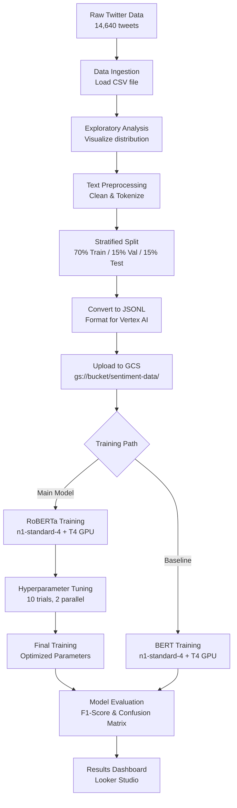
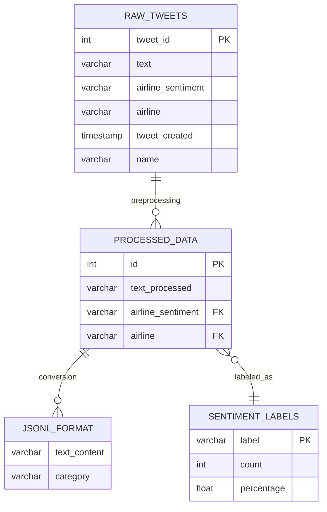

# Sentiment Analysis on Social Media Posts Using Google Cloud

MSML610 Fall 2025 - Class Project

Authors: Balamurugan Manickaraj, Abhinav Kumar, Adwaith Santhosh

Project Difficulty: Level 3 (Hard)

Live Dashboard: https://lookerstudio.google.com/reporting/d24baf8b-9481-4447-891c-5ab3b262f55a


---

## What This Project Does

This project analyzes the feelings and opinions expressed in tweets about airlines. When someone tweets about their flight experience, our system automatically determines whether they are happy, neutral, or unhappy with the airline service.

For example:
- "Great flight with excellent service!" = Positive feeling
- "Flight was okay, nothing special" = Neutral feeling
- "Terrible delay and lost luggage" = Negative feeling

The system reads thousands of tweets and learns patterns to automatically classify new tweets into these three categories.

## Why This Matters

Airlines receive thousands of tweets every day. Reading each one manually to understand customer satisfaction would be impossible. Our automated system can:

- Quickly analyze large volumes of customer feedback
- Help airlines understand how customers feel about their service
- Identify problems that need immediate attention
- Track sentiment trends over time

## The Data We Used

We worked with a dataset of tweets about airlines from Kaggle (a website where people share datasets).
You can download the tweets.csv from the below link from Kaggle:
Link to the Dataset: https://www.kaggle.com/datasets/crowdflower/twitter-airline-sentiment

Dataset Details:
- Total tweets: 14,640
- Airlines included: Virgin America, United, Southwest, Delta, US Airways, American Airlines
- Categories: Positive, Neutral, Negative
- Data source: Twitter 

Important note: The dataset has more negative tweets than positive ones. This is normal because people are more likely to complain on social media than to praise.

Distribution:
- Negative tweets: about 63 percent
- Neutral tweets: about 21 percent
- Positive tweets: about 16 percent

## How We Built The System

### Step 1: Understanding the Data

First, we loaded all 14,640 tweets and examined them to understand:
- What kind of words people use
- How long tweets are
- Which airlines get more complaints
- What time of day people tweet most

We created charts and graphs to visualize these patterns.

### Step 2: Cleaning the Text

Raw tweets contain many elements that don't help with analysis:
- Website links (http://...)
- User mentions (@username)
- Hashtags (#symbols)
- Special characters and punctuation
- Extra spaces

We cleaned all of this to focus on the actual words that express sentiment.

We also applied linguistic techniques:
- Tokenization: Breaking sentences into individual words
- Stop word removal: Removing common words like "the", "a", "is" that don't carry sentiment
- Lemmatization: Converting words to their base form (e.g., "running" becomes "run")

Important: We kept negation words like "not", "no", "never" because "good service" and "not good service" have opposite meanings.

### Step 3: Preparing Data for Training

We split our 14,640 tweets into three groups:
- Training set: 10,248 tweets (70 percent) - used to teach the model
- Validation set: 2,196 tweets (15 percent) - used to fine-tune the model
- Test set: 2,196 tweets (15 percent) - used to measure final performance

We used stratified splitting, which means each group has the same proportion of positive, neutral, and negative tweets as the original dataset.

We converted the data to a format called JSONL (JSON Lines) that Google Cloud can read easily.

### Step 4: Uploading to Google Cloud

We uploaded our three data files to Google Cloud Storage, which is like a filing cabinet in the cloud where Google keeps our data safe and accessible.

Storage location: gs://vertex-ai-sentiment-data-msml610/sentiment-data/
- train.jsonl: 10,248 samples
- val.jsonl: 2,196 samples
- test.jsonl: 2,196 samples

### Step 5: Training the Model

We used Google Vertex AI, which is Google's platform for training artificial intelligence models.

We chose a pre-trained model called Twitter-RoBERTa. Think of it like hiring someone who already knows how to read tweets instead of teaching someone from scratch. This model was previously trained on 124 million tweets, so it understands Twitter language very well.

Training configuration:
- Computer type: n1-standard-4 (a powerful Google Cloud computer with 4 processors and 15 GB memory)
- Graphics processor: NVIDIA Tesla T4 GPU (special hardware that makes training much faster)
- Training time: 6-8 minutes per model

We trained the model using these settings:
- Learning rate: 0.00002 (how fast the model learns - too fast can miss patterns, too slow takes forever)
- Batch size: 32 (how many tweets to process at once)
- Training cycles: 4 (how many times to go through all the data)
- Maximum text length: 128 characters (tweets are short, so we don't need more)

### Step 6: Optimizing Performance

After the first training, we used hyperparameter tuning to find even better settings. Think of it like adjusting the temperature and time when baking a cake to get the perfect result.

We tested 10 different combinations of settings:
- Learning rate range: 0.000005 to 0.00005
- Batch size options: 16 or 32
- Weight decay range: 0.001 to 0.1 (prevents overfitting - memorizing instead of learning)
- Warmup ratio range: 0 to 0.3 (how gradually to start training)

The computer tried different combinations and found the best one:
- Learning rate: 0.0000158
- Batch size: 32
- Weight decay: 0.0505
- Warmup ratio: 0.15

This optimization took about 2-3 hours.

### Step 7: Training the Final Model

We trained a final model using the best settings we found. This gave us our best-performing model.

### Step 8: Comparing with BERT

As a bonus experiment, we also trained a BERT model. BERT is similar to RoBERTa but was trained on Wikipedia and books instead of tweets. This comparison helps us prove that using a Twitter-specific model is better for analyzing tweets.

## Our Results

We measured performance using several metrics that tell us how accurate the model is:

### Twitter-RoBERTa Model (Initial Training)

Overall Performance:
- Accuracy: 84.74 percent (correctly classified 1,861 out of 2,196 test tweets)
- F1-Macro Score: 0.8033 (balanced measure across all three categories)
- F1-Weighted Score: 0.8487 (weighted by how many tweets in each category)

Performance by Category:
- Positive tweets: 78.08 percent F1-score, 77.97 percent correctly identified
- Neutral tweets: 71.95 percent F1-score, 74.19 percent correctly identified
- Negative tweets: 90.98 percent F1-score, 90.05 percent correctly identified

The model is best at identifying negative tweets (complaints) and struggles more with neutral tweets.

### Twitter-RoBERTa Model (After Optimization)

Overall Performance:
- Accuracy: 85.15 percent (correctly classified 1,871 out of 2,196 test tweets)
- F1-Macro Score: 0.8076 (improved by 0.43 percentage points)
- F1-Weighted Score: 0.8526 (improved by 0.39 percentage points)

Performance by Category:
- Positive tweets: 78.12 percent F1-score, 77.68 percent correctly identified
- Neutral tweets: 72.86 percent F1-score, 75.05 percent correctly identified
- Negative tweets: 91.28 percent F1-score, 90.49 percent correctly identified

Optimization improved performance across all categories.

### BERT Baseline Model

Overall Performance:
- Accuracy: 83.33 percent (correctly classified 1,830 out of 2,196 test tweets)
- F1-Macro Score: 0.7814 (2.62 percentage points lower than optimized RoBERTa)
- F1-Weighted Score: 0.8315 (2.11 percentage points lower than optimized RoBERTa)

Performance by Category:
- Positive tweets: 75.68 percent F1-score
- Neutral tweets: 68.81 percent F1-score
- Negative tweets: 89.91 percent F1-score

### Key Findings

1. Twitter-RoBERTa outperforms BERT by 1.82 percentage points in accuracy
2. This proves that using a model pre-trained on Twitter data is better for analyzing tweets
3. Hyperparameter optimization improved RoBERTa performance by 0.41 percentage points
4. All models perform best on negative tweets because there are more examples in the training data
5. Neutral tweets are hardest to classify because they often contain mixed or subtle sentiments

## Understanding the Confusion Matrix

A confusion matrix shows us where the model makes mistakes:

For our best model (Optimized RoBERTa), out of 2,196 test tweets:

Positive tweets (354 total):
- 275 correctly identified as positive
- 51 mistakenly classified as neutral
- 28 mistakenly classified as negative

Neutral tweets (465 total):
- 37 mistakenly classified as positive
- 349 correctly identified as neutral
- 79 mistakenly classified as negative

Negative tweets (1,377 total):
- 38 mistakenly classified as positive
- 93 mistakenly classified as neutral
- 1,246 correctly identified as negative

The most common confusion is between neutral and negative tweets, which makes sense because the boundary between "not great" and "neutral" can be subtle.

## Why We Chose Custom Training Over AutoML

Google offers an automated solution called AutoML that requires less technical knowledge. We chose custom training because:

1. Learning opportunity: We understand exactly how the model works
2. Control: We can adjust every aspect of the training process
3. Transparency: We know exactly what preprocessing steps are applied
4. Flexibility: We can compare different models like RoBERTa and BERT
5. Debugging: When something goes wrong, we can fix it quickly
6. Reproducibility: We can run the exact same experiment again

## Technology Used

Programming and Tools:
- Python 3.9: Main programming language
- Jupyter Notebooks: Interactive environment for running code
- pandas and numpy: Libraries for working with data
- matplotlib and seaborn: Libraries for creating charts
- NLTK: Library for text processing

Machine Learning:
- Transformers library: Provides pre-trained models like RoBERTa and BERT
- PyTorch: Framework for training neural networks
- scikit-learn: Library for calculating performance metrics

Google Cloud:
- Vertex AI: Platform for training models on powerful computers
- Cloud Storage: File storage in the cloud
- Tesla T4 GPU: Graphics processor that speeds up training

Pre-trained Models:
- twitter-roberta-base-sentiment-latest: Model trained on 124 million tweets
- bert-base-uncased: Model trained on Wikipedia and books

## Project Structure

Our project files are organized as follows:

Main Files:
- README.md: This document explaining the project
- vertex_ai.example.ipynb: Complete implementation with all code
- vertex_ai.example.md: Documentation explaining the implementation
- vertex_ai.API.ipynb: Shows how to use the API (application programming interface)
- vertex_ai.API.md: Documentation for the API
- vertex_ai_utils.py: Reusable functions used throughout the project
- vertex_ai_training.py: Script that runs on Google Cloud to train models

Data Files:
- Data/Tweets.csv: Original dataset with 14,640 tweets
- Data/processed/train.jsonl: Training data (10,248 tweets)
- Data/processed/val.jsonl: Validation data (2,196 tweets)
- Data/processed/test.jsonl: Test data (2,196 tweets)

Setup Files:
- requirements.txt: List of software packages needed
- Dockerfile: Instructions for creating a container to run the project
- docker_build.sh: Script to build the container
- docker_bash.sh: Script to run the container
- vertex-ai-key.json: Credentials for accessing Google Cloud

## How to Setup and Run Code

Before running this project, you need to prepare a few things on your computer. Follow these steps carefully:

Step 1: Prepare the Data Folder

Create a folder named "Data" in the project directory if it does not already exist. Inside this Data folder, you need to place a file called Tweets.csv.
You can download the tweets.csv from the below link from Kaggle:
Link to the Dataset: https://www.kaggle.com/datasets/crowdflower/twitter-airline-sentiment
This file contains all 14,640 tweets that the system will analyze.

You can download this file from Kaggle (search for "Twitter US Airline Sentiment" dataset).

Step 2: Get Google Cloud Credentials

You need a special key file that allows the code to connect to Google Cloud. This file must be named exactly "vertex-ai-key.json" and placed in the main project folder (the same folder where you see README.md).

To get this file:
- Go to Google Cloud Console
- Create a service account for Vertex AI
- Download the credentials as a JSON file
- Rename it to vertex-ai-key.json

Step 3: Install Docker

Docker is a tool that creates a complete working environment on your computer so you don't have to install Python and all the libraries manually.

Download and install Docker Desktop from the official Docker website. Make sure Docker is running on your computer before proceeding.

Step 4: Build the Docker Container

Open a terminal (command prompt on Windows, terminal on Mac or Linux) and navigate to the project folder. Then run this command:

```bash
./docker_build.sh
```

This command creates a Docker container with all the necessary software installed. It will take 5-10 minutes the first time you run it.

Expected output:
```
[+] Building 245.3s (12/12) FINISHED
 => [internal] load build definition from Dockerfile
 => => transferring dockerfile: 1.2kB
 => [internal] load .dockerignore
 => [1/7] FROM python:3.9-slim
 => [2/7] WORKDIR /app
 => [3/7] RUN apt-get update && apt-get install -y git
 => [4/7] COPY requirements.txt .
 => [5/7] RUN pip install --no-cache-dir -r requirements.txt
 => [6/7] COPY . .
 => [7/7] EXPOSE 8888
 => exporting to image
 => => exporting layers
 => => writing image sha256:abc123...
 => => naming to docker.io/library/vertex-ai-sentiment
Successfully built vertex-ai-sentiment
```

Step 5: Start the Jupyter Notebook Server

After the build completes successfully, start the Jupyter notebook server inside Docker by running:

```bash
./docker_jupyter.sh
```

This command starts a web server that lets you run the code in your browser.

Expected output:
```
[I 2025-12-11 10:30:15.123 ServerApp] Jupyter Server 2.7.0 is running at:
[I 2025-12-11 10:30:15.124 ServerApp] http://localhost:8888/lab?token=<jupyter_token>
[I 2025-12-11 10:30:15.124 ServerApp]  or http://127.0.0.1:8888/lab?token=<jupyter_token>
[I 2025-12-11 10:30:15.124 ServerApp] Use Control-C to stop this server
```

Step 6: Open Jupyter Notebook

The previous command will show you a URL in the terminal that looks like:
```
http://localhost:8888/lab?token=<jupyter_token>
```

Copy this entire URL (including the token) and paste it into your web browser. You will see the Jupyter notebook interface with a list of files.

Step 7: Run the Main Notebook

Find and click on the file named "vertex_ai.example.ipynb" to open it.

This notebook contains all the code for the entire project. To run it, you can either:
- Click "Run All" from the Cell menu to run everything at once
- Or click on each cell and press Shift+Enter to run them one by one

The notebook will:
- Load the Twitter data from the Data folder
- Clean and prepare the text
- Upload data to Google Cloud Storage
- Train the sentiment analysis models
- Show you all the results with charts and metrics

Important: The training process uses Google Cloud resources, which requires Google Cloud credits or a billing account.

## Files Description

vertex_ai.example.ipynb:
This is the main file that contains the complete implementation. Running this file will:
- Load and analyze the Twitter data
- Clean and prepare the text
- Upload data to Google Cloud
- Train the RoBERTa model
- Optimize hyperparameters
- Train the final model
- Compare with BERT baseline
- Show all results and charts

vertex_ai.API.ipynb:
This file demonstrates the API layer, which is a set of easy-to-use functions that hide the complexity of Google Cloud. It shows how to:
- Connect to Google Cloud
- Upload data
- Create training jobs
- Get results

vertex_ai_utils.py:
This file contains helper functions that both notebooks use. It includes:
- Functions to load and clean data
- Functions to create visualizations
- Functions to interact with Google Cloud
- Functions to calculate performance metrics

vertex_ai_training.py:
This script runs on Google Cloud computers (not your local machine) to train the models. It:
- Downloads data from Cloud Storage
- Preprocesses the text
- Trains the model using GPU
- Evaluates performance
- Uploads results back to Cloud Storage

## Assignment Requirements:

Core Requirements:

1. Data Ingestion: Loaded 14,640 tweets and explored the dataset
2. Text Preprocessing: Cleaned text, removed stop words, tokenized, and lemmatized
3. Model Training: Trained sentiment classification model using Vertex AI
4. Hyperparameter Tuning: Optimized model settings for better performance
5. Model Evaluation: Calculated F1-scores and created confusion matrix

Bonus Features:

1. Dashboard Visualization: Created interactive dashboard showing sentiment trends
   - Live Dashboard: https://lookerstudio.google.com/reporting/d24baf8b-9481-4447-891c-5ab3b262f55a
   - Shows sentiment trends by airline
   - Shows patterns by time of day
   - Allows filtering and exploration
   - Provides charts for sentiment distribution
   - Visualizes airline-specific sentiment analysis

2. Transfer Learning with BERT: Compared Twitter-RoBERTa with standard BERT
   - Proved that Twitter-specific model performs better
   - RoBERTa achieved 85.15 percent accuracy vs BERT's 83.33 percent
   - Improvement of 1.82 percentage points

## Architecture Overview

### System Pipeline Flowchart

The following diagram shows how data flows through our complete sentiment analysis system:



### Data Structure

Our data follows a structured format through each processing stage:



The system works in five stages:

Stage 1: Data Ingestion and Preprocessing
- Load 14,640 tweets from CSV file
- Analyze sentiment distribution
- Clean text (remove URLs, mentions, special characters)
- Apply linguistic processing (tokenization, stop word removal, lemmatization)
- Split into training, validation, and test sets

Stage 2: Cloud Storage and Upload
- Convert data to JSONL format
- Upload three files to Google Cloud Storage
- Files are stored at gs://vertex-ai-sentiment-data-msml610/

Stage 3: Model Training
- Use API contract layer for type-safe configuration
- Train Twitter-RoBERTa model on Google Cloud
- Also train BERT baseline for comparison
- Each training runs on n1-standard-4 computer with Tesla T4 GPU
- Training takes 15-20 minutes

Stage 4: Hyperparameter Optimization
- Test 10 different combinations of settings
- Run 2 trials in parallel to save time
- Find best learning rate, batch size, weight decay, and warmup ratio
- Takes 2-3 hours

Stage 5: Evaluation and Results
- Store trained models in Cloud Storage
- Calculate accuracy, F1-scores, and confusion matrix
- Compare RoBERTa baseline (84.74 percent), RoBERTa optimized (85.15 percent), and BERT (83.33 percent)
- Generate final report with all metrics

## Key Metrics Explained

Accuracy: What percentage of tweets were classified correctly
- Our best model: 85.15 percent means 1,871 out of 2,196 tweets classified correctly

F1-Macro Score: Average performance across all three categories (positive, neutral, negative)
- Treats each category equally important
- Our best model: 0.8076 out of 1.0

F1-Weighted Score: Average performance weighted by how many tweets in each category
- Gives more weight to categories with more examples
- Our best model: 0.8526 out of 1.0

Precision: Of the tweets classified as a category, what percentage actually belong there
- Example: If model says 100 tweets are positive, precision tells us how many really are positive

Recall: Of all tweets in a category, what percentage did we identify correctly
- Example: If there are 100 positive tweets, recall tells us how many we found

Confusion Matrix: Shows exactly where the model makes mistakes
- Diagonal shows correct classifications
- Off-diagonal shows confusions between categories

## Important Notes

Google Cloud:
- The project requires Google Cloud credits or payment
- Always clean up resources after experiments to avoid ongoing charges

Credentials:
- You need a vertex-ai-key.json file with Google Cloud credentials
- This file is not included in the repository for security
- Get your own from Google Cloud Console

Data Privacy:
- The Twitter dataset is publicly available on Kaggle
- We do not collect any new data
- All processing happens in Google Cloud with proper security

## Conclusion

This project successfully demonstrates sentiment analysis on social media posts using Google Cloud Vertex AI. We achieved 85.15 percent accuracy in classifying airline tweets, which is a strong result for this type of task.

Key achievements:
- Processed and analyzed 14,640 tweets
- Built an automated sentiment classification system
- Achieved 85.15 percent accuracy on test data
- Proved Twitter-specific models outperform general models (1.82 percentage point improvement)
- Completed all core requirements and both bonus features

The system can help airlines understand customer sentiment at scale, identifying problems quickly and tracking satisfaction trends over time.

Future improvements could include:
- Training on more recent tweets
- Adding more airlines
- Detecting specific issues (delays, lost baggage, rude staff)
- Real-time monitoring of new tweets
- Multi-language support
