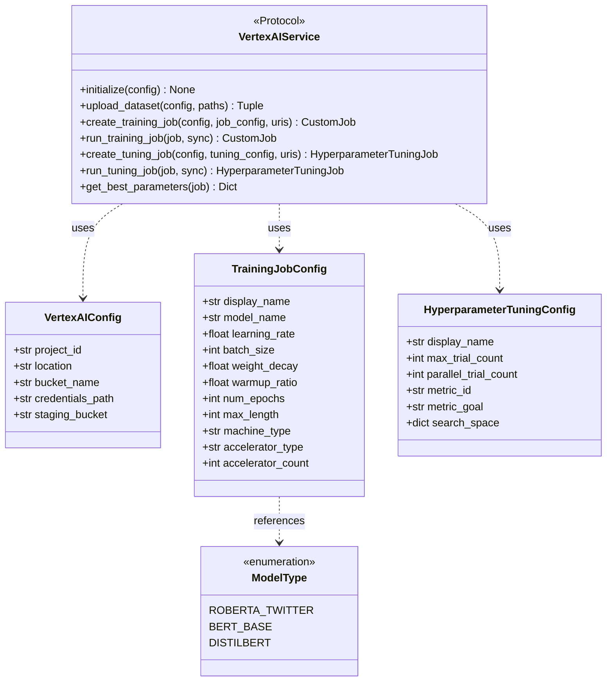
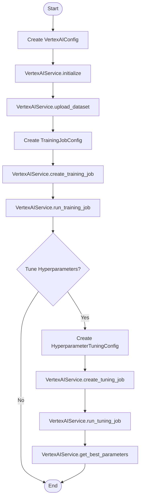

# Vertex AI API Documentation

## Overview

This document describes the **contract layer** for the Vertex AI sentiment analysis project. The API layer defines stable interfaces (dataclasses, enums, and abstract protocols) that allow integration without pulling in runtime implementation details.

### What is a Contract Layer?

The contract layer contains:
1. **Dataclasses** - Type-safe configuration objects
2. **Enums** - Fixed sets of valid options
3. **Protocol classes** - Abstract interfaces defining method signatures

The actual implementation of these interfaces lives in `vertex_ai.example.ipynb` and `vertex_ai_utils.py`.

## SDK Architecture

The following diagram shows the contract classes and their relationships:



## Workflow

The following flowchart shows the typical sequence of API calls:



---

## Configuration Contracts

### VertexAIConfig

Configuration for connecting to Google Cloud Vertex AI services.

| Field | Type | Default | Description |
|-------|------|---------|-------------|
| `project_id` | str | required | Google Cloud project ID |
| `location` | str | required | GCP region (e.g., "us-central1") |
| `bucket_name` | str | required | GCS bucket for data and models |
| `credentials_path` | str | "vertex-ai-key.json" | Path to service account key |
| `staging_bucket` | Optional[str] | auto-generated | Temporary storage location |

```python
@dataclass
class VertexAIConfig:
    project_id: str
    location: str
    bucket_name: str
    credentials_path: str = "vertex-ai-key.json"
    staging_bucket: Optional[str] = None
```

### TrainingJobConfig

Configuration for training machine learning models.

| Field | Type | Default | Description |
|-------|------|---------|-------------|
| `display_name` | str | required | Human-readable job name |
| `model_name` | str | RoBERTa Twitter | HuggingFace model identifier |
| `learning_rate` | float | 2e-5 | Training learning rate |
| `batch_size` | int | 32 | Samples per batch |
| `weight_decay` | float | 0.01 | Regularization parameter |
| `warmup_ratio` | float | 0.1 | Learning rate warmup fraction |
| `num_epochs` | int | 4 | Training iterations |
| `max_length` | int | 128 | Maximum sequence length |
| `machine_type` | str | "n1-standard-4" | Compute instance type |
| `accelerator_type` | str | "NVIDIA_TESLA_T4" | GPU type |
| `accelerator_count` | int | 1 | Number of GPUs |

```python
@dataclass
class TrainingJobConfig:
    display_name: str
    model_name: str = "cardiffnlp/twitter-roberta-base-sentiment-latest"
    learning_rate: float = 2e-5
    batch_size: int = 32
    weight_decay: float = 0.01
    warmup_ratio: float = 0.1
    num_epochs: int = 4
    max_length: int = 128
    machine_type: str = "n1-standard-4"
    accelerator_type: str = "NVIDIA_TESLA_T4"
    accelerator_count: int = 1
```

### HyperparameterTuningConfig

Configuration for hyperparameter optimization.

| Field | Type | Default | Description |
|-------|------|---------|-------------|
| `display_name` | str | required | Job name |
| `max_trial_count` | int | 10 | Maximum trials to run |
| `parallel_trial_count` | int | 2 | Concurrent trials |
| `metric_id` | str | "f1_macro" | Optimization metric |
| `metric_goal` | str | "maximize" | Optimization direction |
| `search_space` | dict | auto-generated | Parameter ranges |

```python
@dataclass
class HyperparameterTuningConfig:
    display_name: str
    max_trial_count: int = 10
    parallel_trial_count: int = 2
    metric_id: str = "f1_macro"
    metric_goal: str = "maximize"
    search_space: Dict[str, Dict[str, Any]] = field(default_factory=dict)
```

### ModelType (Enum)

Supported pre-trained models.

| Value | Model | Description |
|-------|-------|-------------|
| `ROBERTA_TWITTER` | cardiffnlp/twitter-roberta-base-sentiment-latest | Twitter-optimized RoBERTa |
| `BERT_BASE` | bert-base-uncased | Standard BERT |
| `DISTILBERT` | distilbert-base-uncased | Lightweight BERT |

```python
class ModelType(Enum):
    ROBERTA_TWITTER = "cardiffnlp/twitter-roberta-base-sentiment-latest"
    BERT_BASE = "bert-base-uncased"
    DISTILBERT = "distilbert-base-uncased"
```

---

## Service Interface (Protocol)

The `VertexAIService` protocol defines the abstract interface for Vertex AI operations. This allows different implementations to satisfy the same contract.

```python
from typing import Protocol, Tuple, Dict, Any, Optional
from google.cloud import aiplatform

class VertexAIService(Protocol):
    """Abstract interface for Vertex AI operations."""
    
    def initialize(self, config: VertexAIConfig) -> None:
        """Initialize Vertex AI SDK with project settings."""
        ...
    
    def upload_dataset(
        self,
        config: VertexAIConfig,
        train_path: str,
        val_path: str,
        test_path: str,
        destination_folder: str = "data"
    ) -> Tuple[str, str, str]:
        """Upload datasets to GCS. Returns (train_uri, val_uri, test_uri)."""
        ...
    
    def create_training_job(
        self,
        config: VertexAIConfig,
        job_config: TrainingJobConfig,
        train_uri: str,
        val_uri: str,
        test_uri: str
    ) -> aiplatform.CustomJob:
        """Create a training job (not started)."""
        ...
    
    def run_training_job(
        self,
        job: aiplatform.CustomJob,
        sync: bool = True
    ) -> aiplatform.CustomJob:
        """Run a training job. If sync=True, wait for completion."""
        ...
    
    def create_tuning_job(
        self,
        config: VertexAIConfig,
        tuning_config: HyperparameterTuningConfig,
        train_uri: str,
        val_uri: str,
        test_uri: str
    ) -> aiplatform.HyperparameterTuningJob:
        """Create a hyperparameter tuning job (not started)."""
        ...
    
    def run_tuning_job(
        self,
        job: aiplatform.HyperparameterTuningJob,
        sync: bool = False
    ) -> aiplatform.HyperparameterTuningJob:
        """Run a tuning job. Recommend sync=False (takes hours)."""
        ...
    
    def get_best_parameters(
        self,
        job: aiplatform.HyperparameterTuningJob
    ) -> Optional[Dict[str, Any]]:
        """Get best hyperparameters from completed tuning job."""
        ...
```

---

## Summary

This API layer provides:

1. **Configuration Contracts**: `VertexAIConfig`, `TrainingJobConfig`, `HyperparameterTuningConfig`
2. **Model Options**: `ModelType` enum
3. **Service Interface**: `VertexAIService` protocol

For the **runnable implementation** of this contract, see `vertex_ai.example.ipynb`.
