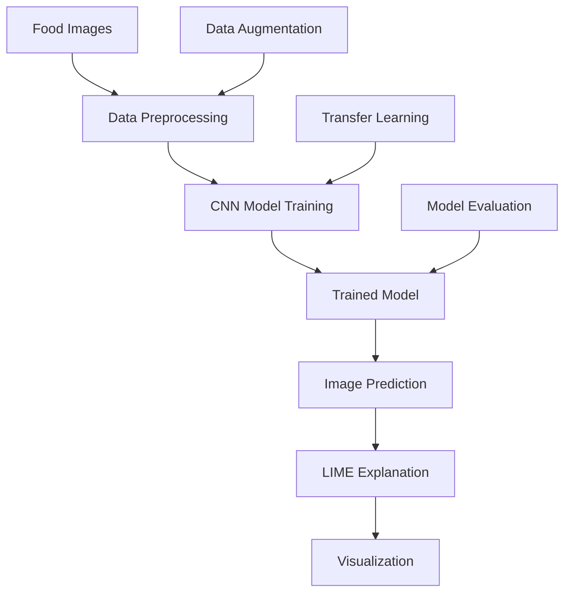

# Food Image Classification with LIME Explanations - Complete Example

This document presents a complete end-to-end example of building a food image classification system with LIME-based interpretability.

## Project Overview

The goal is to:
1. Train a CNN to classify food images from the Food-101 dataset
2. Use LIME to explain which image regions influence the model's predictions
3. Compare different CNN architectures and their interpretability

## Architecture Overview



## Dataset: Food-101

The Food-101 dataset contains 101 food categories with:
- 101,000 images total
- 1,000 images per category
- 750 training images and 250 test images per category

**Dataset Structure:**
```
data/food101/
├── train/
│   ├── apple_pie/
│   ├── baby_back_ribs/
│   └── ...
└── test/
    ├── apple_pie/
    ├── baby_back_ribs/
    └── ...
```

## Implementation Steps

### 1. Data Preparation

We use a subset of Food-101 for faster experimentation:
- Load images directly from JSON metadata files (fast method)
- Support for selecting specific classes or a random subset of classes
- Apply data augmentation (random flips, rotations, color jitter)
- Normalize using ImageNet statistics
- Create balanced subsets ensuring equal distribution across classes

**Key Design Decisions:**
- **Metadata-Driven Loading**: Use `create_balanced_subset_from_metadata()` to load directly from JSON files, avoiding full dataset iteration
- **Class Selection**: Support for selecting specific classes or randomly sampling N classes
- **Balanced Subsets**: Ensures equal number of samples per class for fair training
- **ImageNet Normalization**: Standard practice for transfer learning
- **Data Augmentation**: Improves generalization and reduces overfitting

### 2. Model Construction

We experiment with three architectures:

#### ResNet-18
- Lightweight (11M parameters)
- Fast training and inference
- Good baseline performance

#### ResNet-50
- Deeper architecture (25M parameters)
- Better feature extraction
- Higher accuracy potential

#### EfficientNet-B0
- Modern architecture (5M parameters)
- Best parameter efficiency
- Competitive performance

**Transfer Learning Strategy:**
- Use ImageNet pretrained weights
- Replace final classification layer
- Fine-tune all layers (not just classifier)

### 3. Training Process

**Hyperparameters:**
- Learning rate: 0.001 (with step decay)
- Batch size: 32-64
- Epochs: 5-20 (depending on convergence)
- Optimizer: Adam
- Loss: Cross-entropy

**Training Features:**
- Displays current loss and accuracy metrics during each batch
- Optional TensorBoard logging for detailed metric tracking
- Automatic learning rate scheduling

**Multi-Model Training:**
- Train multiple architectures (ResNet-18, ResNet-50, EfficientNet-B0) in a single workflow
- Automatically save each trained model to disk
- Store training histories for all models for comparison

**Training Monitoring:**
- Track training and validation accuracy in real-time
- Monitor for overfitting through progress bars
- Save all trained models for later comparison

### 4. LIME Integration

**LIME Workflow:**
1. Select test images for explanation
2. Generate superpixel segmentation
3. Create perturbed versions by hiding superpixels
4. Get predictions for perturbed images
5. Learn a linear model to explain predictions
6. Visualize important regions

**Configuration:**
- `num_samples=1000`: Number of perturbed samples
- `num_features=10`: Top superpixels to highlight
- `top_labels=5`: Number of classes to explain

### 5. Evaluation Metrics

**Model Performance:**
- Overall accuracy
- Per-class accuracy
- Confusion matrix

**Interpretability:**
- Visual inspection of highlighted regions
- Consistency across similar images
- Alignment with human intuition

### 6. Advanced Analysis

**Architecture Comparison:**
- Load pretrained models
- Compare accuracy across ResNet-18, ResNet-50, EfficientNet
- Visualize training histories for all architectures side-by-side
- Analyze explanation quality across different models
- Consider inference speed and parameter count trade-offs

**Explanation Analysis:**
- Generate LIME explanations for multiple architectures on the same image
- Compare explanations for correct vs. incorrect predictions
- Analyze which features each architecture focuses on
- Visualize explanations
- Identify potential model biases

## Example Workflow

### Step 1: Setup and Data Loading

```python
# Load metadata JSON files
import json
from pathlib import Path
from lime_cnn_utils import create_balanced_subset_from_metadata

meta_dir = Path("data/food-101/meta")
train_meta_path = meta_dir / "train.json"
test_meta_path = meta_dir / "test.json"

# Load metadata
with open(train_meta_path, 'r') as f:
    train_metadata = json.load(f)
all_class_names = sorted(train_metadata.keys())

# Create balanced subsets using metadata (fast method)
train_dataset = create_balanced_subset_from_metadata(
    metadata_path=train_meta_path,
    data_root="data",
    all_class_names=all_class_names,
    total_samples=1000,
    transform=train_transform,
    selected_classes=None,  # Use all classes, or specify a list
    num_classes_to_use=5,   # Or randomly select N classes
    random_seed=42
)

test_dataset = create_balanced_subset_from_metadata(
    metadata_path=test_meta_path,
    data_root="data",
    all_class_names=all_class_names,
    total_samples=200,
    transform=val_transform,
    selected_classes=None,
    num_classes_to_use=5,
    random_seed=42
)
```

### Step 2: Model Training

```python
# Train multiple architectures
from lime_cnn_utils import create_cnn_model, train_model, save_model

architectures_to_train = ['resnet18', 'resnet50', 'efficientnet_b0']
trained_models = {}
training_histories = {}

for arch in architectures_to_train:
    # Create model
    model = create_cnn_model(num_classes=5, architecture=arch, pretrained=True)
    model = model.to(device)
    
    # Train model (with progress bars)
    history = train_model(
        model=model,
        train_loader=train_loader,
        val_loader=val_loader,
        num_epochs=5,
        device=device,
        learning_rate=0.001,
        log_dir="runs"  # Optional TensorBoard logging
    )
    
    # Save model
    model_path = f"models/food_classifier_{arch}.pth"
    save_model(model, model_path, train_dataset.class_to_idx)
    
    trained_models[arch] = model
    training_histories[arch] = history

# Visualize training histories for all models
# (see example notebook for visualization code)
```

### Step 3: Model Evaluation

```python
# Evaluate on test set (with progress bar)
from lime_cnn_utils import evaluate_model

results = evaluate_model(model, test_loader, device=device)
print(f"Test Accuracy: {results['accuracy']:.2f}%")
print(f"Correct: {results['correct']}/{results['total']}")

# Compare architectures by loading pretrained models
from lime_cnn_utils import compare_architectures

comparison_results = compare_architectures(
    architectures=['resnet18', 'resnet50', 'efficientnet_b0'],
    test_loader=test_loader,
    num_classes=5,
    model_dir='models',
    device=device
)

# Access results
for arch, results in comparison_results.items():
    print(f"{arch}: {results['test_accuracy']:.2f}% accuracy")
```

### Step 4: Generate Explanations

```python
# Explain a specific image
explanation = explain_prediction(
    image_path="data/test_image.jpg",
    model=model,
    class_names=class_names,
    num_features=10
)

# Visualize
visualize_explanation(explanation)
```

## Results and Insights

**What LIME Reveals:**
1. **Feature Focus**: Which parts of the food image the model considers important
2. **Decision Boundaries**: How the model distinguishes between similar foods
3. **Potential Biases**: Whether the model relies on background or irrelevant features

**Common Patterns:**
- Models often focus on distinctive food features (e.g., pasta shape, burger layers)
- Background elements can sometimes influence predictions
- Texture and color patterns are important discriminators

## Challenges and Solutions

### Challenge 1: Computational Cost
**Problem**: LIME explanations are computationally expensive
**Solution**: 
- Use metadata-driven subset creation for faster data loading
- Use subset of images for training
- Limit `num_samples` parameter
- Cache explanations for repeated analysis
- Load pretrained models instead of retraining for comparisons

### Challenge 2: Superpixel Quality
**Problem**: Poor superpixel segmentation affects explanation quality
**Solution**: LIME uses QUICKSHIFT algorithm which generally works well for food images

## Extensions and Future Work

1. **More Architectures**: Experiment with Vision Transformers
2. **Explanation Metrics**: Quantify explanation quality
3. **Interactive Visualization**: Build web interface for exploration
4. **Multi-class Explanations**: Explain why model chose one class over another

## Conclusion

This project demonstrates:
- How to build a practical food classification system
- Integration of LIME for model interpretability
- Comparison of different CNN architectures
- Best practices for transfer learning and fine-tuning

The combination of accurate classification and interpretable explanations makes the system more trustworthy and useful for real-world applications.