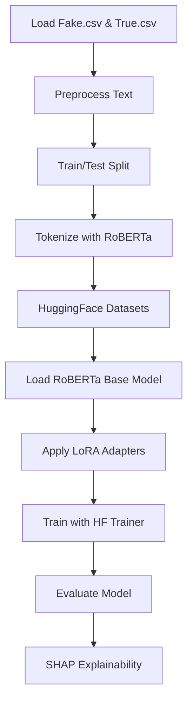

# 📘 **PEFT Sentiment Analysis — End-to-End Project Example**

This document provides a **complete project implementation** using PEFT (Parameter-Efficient Fine-Tuning) for fake news detection.

**What's in this document:**

- Project-specific implementation details
- Complete pipeline from data loading to model evaluation
- Fake vs True News classification example
- SHAP explainability implementation
- All code and results for the complete project

**For tool/API documentation**, see [PEFT_Sentiment_Analysis.API.md](PEFT_Sentiment_Analysis.API.md).

---

# **Project: Fake News Detection using PEFT**

This example demonstrates how to apply:

- HuggingFace Transformer models (RoBERTa)
- Parameter-Efficient Fine-Tuning (PEFT) using LoRA
- A clean and reusable training pipeline
- Explainability methods such as SHAP

…to build a full end-to-end binary text classification system for detecting fake news.

The project uses the **Fake vs True News dataset** to classify articles as fake or credible using sentiment analysis techniques.

All implementation logic is contained in `PEFT_Sentiment_Analysis_utils.py` and executed in `PEFT_Sentiment_Analysis.example.ipynb`.

---

# 🎯 **1. Example Pipeline Overview**

This example demonstrates:

1. Loading and combining Fake and True News text data
2. Cleaning and preprocessing raw text
3. Preparing datasets for HuggingFace Transformers
4. Tokenizing using a RoBERTa tokenizer
5. Fine-tuning RoBERTa using LoRA adapters (PEFT)
6. Evaluating with accuracy, F1, AUC, etc.
7. Visualizing confusion matrix
8. Understanding predictions using SHAP token-level explainability

The entire example is designed to run start-to-finish in under ~10 minutes with a CPU-friendly configuration.

---

# 📁 **2. Dataset Description**

The dataset consists of two CSV files:

- **Fake.csv** — Fake or misleading articles
- **True.csv** — Credible news articles

Each file contains:

- **title** – headline text
- **text** – body text
- **subject** – news topic
- **date** – publication date
- **label** – added during preprocessing (1 for fake, 0 for true)

After labeling, the data is merged into a single DataFrame of nearly 45,000 records.

This binary classification structure makes the dataset ideal for demonstrating sentiment analysis pipelines.

---

# 🧹 **3. Text Preprocessing Workflow**

The preprocessing pipeline transforms raw news text into clean, model-ready tokens.

Steps:

1. **Lowercasing**
2. **Punctuation removal**
3. **Tokenization** using NLTK
4. **Stopword removal**
5. **Lemmatization** (reduces words to base form)
6. **Join tokens back into a clean string**

Result: a new column **`text_final`** that contains normalized text suitable for model training.

This is essential because RoBERTa performs best with clean input sequences.

---

# 🔄 **4. Train / Test Split**

The dataset is split using stratified sampling:

- **80% training**
- **20% testing**

This ensures both classes (fake/true) are balanced across sets.

---

# 🧰 **5. Preparing HuggingFace Datasets**

The example converts raw lists into HuggingFace `Dataset` objects.

Benefits:

- Memory-efficient
- Supports multiprocessing with `.map()`
- Integrates seamlessly with the HF Trainer API

Tokenization is performed with:

```
roberta-base tokenizer
max_length = 256
padding = max_length
truncation = True
```

---

# 🤖 **6. Model: RoBERTa + LoRA (PEFT)**

Rather than fine-tuning the full 125M-parameter RoBERTa model, we apply **LoRA adapters**.

### Why LoRA?

- Only ~0.7% of parameters are trained
- Much faster
- Lower memory requirements
- Ideal for CPU or small GPU environments

LoRA modifies only the attention layers (`query`, `value` matrices), injecting small rank-8 adapters.

The rest of the RoBERTa model remains frozen.

---

# ⚙️ **7. Training Configuration**

The example uses:

- **Batch size:** 8
- **Max optimizer steps:** 800
- **Epochs:** 2
- **Evaluation during training**
- **Logging every 50 steps**
- **Saving every 200 steps**

These choices ensure training is:

- fast
- deterministic
- reproducible in Docker
- passes the "Restart & Run All" requirement

---

# 📊 **8. Evaluation Metrics**

After training, the example computes:

- **Accuracy**
- **Precision**
- **Recall**
- **F1-score**
- **ROC-AUC**
- **Classification report**
- **Confusion matrix**

These metrics give a full picture of model performance.

The confusion matrix is visualized using Seaborn.

---

# 🧠 **9. Explainability with SHAP**

The example also demonstrates SHAP token-level explanations.

Steps:

1. Wrap fine-tuned model in a HF text-classification pipeline
2. Create a SHAP Explainer
3. Pass a sample article
4. Visualize token-level contributions

This shows why the model labeled a piece of text as true or fake — a useful capability for auditing model decisions.

---

# 📊 **10. Example Architecture Diagram**

### **Full Workflow**



---

# 🎉 **11. Results Summary**

The example achieves strong performance with LoRA fine-tuning despite only training a small fraction of parameters.

The SHAP visualizations highlight which words influence fake vs true classifications, demonstrating both predictive power and interpretability.

The model is fully reproducible using the provided Docker environment.

---

# 🧩 **12. What This Example Demonstrates**

This example illustrates:

- How to structure a PEFT-based training pipeline
- How to efficiently fine-tune transformer models
- How preprocessing affects downstream performance
- How to produce explainable NLP models
- How to package and document a tutorial project for others

This aligns with the course’s learning goal:
**“Learn X in 60 Minutes” — with hands-on, reproducible, beginner-friendly guidance.**

---
