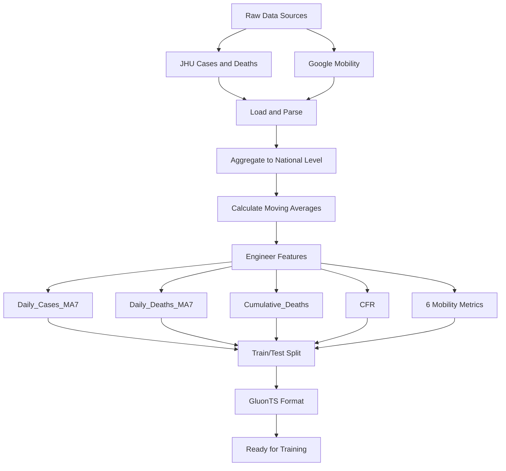

# Summary

This project provides a reproducible pipeline and interactive notebooks for
probabilistic forecasting of U.S. daily COVID-19 cases using GluonTS. It walks
through data ingestion (JHU case/death time series and Google Mobility),
preprocessing and feature engineering (7-day moving averages, CFR, mobility
metrics), and model training/evaluation with three GluonTS models: DeepAR,
SimpleFeedForward, and DeepNPTS. The notebooks show end-to-end steps - automatic
data download, model fitting, posterior/predictive checks, and probabilistic
evaluation metrics (MAE, RMSE, CRPS).

# COVID-19 Case Prediction Using GluonTS

## Getting Started

### Data Setup

The data files are **not included** in the repository. They will be
**automatically downloaded** when you run the notebooks.

**Automatic Download (Default)**

When you open and run the notebooks (`GluonTS.API.ipynb` or
`GluonTS.example.ipynb`), they will:

1. Check if data files exist in the `data/` directory
2. Automatically download missing files from Google Drive
3. Show progress for each download
4. Continue with the analysis

**Manual Download (Optional)**

If automatic download fails (e.g., network restrictions), don't panic you can
download the data manually. We have stored them in a public Google Drive that
you can access from the links below:

- [US COVID-19 Cases](https://drive.google.com/file/d/1ZfZtoV3PpZblZYES0A5LHCwp54cR8RJL/view)
  - Save as `data/cases.csv`
- [US COVID-19 Deaths](https://drive.google.com/file/d/1kYC9nrCnKbNpnoZKz8o6TDMM371gyxbl/view)
  - Save as `data/deaths.csv`
- [US Mobility Report](https://drive.google.com/file/d/1TMqG8Z8vbxmQAv1rNKczYYPCzwT4ZS_q/view)
  - Save as `data/mobility.csv`

Or run:

```bash
> python GluonTS_utils_data_download.py
```

You may need to use `python3` if you run into problems running the above
command.

### Build and Run

#### Build the Docker Image

```bash
> ./docker_build.sh
```

**Expected Output:**
```
Building Docker Image: gluonts-covid
==========================================
[+] Building 45.2s (12/12) FINISHED
 => [internal] load build definition
 => => transferring dockerfile
 => [internal] load .dockerignore
 => [1/6] FROM docker.io/library/python:3.10-slim
 => [2/6] RUN apt-get update && apt-get install -y build-essential
 => [3/6] WORKDIR /workspace
 => [4/6] COPY requirements.txt .
 => [5/6] RUN pip install --no-cache-dir -r requirements.txt
 => [6/6] COPY . /workspace
 => exporting to image
 => => exporting layers
 => => writing image sha256:abc123...
 => => naming to docker.io/library/gluonts-covid

Docker image built successfully

Next steps:
  Run Jupyter: ./docker_jupyter.sh
  Run bash: ./docker_bash.sh
```

**Build time:** Roughly 1-2 minutes for the first time, <30 seconds for
subsequent builds

#### Run Jupyter Notebook

```bash
> ./docker_jupyter.sh
```

**Expected Output:**
```
Starting Jupyter Notebook Server
==========================================
URL: http://localhost:8888
Press Ctrl+C to stop
==========================================

[I 2025-12-14 12:00:00.123 ServerApp] Jupyter Server 2.x.x is running at:
[I 2025-12-14 12:00:00.123 ServerApp] http://localhost:8888/tree
[I 2025-12-14 12:00:00.123 ServerApp] Use Control-C to stop this server
```

**Open your browser** to `http://localhost:8888` and navigate to:

- `GluonTS.API.ipynb`: Learn model APIs
- `GluonTS.example.ipynb`: Complete application with a real world use case

#### Access Interactive Shell (Optional)

```bash
> ./docker_bash.sh
```

**Expected Output:**
```
Starting Interactive Bash Shell
==========================================
Working directory: /workspace
Type 'exit' to leave
==========================================

root@abc123:/workspace#
```

These are useful for running Python scripts directly or debugging.

### File Organization

- Main Notebooks (Start Here)
  - `GluonTS.API.ipynb`: Model API demonstrations
  - `GluonTS.API.md`: API documentation
  - `GluonTS.example.ipynb`: Complete application
  - `GluonTS.example.md`: Application guide
- Utility Modules
  - `GluonTS_utils_data_io.py`: Load COVID data
  - `GluonTS_utils_preprocessing.py`: Clean and prepare data
  - `GluonTS_utils_gluonts.py`: GluonTS formatting
  - `GluonTS_utils_evaluation.py`: Metrics and plots
  - `GluonTS_utils_notebook_loader.py`: Quick data loader
  - `GluonTS_utils_models.py`: Model wrappers
- Data Files
  - `data/cases.csv`: JHU COVID-19 cases
  - `data/deaths.csv`: JHU COVID-19 deaths
  - `data/mobility.csv`: Google Mobility data
- Docker Setup
  - `Dockerfile`: Container configuration
  - `docker_build.sh`: Build script
  - `docker_jupyter.sh`: Jupyter launcher
  - `docker_bash.sh`: Shell access
- `requirements.txt`: Python dependencies

### Model Comparison

| Model                 | External Features           | Training Time | Best Use Case                       |
| --------------------- | --------------------------- | ------------- | ----------------------------------- |
| **DeepAR**            | Yes (deaths, mobility, CFR) | 3-4 min       | Complex patterns, highest accuracy  |
| **SimpleFeedForward** | No                          | 30-60 sec     | Quick baselines, stable trends      |
| **DeepNPTS**          | Yes (deaths, mobility, CFR) | 3-4 min       | Regime changes, distribution shifts |

## Data Pipeline



### Features Used

- **Target**: Daily COVID-19 cases (7-day moving average)
- **Deaths Features**: Daily deaths (MA7), cumulative deaths, CFR
- **Mobility Features**: Retail, grocery, parks, transit, workplaces,
  residential

**Metrics Explained**

- **MAE** = Average absolute difference (lower = better)
- **RMSE** = Penalizes large errors more (lower = better)
- **MAPE** = Percentage error, scale-independent (lower = better)
- **CRPS** = Probabilistic forecast quality (lower = better)

## Troubleshooting

### Docker Issues

**Problem:** Port 8888 already in use

**Solution:** Stop existing Jupyter or change port:

- Edit `docker_jupyter.sh`, line 14:
  ```bash
  -p 8889:8888  # Use 8889 instead
  ```

**Problem:** Docker build fails

**Solution:** Ensure Docker is running:

```bash
> docker info
```

### Training Issues

**Problem:** MPS (Apple GPU) not supported error

**Solution:** This should already be handled! The shell scripts set
`PYTORCH_ENABLE_MPS_FALLBACK=1` to use CPU for unsupported operations.

**Expected message:**
```
GPU available: True (mps), used: True
WARNING: Using CPU fallback for unsupported MPS operations
```

This is normal and won't significantly impact performance.

**Problem:** Out of memory

**Solution:** Reduce batch size in notebook:

```python
batch_size = 16  # Instead of 32
```

### Data Issues

**Problem:** Data files not found

**Solution:** Verify data directory:

```bash
> ls data/
# Should show: cases.csv, deaths.csv, mobility.csv
```

Initially when you clone this repo you will not see any data files in this
folder. Do not panic this is normal. Please go back to the `Data Setup` section
above if you do not see any of those CSV data files as it has a guide on how to
get them.

## Additional Resources

### GluonTS Documentation

- Official docs: https://ts.gluon.ai/
- GitHub: https://github.com/awslabs/gluonts

### Research Papers

- DeepAR: https://arxiv.org/abs/1704.04110
- DeepNPTS: https://arxiv.org/abs/1906.05264

### COVID-19 Data Sources

- JHU CSSE: https://github.com/CSSEGISandData/COVID-19
- Google Mobility: https://www.google.com/covid19/mobility/
- CDC Data: https://covid.cdc.gov/covid-data-tracker/

## Technical Specifications

- **Python**: 3.10+
- **Framework**: GluonTS 0.14.0 with PyTorch backend
- **Hardware**: CPU-optimized, Apple Silicon compatible
- **Docker**: Multi-stage build with slim base image
- **Data**: 1,143 days training, 14 days testing

## Quick Command Reference

```bash
# Check data files
> python GluonTS_utils_data_download.py

# Build Docker image
> ./docker_build.sh

# Run Jupyter (default)
> ./docker_jupyter.sh

# Interactive shell
> ./docker_bash.sh

# Stop container
# Press Ctrl+C in terminal where Jupyter is running

# View running containers
> docker ps

# Remove all containers
> docker rm $(docker ps -aq)
```

## Data Files

The following data files should be in the `data/` directory:

- `cases.csv` (17 MB): JHU COVID-19 confirmed cases
- `deaths.csv` (11 MB): JHU COVID-19 deaths
- `mobility.csv` (97 MB): Google Mobility Reports

Download from:
https://drive.google.com/drive/folders/1qMDGBstdY8H2hYpz8xSolhzNOsVxNHMA
