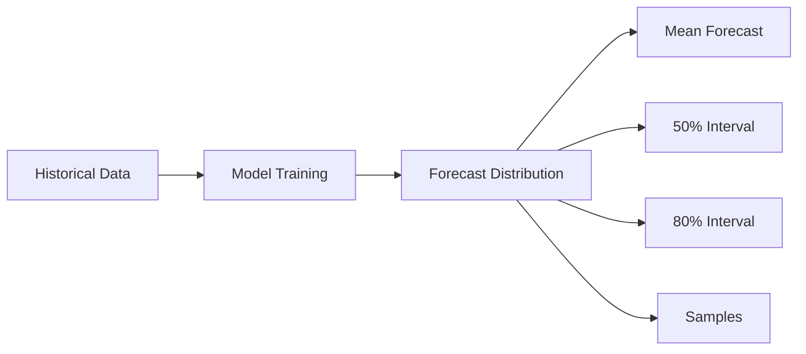
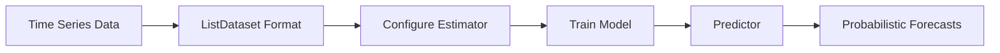
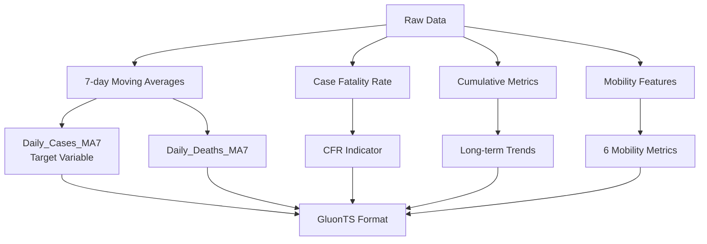
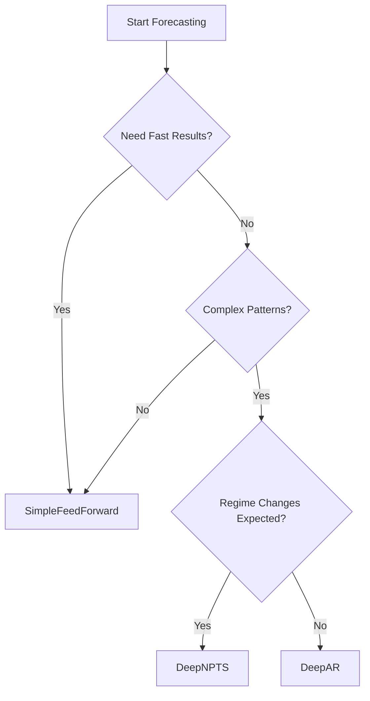

TL;DR: Learn how to build probabilistic time series forecasting models with GluonTS to predict COVID-19 cases with uncertainty quantification, enabling better decision-making for public health planning.

<!-- more -->

When public health officials plan hospital resources, a single number isn't enough. "We expect 10,000 COVID-19 cases next week" misses critical information: _What if cases surge to 15,000? What if they drop to 5,000?_ Decision-makers need the full range of possibilities and their probabilities.

**Probabilistic time series forecasting** generates distributions of possible outcomes with confidence intervals, not just point predictions. This tutorial shows you how to build probabilistic forecasting models using GluonTS and apply them to COVID-19 case data.

You'll learn why uncertainty matters and how probabilistic forecasts enable better decision-making. We'll show you how to use GluonTS to build and train probabilistic models with minimal code.

You'll discover how to choose between **DeepAR**, **SimpleFeedForward**, and **DeepNPTS** models. We'll teach you interpretation skills to read prediction intervals and assess model confidence. Finally, you'll apply forecasting to COVID-19 with scenario analysis.

This tutorial assumes basic Python familiarity (pandas, numpy helpful), understanding of time series concepts, and Docker installed. To get started, follow the [README](README.md) to set up your environment, then run `./docker_jupyter.sh` to launch Jupyter notebooks.

## Understanding Probabilistic Forecasting

### Beyond Single Point Predictions

Traditional forecasting answers "What will happen?" with a single number. **Probabilistic forecasting** answers "_What could happen, and how likely?_" with a distribution.

**Example**: Instead of "Tomorrow will be 72°F," you get "68-76°F with 50% chance between 70-74°F."

### Why Uncertainty Matters

A hospital administrator sees "100 COVID-19 patients expected." But _what if there's a 20% chance of 150 patients (surge) or 10% chance of 50 (decline)?_ Probabilistic forecasts enable risk planning, informed decisions, and better communication: "80% confident between Y and Z, 10% chance exceeding W."

### Key Concepts

**Prediction intervals** define where the true value is likely to fall: 50% interval (middle 50% of outcomes), 80% interval (10th-90th percentile), 90% interval (very wide range). **Example**: Mean 8,500 cases, 80% interval [6,000, 11,500].

**Quantiles** divide the distribution into equal-probability segments. Models generate forecasts by sampling many possible futures (e.g., 100 samples):

```python
forecast.quantile(0.1)  # 10th percentile (lower bound)
forecast.quantile(0.5)  # Median
forecast.quantile(0.9)  # 90th percentile (upper bound)
```

**Calibrated uncertainty** means intervals are accurate: if a model claims "80% of outcomes in this range," then 80% of actual outcomes should fall within. Uncalibrated models are misleading (too narrow = overconfident, too wide = underconfident).

### Visualizing Probabilistic Forecasts



See forecast visualizations in the [GluonTS.API.ipynb notebook](GluonTS.API.ipynb).

## Introduction to GluonTS

**GluonTS** (Gluon Time Series) is an open-source Python library for probabilistic time series forecasting. Developed by Amazon Research, it provides a consistent API for building, training, and evaluating forecasting models.

### Key Features

The main advantages are:

- **Probabilistic by default**: All models produce uncertainty estimates
- **Multiple architectures**: From simple feedforward to complex autoregressive models
- **Easy data handling**: Built-in utilities for time series preparation
- **Comprehensive evaluation**: Metrics for point and probabilistic forecasts
- **Production-ready**: Built on PyTorch/MXNet

### When to Use GluonTS

**Choose GluonTS when:** You need uncertainty quantification, have sufficient data (hundreds to thousands of time steps), and want to compare multiple architectures easily. **Consider alternatives:** Prophet (strong seasonality) or ARIMA (small datasets).

### GluonTS Workflow



The workflow consists of five main steps:

1. **Data Preparation**: Convert to `ListDataset` format
2. **Estimator**: Configure model parameters
3. **Training**: Fit model to historical data (`estimator.train()`)
4. **Predictor**: Trained model ready for forecasting
5. **Forecasts**: Probabilistic predictions with uncertainty intervals

### The Three Models

| Model                 | Best For                                                   | Training Time |
| :-------------------- | :--------------------------------------------------------- | :------------ |
| **DeepAR**            | Complex patterns, multiple seasonalities, highest accuracy | 2-4 min       |
| **SimpleFeedForward** | Stable trends, quick baselines, limited compute            | 30-60 sec     |
| **DeepNPTS**          | Regime shifts, distribution changes, flexible uncertainty  | 1-3 min       |

For detailed API documentation, see [GluonTS.API.md](GluonTS.API.md).

## The COVID-19 Forecasting Problem

### Problem Statement

Public health officials need 14-day COVID-19 case predictions to allocate resources, plan interventions, and communicate risk. A 14-day horizon balances planning time with forecast accuracy.

Specifically, forecasts help:

- **Allocate resources**: Plan ICU beds, ventilators, staffing
- **Plan interventions**: Decide on mask mandates, capacity limits
- **Communicate risk**: Inform the public about expected trends

### Why COVID-19 Data Is Ideal for Learning

COVID-19 case data exhibits multiple waves with distinct peaks (initial surge, Delta, Omicron) that have different patterns. It shows weekly seasonality with lower reporting on weekends.

External factors like mobility data, policy changes, and variant emergence significantly impact case counts. The data includes noise and uncertainty from reporting delays and data quality issues. Most importantly, forecasts inform critical real-world decisions.

### Data Sources

**JHU COVID-19 Cases and Deaths**: Daily confirmed cases and deaths by state, aggregated nationally (Jan 2020 - Mar 2023). Deaths lag cases by 2-3 weeks but are highly correlated, helping anticipate trends.

**Google Mobility Data**: Six categories (retail, grocery, parks, transit, workplaces, residential) showing percentage change from baseline. Mobility changes precede case changes (reduced mobility → fewer cases with lag).

### Feature Engineering



The feature engineering process includes:

- **7-day moving averages**: Smooths weekend artifacts, reduces noise
- **Case Fatality Rate (CFR)**: `Deaths / Cases` - healthcare strain indicator
- **Cumulative metrics**: Long-term trends, less noisy
- **Mobility features**: Behavioral response indicators

### Data Challenges

COVID-19 data presents forecasting challenges:

- **Non-stationarity**: Mean and variance change over time
- **Regime changes**: Different variants behave differently
- **Reporting artifacts**: Weekend underreporting, corrections
- **External shocks**: Policy changes, variant emergence
- **Noise**: Measurement error, reporting delays

These challenges make it an excellent testbed for probabilistic models that must adapt to changing patterns and quantify uncertainty appropriately.

## Three Models, Three Approaches

Each model has distinct strengths suited to different forecasting scenarios. Understanding when to use each helps you choose the right tool for your problem.

### DeepAR: Complex Patterns and High Accuracy

Uses recurrent neural networks to learn temporal dependencies. **Best for:** Complex patterns with multiple seasonalities, long-term dependencies, highest accuracy needs.

**Strengths:** Best overall accuracy, captures wave dynamics, well-calibrated uncertainty, handles external features. **Configuration:** `context_length=60`, `num_layers=2`, `hidden_size=40`, `num_feat_dynamic_real=3`. **Training time:** 2-4 minutes.

### SimpleFeedForward: Fast Baseline

Direct mapping from recent history to future predictions using feedforward networks. **Best for:** Fast results, stable trends, quick baselines.

**Strengths:** 10x faster than DeepAR, good for stable periods, excellent for prototyping. **Limitations:** Struggles with sudden changes, less accurate for complex patterns, no feature support. **Training time:** 30-60 seconds.

### DeepNPTS: Regime Changes and Flexibility

Learns data distribution non-parametrically, adapting to changing patterns. **Best for:** Distribution changes, regime shifts (new variants), unusual data.

**Strengths:** Adapts to distribution shifts, excellent during variant transitions, flexible uncertainty, handles external features. **Training time:** 1-3 minutes.

### Model Selection Guide



**Quick reference:**

- **Stable trends, quick baseline** → SimpleFeedForward
- **Complex patterns, highest accuracy** → DeepAR
- **Regime changes, variant transitions** → DeepNPTS

See detailed model comparisons in [GluonTS.API.ipynb](GluonTS.API.ipynb).

## Hands-On: Building Your First Forecast

Here's a quick walkthrough of the essential steps to build a probabilistic forecast with GluonTS.

### Step 1: Data Preparation

Convert your time series into GluonTS `ListDataset` format:

```python
from gluonts.dataset.common import ListDataset

train_ds = ListDataset([
    {
        "start": "2020-01-01",
        "target": [cases_day1, cases_day2, ...],
        "feat_dynamic_real": [[deaths_day1, ...], [mobility_day1, ...]]
    }
], freq="D")
```

### Step 2: Model Configuration

Configure your estimator with key parameters:

```python
from gluonts.torch.model.deepar import DeepAREstimator

estimator = DeepAREstimator(
    freq='D',
    prediction_length=14,  # Forecast 14 days ahead
    context_length=60,      # Use 60 days of history
    num_feat_dynamic_real=3,  # 3 external features
    trainer_kwargs={"max_epochs": 10}
)
```

### Step 3: Training

Fit the model to historical data: `predictor = estimator.train(train_ds)`. The model learns patterns, dependencies, and uncertainty distributions.

### Step 4: Generating Forecasts

Generate probabilistic forecasts:

```python
from gluonts.evaluation import make_evaluation_predictions

forecast_it, ts_it = make_evaluation_predictions(
    dataset=test_ds,
    predictor=predictor,
    num_samples=100  # Generate 100 samples for distribution
)

forecasts = list(forecast_it)
```

### Step 5: Extracting Uncertainty

Access probabilistic outputs:

```python
forecast = forecasts[0]

# Point predictions
mean = forecast.mean
median = forecast.quantile(0.5)

# Confidence intervals
lower_80 = forecast.quantile(0.1)  # 10th percentile
upper_80 = forecast.quantile(0.9)  # 90th percentile

# All samples
samples = forecast.samples  # Shape: (100, 14)
```

See the complete walkthrough in [GluonTS.example.ipynb](GluonTS.example.ipynb).

## Interpreting Probabilistic Forecasts

Understanding probabilistic forecasts requires interpreting prediction intervals, assessing confidence, and recognizing common pitfalls.

### Reading Prediction Intervals

**10th-90th percentiles:** 10th percentile = 10% of outcomes fall below (lower bound), 90th percentile = 90% fall below (upper bound). **80% interval** = 80% of likely outcomes fall between bounds.

**Example:** [6,000, 11,500] cases means 80% chance actual value falls within this range.

### Assessing Model Confidence

**Narrow intervals** = High confidence (model is certain, low uncertainty, may indicate overconfidence if too narrow).

**Wide intervals** = High uncertainty (model acknowledges uncertainty, may be due to noise/regime changes/limited data, more realistic for volatile time series).

### When to Trust Forecasts

**Trust forecasts when:**

- Intervals are well-calibrated (actual outcomes match predicted intervals)
- Historical performance is good
- Data quality is high
- No recent regime changes

**Be cautious when:**

- Intervals are too narrow (overconfident)
- Intervals are too wide (underconfident)
- Recent data shows distribution shifts
- External factors have changed significantly

### Common Pitfalls

**Overconfidence**: Too narrow intervals (claims 80% but only 60% fall within). **Underconfidence**: Too wide intervals (claims 80% but 95% fall within). **Ignoring uncertainty**: Decisions based only on mean forecast.

**Best practice:** Always consider the full distribution, not just the mean.

See forecast interpretation examples in [GluonTS.example.ipynb - Section 5](GluonTS.example.ipynb).

## Model Evaluation: Beyond Accuracy

Evaluating probabilistic forecasts requires metrics beyond point forecast accuracy.

### Point Forecast Metrics

**MAE (Mean Absolute Error):** Average absolute difference (easy to interpret, robust to outliers).

**RMSE (Root Mean Square Error):** Penalizes large errors more (common metric, same units as target). **MAPE (Mean Absolute Percentage Error):** Scale-independent percentage error (useful for comparison).

### Probabilistic Metrics

**CRPS (Continuous Ranked Probability Score):** Evaluates the full forecast distribution

- Lower is better
- Rewards well-calibrated uncertainty
- Considers entire distribution, not just mean

**Why CRPS matters:**

- A model can have good MAE but poor uncertainty estimates
- CRPS evaluates probabilistic forecast quality
- Both accuracy and uncertainty quality matter for decision-making

### Comparing Models

When comparing models, consider accuracy (lowest MAE/RMSE), uncertainty quality (lowest CRPS), calibration (accurate intervals), and speed (training time).

**Example:** DeepAR (best accuracy, well-calibrated), SimpleFeedForward (good accuracy, fastest), DeepNPTS (good accuracy, flexible uncertainty, adapts to changes).

See evaluation code and metrics in [GluonTS.example.ipynb - Section 5](GluonTS.example.ipynb).

## Real-World Application: Scenario Analysis

Probabilistic forecasts enable "what-if" analysis for decision-making. Here's how to use forecasts for scenario planning.

### What Is Scenario Analysis?

Simulating different intervention scenarios to quantify their impact on case counts. Helps public health officials evaluate intervention effectiveness, balance health vs. economic costs, plan resource allocation, and communicate risk.

**How it works:** Adjust features by intervention strength, re-run forecasts with modified features, compare predictions across scenarios, quantify impact.

### The Five Scenarios

We test five scenarios using DeepAR (which uses external features):

| Scenario                     | Description                     | Mobility Change | CFR Change |
| :-------------------------- | :------------------------------ | :-------------- | :--------- |
| **1. Baseline**              | No intervention, current trends | 0%              | 0%         |
| **2. Moderate Intervention** | Masks, capacity limits          | -15%            | 0%         |
| **3. Strong Intervention**   | Lockdowns, closures             | -30%            | 0%         |
| **4. Relaxation**            | Reopening, holidays             | +20%            | 0%         |
| **5. Healthcare Strain**     | Hospital capacity stressed      | 0%              | +15%       |

**Interpreting Results:**

```
Scenario                  Avg Daily    Total Cases    vs Baseline
----------------------------------------------------------------
Baseline                  47,028       658,396        --
Moderate Intervention     44,957       629,404        4.4% fewer
Strong Intervention       45,989       643,840        2.2% fewer
Relaxation                46,074       645,039        2.0% more
Healthcare Strain         48,455       678,376        3.0% more
```

**Key insights:** Quantify intervention impact with uncertainty bounds, compare scenarios probabilistically, make informed decisions balancing multiple factors.

See complete scenario analysis in [GluonTS.example.ipynb - Section 6](GluonTS.example.ipynb).

## Key Takeaways and Next Steps

### Why Probabilistic Forecasting Matters

Probabilistic forecasting moves beyond single point predictions to capture **uncertainty, trends, and variability**—critical for informed decision-making.

Unlike "10,000 cases expected," probabilistic models provide "10,000 cases with 80% confidence interval [8,000-12,000]," enabling risk-aware planning.

### Handling Noisy, Evolving Time Series

COVID-19 data exemplifies **noisy, evolving time series**: noise (reporting delays, weekend underreporting), evolving patterns (multiple waves with different characteristics), and regime changes (distribution shifts as variants emerge).

**How GluonTS models handle these:** 7-day moving averages smooth noise, DeepAR captures complex patterns despite noise, DeepNPTS adapts to distribution shifts non-parametrically, external features (deaths, mobility) anticipate evolving patterns, and uncertainty quantification signals high uncertainty during transitions.

Probabilistic models **quantify uncertainty** and **adapt to variability**, making them essential for real-world forecasting.

### When to Use Each Model

**Quick reference guide:**

| Model                 | Use When                                     | Key Strength                      |
| :-------------------- | :------------------------------------------- | :-------------------------------- |
| **SimpleFeedForward** | Stable trends, fast baseline needed          | Speed (30-60 sec)                 |
| **DeepAR**            | Complex patterns, highest accuracy needed    | Accuracy + calibrated uncertainty |
| **DeepNPTS**          | Regime changes, distribution shifts expected | Adaptability to evolving patterns |

**Decision flow:** Need fast results? → SimpleFeedForward. Complex patterns? → DeepAR. Regime changes? → DeepNPTS.

### Best Practices

1. **Always report uncertainty**: Point forecasts alone are insufficient
2. **Choose model based on problem**: Consider data characteristics (stable vs. evolving, noisy vs. clean)
3. **Validate on holdout data**: Test performance before deployment
4. **Monitor calibration**: Ensure intervals match actual outcomes
5. **Consider external features**: They significantly improve forecasts for evolving patterns

### Extending This Tutorial

**Try different forecast horizons:** Short-term (7 days), medium-term (14 days), long-term (28 days).

**Add more features:** Vaccination rates, weather data, policy stringency indices, genomic surveillance.

**Experiment with hyperparameters:** Increase `context_length`, adjust `hidden_size`/`num_layers`, tune `dropout_rate`, increase `epochs`.

**Apply to your own data:** Replace COVID-19 data, adapt feature engineering, compare models, build scenario analysis.

### Additional Resources

**GluonTS Documentation:**

- [Official Documentation](https://ts.gluon.ai/)
- [GitHub Repository](https://github.com/awslabs/gluonts)
- [API Reference](GluonTS.API.md)

**Research Papers:** [DeepAR Paper](https://arxiv.org/abs/1704.04110), [GluonTS Paper](https://arxiv.org/abs/1906.05264).

**COVID-19 Data:** [JHU Repository](https://github.com/CSSEGISandData/COVID-19), [Google Mobility Reports](https://github.com/ActiveConclusion/COVID19_mobility).

**Time Series:** "Forecasting: Principles and Practice" by Hyndman & Athanasopoulos.

### Final Thoughts

Probabilistic time series forecasting with GluonTS enables you to capture uncertainty, handle noisy evolving data, make informed decisions using prediction intervals and scenario analysis, and adapt to changing patterns.

Whether forecasting COVID-19 cases, sales, or any time series, probabilistic forecasts provide **uncertainty quantification** and **variability awareness** needed for real-world decision-making.

**Ready to get started?** Follow the [README](README.md) to set up your environment, then dive into the [GluonTS.API.ipynb](GluonTS.API.ipynb) and [GluonTS.example.ipynb](GluonTS.example.ipynb) notebooks.
